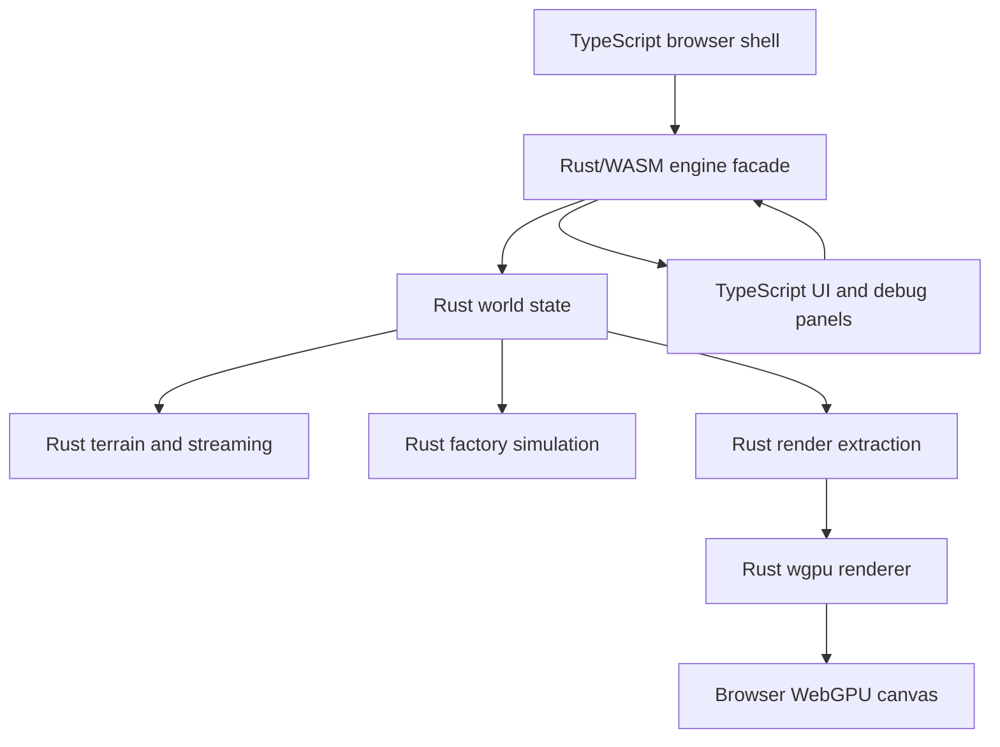

# Rust Engine Migration Plan

This is the plan for moving OFG from a TypeScript-owned browser prototype to a
Rust-owned engine that runs in the browser through WebAssembly and uses Rust for
WebGPU rendering.

This document is a living migration record. Treat it as shared memory for the
Rust-first engine direction: update it when phases start, finish, change shape,
or get blocked, and record why meaningful pivots happen. If an AI agent resumes
after context compaction, or is unsure about engine ownership or the next Rust
migration step, it must reread this document before continuing implementation.

The direction is intentionally Rust-first. TypeScript should become browser shell
and UI glue, not the long-term home for scene state, world simulation, streaming,
or rendering architecture.

## Why This Pivot

The current TypeScript scene/component system was useful for making the prototype
coherent quickly, but it is not the right center of gravity for a large factory
world. As terrain, machines, belts, items, props, saves, visibility, collision,
and tuning all grow, a TypeScript object scene would force us to add registries,
caches, dirty lists, and spatial indexes around the original abstraction. That is
a sign the abstraction is backwards.

The target architecture is simpler:

- Rust owns the world.
- Rust owns rendering.
- TypeScript owns the browser page, DOM UI, input event forwarding, and
  development/debug integration.

This does not require a big-bang rewrite. Each migration slice should move
ownership of one vertical path into Rust and delete or demote the TypeScript
owner for that path.

## WebGPU Assumption

Rust can own WebGPU through `wgpu`.

The `wgpu` project describes itself as a safe, portable Rust graphics library
based on the WebGPU API. It runs natively on Vulkan, Metal, DirectX 12, and
OpenGL ES, and in browsers through WebAssembly on browser WebGPU and WebGL2
backends. WebGPU and WGSL are W3C standards for GPU acceleration on the web.

Primary references:

- [`wgpu`](https://wgpu.rs/)
- [WebGPU](https://webgpu.org/)
- [`wasm-bindgen` guide: `web-sys`](https://wasm-bindgen.github.io/wasm-bindgen/web-sys/index.html)

Implications for OFG:

- WGSL can remain the shader language.
- The browser can still host the canvas and UI.
- Rust can own `wgpu::Instance`, surface/canvas binding, adapter/device/queue,
  pipeline creation, buffers, textures, bind groups, and draw submission.
- TypeScript may initially pass an `HTMLCanvasElement` or canvas handle into the
  Rust/WASM entry point and forward browser events.

## Ownership Target

| Area | Final owner | Notes |
|---|---|---|
| Terrain generation | Rust | Already partly migrated in `crates/terrain_core`. |
| Terrain streaming and LOD | Rust | Scheduler, density stores, mesh stores, priorities, eviction. |
| Scene/world IDs | Rust | Generational IDs, typed storage, lifecycle, parent/child only where useful. |
| Components/simulation | Rust | Prefer data-oriented systems over a polymorphic TypeScript component tree. |
| Transform storage | Rust | Dirty propagation, world matrices, spatial index integration. |
| Factory simulation | Rust | Machines, belts, items, power/logistics, determinism. |
| Collision/queries | Rust | Terrain and placed-object queries. |
| Save/load | Rust | Deterministic schemas, migrations, compression later. |
| Render extraction | Rust | Render packets/batches are produced from Rust world state. |
| WebGPU renderer | Rust | `wgpu` owns GPU resources, pipelines, uploads, and draw calls. |
| Browser shell | TypeScript | Canvas lookup, app startup, DOM HUD, tuning panels, URL params. |
| Input collection | TypeScript initially | Browser events forwarded into Rust input state. Can move interpretation to Rust. |
| Debug UI | TypeScript initially | UI controls call Rust APIs and display Rust status snapshots. |

## Non-Goals

- Do not create a large general-purpose ECS just because we are moving to Rust.
  Use typed stores and systems that match OFG's actual world model.
- Do not keep TypeScript and Rust as equal world authorities. During migration
  there can be compatibility bridges, but each bridge needs an owner and a
  deletion path.
- Do not move to Rust to avoid tests. Rust-owned behavior needs equal or stronger
  unit, golden, and browser-smoke coverage.
- Do not port WebGPU first without a render packet contract. Rendering should
  move after Rust can produce stable render data.

## Target Runtime Shape



TypeScript calls a small Rust facade:

```ts
type EngineHandle = {
  resize(width: number, height: number, scale: number): void;
  setInput(input: BrowserInputFrame): void;
  update(deltaSeconds: number): void;
  render(): void;
  setTerrainConfig(config: TerrainTuningConfig): void;
  resetStreaming(): void;
  debugSnapshot(): EngineDebugSnapshot;
};
```

This is an illustrative contract, not final API. The important rule is that the
facade is coarse. It should not expose thousands of entities or per-object calls
to TypeScript every frame. The long-term browser loop should be close to
`game.tick(frame)` or an equivalent single coarse call after TypeScript has
collected browser input, resize, and UI events.

## Migration Phases

### Phase 0: Document And Guard The Pivot

Goal: make the Rust-first direction explicit and keep future work from adding new
TypeScript world systems.

Implementation:

- Add this plan.
- Update architecture docs to describe TypeScript scene/components as transitional.
- Keep `docs/terrainplan.md` pointing here for terrain/streaming work.
- Add review guidance: new simulation, streaming, terrain, and render-resource
  ownership should default to Rust unless there is a clear browser/UI reason.

Validation:

- Docs point to one migration story.
- No code behavior change required.

### Phase 1: Create A Rust Engine Core Crate

Goal: introduce a Rust-owned engine core alongside `terrain_core`.

Status: initial foundation complete on 2026-06-01. `crates/engine_core` is now a
workspace crate with Rust-owned `Engine`, `World`, generational `EntityId`,
local/world transform storage, deterministic update summaries, lifecycle and
transform tests, and a minimal raw WASM-facing facade. The playable runtime is
unchanged.

Implementation:

- Add `crates/engine_core`.
- Define:
  - `Engine`
  - `World`
  - generational `EntityId`
  - typed transform storage
  - simple lifecycle create/destroy tests
  - deterministic update tick input
- Decide whether hierarchy is required for all entities or only for authored
  control objects. Default leaning: transforms are flat and can reference optional
  parents, but high-volume world objects should not live in a tree.
- Keep `terrain_core` either as a submodule/crate dependency or gradually fold it
  into `engine_core` once boundaries settle.

Validation:

- `cargo test -p engine_core`
- Tests for ID reuse, stale ID rejection, transform update, and deterministic
  update ordering.

Deletion path:

- None yet. This phase creates the Rust owner without changing runtime.

### Phase 2: Move Scene Ownership To Rust

Goal: replace the TypeScript `Scene` as the authoritative world state.

Status: runtime player/camera wiring slice complete on 2026-06-01.
`engine_core` builds as a browser WASM artifact, TypeScript has a tested
`EngineCoreWasmHandle`, and Rust owns the active player/camera rig model with
movement, look, mode switching, camera eye snapshots, and facade exports. The
browser runtime now requires `engine_core.wasm` for player/camera startup. The
TypeScript `PlayerController` fallback has been deleted; TypeScript forwards
input through `RustPlayerController` and mirrors the Rust player transform only
for terrain streaming and remaining scene render items.

Implementation:

- Expose a small WASM facade for:
  - engine creation
  - player/camera creation
  - terrain entity creation
  - transform reads needed by current UI/smoke tests
- Keep the TypeScript scene only as a compatibility adapter while tests migrate.
- Move player/camera transform state into Rust.
- Move `PlayerController` movement interpretation into Rust, with TypeScript only
  forwarding input snapshots.

Validation:

- Existing player controller tests are ported or mirrored in Rust.
- Browser smoke still verifies first-person and debug-fly camera modes.
- TypeScript scene extraction is no longer the authority for player/camera state.

Deletion path:

- TypeScript `PlayerController` deleted on 2026-06-01 after Rust became the
  required browser player/camera runtime.
- Mark TypeScript scene APIs as compatibility-only.

### Phase 3: Move Terrain Streaming Fully Into Rust

Goal: Rust owns the density -> LOD -> render-mesh state machine.

Status: in progress on 2026-06-01. `terrain_core` owns the tested terrain stream
scheduler core and the browser runtime now delegates worker job selection and
state transitions to it through a narrow WASM facade. Rust owns desired density
and LOD0 sets, density-apron dependency checks, nearest-first priority, bounded
in-flight jobs, reset generation tokens, stale completion rejection, retryable
density failures, empty LOD0 tracking, and window pruning. The browser runtime
now also retains completed density payloads in the main `terrain_core.wasm`
density store instead of a TypeScript-owned payload map. The playable runtime no
longer mutates `TerrainRenderer` for streamed chunks; Rust/WASM mesh payloads now
flow into a Rust-owned terrain mesh packet store in `terrain_core.wasm` outside
the scene terrain component path. Scheduler-backed terrain packet pruning also
runs through that Rust store, and rendered/empty LOD0 status comes from the Rust
scheduler rather than a TypeScript render-key mirror. TypeScript still owns the
browser Worker host and WebGPU upload/cache adaptation, but the playable app now
uses `TerrainCoreWorkerStreamer` instead of the legacy `TerrainChunkStreamer`
manager. The dev/smoke browser runtime is now cross-origin isolated and uses
`SharedArrayBuffer`-backed LOD0 density dependency payloads when available, so
the browser no longer structured-clones the 2x2x2 apron fields into each mesh
worker. Mesh workers still copy/install those shared payloads into their local
`terrain_core.wasm` density stores before contouring. Rust now also owns the
terrain worker-pool model through `terrain_core.wasm`: worker slot assignment,
request IDs, in-flight task records, reset generations, and completion
validation. TypeScript provides the browser-only Worker transport and generic
worker group utility. The remaining browser substrate gap is actual
Rust-created/wasm-thread worker spawning, or eventual WebGPU compute for
GPU-side parallelism. The next Phase 3/4 slices should move worker partition
ownership, batch density work, terrain execution facades, or terrain packet
emission farther into Rust until the TypeScript app loop can call a coarse
`game.tick()`-style API.

Implementation:

- Move `TerrainChunkStreamer` state into Rust:
  - desired chunk sets
  - density field jobs
  - mesh jobs
  - in-flight work
  - failures/backoff
  - eviction
  - stream generation/reset
- Replace TypeScript-owned density payload maps with Rust-owned stores.
- Use workers or Rust-side async/task abstractions only through a clear facade.
  The browser may still spawn Web Workers from TypeScript initially, but Rust owns
  job selection and state transitions.
- Add multi-resolution state naming now, even if only density and LOD 0 exist:
  `NotPresent`, `DensityReady`, `Lod(n)Ready`, `Lod0Ready`.

Validation:

- Rust scheduler unit tests for desired sets, priority, dependencies, resets,
  stale completions, failures, and eviction.
- Browser smoke proves reset and movement streaming still work.
- `npm run bench:terrain:wasm` or successor reports density, mesh, queue, and
  visible chunk timings.

Deletion path:

- `TerrainChunkStreamer` is demoted from the playable browser path as of
  2026-06-02; it remains legacy/reference infrastructure while
  `TerrainCoreWorkerStreamer` bridges Rust-owned stream state to browser Workers.

### Phase 4: Define Rust Render Packets

Goal: make rendering consume Rust-produced data before moving WebGPU itself.

Status: in progress. `engine_core` now has a tested Rust render packet model and
raw WASM snapshot buffer for the player camera, main light, and debug player
marker visibility/position. TypeScript decodes that packet and the browser
runtime uses the Rust camera/light packet. Streamed terrain chunks no longer use
`TerrainRenderer` in the playable app; Rust/WASM worker mesh payloads are copied
into a Rust-owned terrain mesh packet store and appended to `RenderWorld` outside
the scene terrain component path through a TypeScript WebGPU cache adapter. This
is still a WebGPU-upload bridge, not full Rust render extraction or Rust/wgpu.

Implementation:

- Define render packet types in Rust:
  - mesh buffer packet
  - instanced mesh packet
  - terrain chunk packet
  - texture/material IDs
  - camera/light packet
  - debug overlay packet
- TypeScript renderer can temporarily consume these packets and upload/draw using
  existing WebGPU code.
- Batches are grouped by mesh/material/texture where possible.
- Packets are coarse and transferable; avoid per-entity JS calls.

Validation:

- Golden tests for packet shape from fixed world state.
- Browser smoke uses Rust render packets for terrain/player/camera.
- Performance counters compare packet size and upload time.

Deletion path:

- Delete TypeScript `SceneRenderExtractor` for Rust-owned objects once terrain
  chunks and marker/static meshes are emitted as Rust render packets instead of
  TypeScript scene components.

### Phase 5: Move WebGPU Rendering To Rust/wgpu

Goal: Rust owns GPU resource lifetime and draw submission.

Implementation:

- Add a Rust renderer module using `wgpu`.
- Browser shell passes a canvas/surface handle into Rust initialization.
- Rust owns:
  - instance/surface
  - adapter/device/queue
  - swapchain/surface configuration
  - depth texture
  - pipeline layouts and pipelines
  - shader modules
  - buffers/textures/samplers/bind groups
  - render pass submission
  - GPU resource pruning
- Reuse WGSL shader sources where possible. Prefer one shader source tree shared
  by Rust build/include and any temporary TypeScript checks.
- Move texture array upload to Rust. TypeScript may still fetch asset bytes at
  first if that keeps the browser glue simple, but Rust should own decoded texture
  data and GPU uploads long-term.

Validation:

- Rust renderer tests for CPU-side resource lifecycle where possible.
- Browser smoke proves Rust/wgpu draws the first-person, debug-fly, and streamed
  terrain views.
- Shader validation happens through Rust/wgpu pipeline creation in smoke.
- A repeated streaming smoke or debug command verifies GPU buffer counts do not
  grow without bound.

Deletion path:

- Delete TypeScript `WebGpuRenderer` once Rust/wgpu is the default browser path.
- Keep only a thin TypeScript `startEngine(canvas, options)` wrapper.

### Phase 6: Move Factory Simulation And Spatial World Data To Rust

Goal: prevent factory gameplay from ever entering the TypeScript scene model.

Implementation:

- Add typed Rust stores for:
  - placed machines
  - belts/conveyors
  - items/fluids/power when introduced
  - spatial sectors/chunks
  - selection/debug metadata
- Add deterministic tick tests.
- Add spatial queries for selection, collision, visibility, and save/load.
- Emit instanced render packets for repeated objects.

Validation:

- Determinism tests for fixed inputs and seeds.
- Save/load round-trip tests.
- Browser smoke for a fixed small factory scene.

Deletion path:

- TypeScript never owns factory simulation beyond UI commands.

### Phase 7: Rust Save/Load, Tuning, And Debug Snapshots

Goal: make Rust the durable source of truth.

Implementation:

- Define versioned Rust save schemas.
- Store terrain tuning descriptors, world seed, edits, placed objects, and
  simulation state.
- Expose debug snapshots for TypeScript UI:
  - active chunks
  - timings
  - memory estimates
  - selected object
  - current terrain/material parameters
- Keep UI save/load controls in TypeScript.

Validation:

- Save/load round-trip.
- Backward-compatible migration tests once schema changes begin.
- Tuning changes reproduce deterministic screenshots.

## WebGPU Migration Details

The Rust renderer should be introduced only after render packets exist, but it is
part of the target architecture.

Recommended Rust module split:

```text
crates/engine_core
  src/world
  src/terrain
  src/sim
  src/render_packets
  src/input
  src/save

crates/engine_web
  src/lib.rs              wasm-bindgen facade
  src/browser_shell.rs    canvas/window bindings
  src/wgpu_renderer.rs    wgpu renderer
  src/assets.rs           browser asset loading bridge
```

Potential dependency shape:

- `engine_core`: no browser dependencies.
- `engine_web`: `wasm-bindgen`, `web-sys`, `js-sys`, `wgpu`, and browser-only
  glue.
- Native test harnesses should depend on `engine_core`, not browser APIs.

Renderer ownership rules:

- No WebGPU handles in TypeScript scene resources.
- No WebGPU handles in save data.
- Rust render resources are keyed by Rust IDs.
- Resource creation/destruction is explicit and testable at the CPU bookkeeping
  layer.
- Shaders remain WGSL.

Browser shell responsibilities after Rust/wgpu:

- Load the WASM module.
- Locate or create the canvas.
- Forward resize/device-pixel-ratio changes.
- Forward keyboard/mouse/pointer-lock state.
- Host HTML tuning/debug panels.
- Call `engine.update()` and `engine.render()` or hand control of the RAF loop to
  Rust through exported functions.

## Testing And Validation Gates

Every migration slice needs at least one deletion, one parity test, or one browser
proof. Otherwise it is likely adding a second system instead of moving ownership.

Required gates by area:

- Rust logic: `cargo test`.
- WASM artifacts: `npm run check:wasm` or successor.
- TypeScript shell: `npm test`.
- Rendering/browser integration: `npm run smoke:browser`.
- Terrain visual work: targeted terrain smokes.
- Rust/wgpu renderer: browser smoke plus a repeated streaming/resource-lifetime
  smoke.

New tests to add during migration:

- Rust scene/world ID lifecycle.
- Rust transform propagation and dirty tracking.
- Rust render packet golden fixtures.
- Rust terrain scheduler dependency and cancellation tests.
- Rust/wgpu resource lifetime bookkeeping tests.
- Browser smoke that runs with TypeScript renderer disabled.

## First Concrete Slice

The next implementation slice should be small but architectural:

1. Add `crates/engine_core`.
2. Define Rust-owned `Engine`, `World`, `EntityId`, and transform storage.
3. Add Rust tests for create/destroy/stale IDs and transforms.
4. Expose a minimal WASM facade that can create the engine and return a debug
   snapshot.
5. Keep the current runtime unchanged except for a smoke-hidden initialization
   check if useful.

This establishes the new ownership direction without destabilizing terrain or
rendering. The following slice can move player/camera state, then terrain
streaming, then render packets, then Rust/wgpu.

## Decision Log

| Date | Decision | Reason |
|---|---|---|
| 2026-06-01 | Adopt Rust-first engine direction | The TypeScript scene/component model would require increasingly clever caches and registries as world complexity grows. Rust should own the world, simulation, streaming, render extraction, and eventually WebGPU rendering. |
| 2026-06-01 | Use `wgpu` for Rust-owned WebGPU | `wgpu` is the Rust WebGPU path that can target browsers through WASM while preserving native-renderer optionality later. |
| 2026-06-01 | Keep `engine_core` browser-free in the first slice | The core crate should stay easy to test natively. Browser bindings, `wasm-bindgen`, and `wgpu` belong in a later `engine_web` layer once render packets and ownership contracts exist. |
| 2026-06-01 | Keep Rust core modules focused | `engine_core` is split into `math`, `world`, `player`, `engine`, and `facade` modules so Rust ownership can grow without recreating a monolithic engine file. |
| 2026-06-01 | Split Rust terrain before Phase 3 growth | `terrain_core` now has focused modules for facade, field sampling, chunk storage, density generation, meshing, materials, noise, presets, and tests so the streaming migration does not grow another epic Rust file. |

## Progress Log

| Date | Progress | Notes |
|---|---|---|
| 2026-06-01 | Phase 1 foundation complete | Added `crates/engine_core` with Rust-owned engine/world state, generational entity IDs, optional parented transforms, deterministic update ticks, raw WASM facade exports, and Rust tests. Current TypeScript runtime remains unchanged. |
| 2026-06-01 | Phase 2 bridge started | Added generated `engine_core.wasm`, TypeScript metadata/handle tests, and Rust-owned player/camera movement state with Rust and WASM tests. Split `engine_core` into focused modules as part of the same slice. Runtime player/camera authority is still TypeScript until the next wiring slice. |
| 2026-06-01 | Phase 2 runtime wiring slice complete | Added a tested `RustPlayerController` adapter and wired the playable browser runtime to Rust-owned player/camera state when `engine_core.wasm` is available. TypeScript now forwards input and mirrors transforms for existing renderer/streamer compatibility. Browser smoke records and asserts the Rust player controller path. |
| 2026-06-01 | Terrain core module split complete | Split the monolithic Rust terrain crate into focused modules before starting Phase 3 terrain streaming ownership work. No behavior change intended; validation covered Rust terrain tests, workspace Rust tests, WASM freshness, and TypeScript tests. |
| 2026-06-01 | Phase 3 scheduler core started | Added the first Rust-owned terrain stream scheduler model in `terrain_core`. Tests cover desired density aprons, LOD0 targets, density-first priority, dependency gating, ready/empty LOD0 states, reset generation tokens, stale result rejection, pruning, retryable density failures, and configuration validation. Runtime wiring is still pending. |
| 2026-06-01 | Phase 3 scheduler runtime bridge complete | Exposed the Rust terrain stream scheduler through `terrain_core.wasm`, added a TypeScript adapter, and wired the playable worker-backed terrain streamer to use Rust for desired sets, ticks, completions, reset generations, and status. Browser smoke now asserts the Rust terrain scheduler path and active workers. At this point TypeScript still owned worker dispatch, transferred density payloads, and render uploads. |
| 2026-06-01 | Phase 3 retained density store moved to Rust | Added WASM exports and a TypeScript adapter for Rust-owned retained density payload storage. Scheduler-backed runtime streaming now stores completed density chunks in `terrain_core.wasm` and loads mesh apron dependencies from that store; browser smoke asserts the Rust density-store path. TypeScript still dispatches workers and copies apron payloads into worker-local WASM stores for meshing. |
| 2026-06-01 | Phase 4 render packet bridge started | Added `engine_core` render packet types and a WASM memory snapshot for camera, main light, and debug player marker data. TypeScript now decodes that packet, converts it to the existing `CameraFrame`/light data, and the browser render loop uses the Rust camera/light packet when available. The next render ownership step is terrain chunk render packets so `TerrainRenderer` and `SceneRenderExtractor` can stop owning Rust-world objects. |
| 2026-06-01 | TypeScript player fallback retired | Deleted the TypeScript `PlayerController` and its tests, moved shared player intent/mode types into `playerTypes.ts`, and made the browser runtime require `engine_core.wasm` for player/camera startup. This removes the first old TypeScript gameplay authority rather than keeping parallel movement systems alive. |
| 2026-06-01 | Playable terrain fallback retired | Made the browser app require `terrain_core.wasm`, the Rust stream scheduler, the Rust density store, and the terrain worker path. TypeScript terrain generation remains as reference/test/debug code and lower-level compatibility hooks, but the playable app no longer falls back to TypeScript terrain chunks when Rust terrain core is unavailable. |
| 2026-06-02 | Runtime terrain render-packet bridge started | Added a tested `TerrainRenderPacketStore`, retargeted `TerrainChunkStreamer` to a chunk-sink interface, and wired the playable app so Rust/WASM terrain worker mesh payloads render through external terrain packet items instead of a `TerrainRenderer` scene component. Browser smoke now asserts `terrainRenderPacketRuntime: rust`. Remaining bridge work: TypeScript still owns worker dispatch, mesh object creation, packet storage, WebGPU upload, and scene extraction for marker/static meshes. |
| 2026-06-02 | Terrain mesh packet storage moved to Rust | Added a validated Rust terrain mesh packet store in `terrain_core.wasm`, raw WASM packet input/list/load exports, and a tested TypeScript WebGPU cache adapter. `TerrainChunkStreamer` now passes raw mesh buffers to its sink instead of constructing `Mesh` objects, and the playable app stores streamed terrain mesh payloads in Rust. Remaining bridge work: TypeScript still owns worker dispatch, density payload transfer into workers, renderer cache objects, WebGPU upload, and scene extraction for marker/static meshes. |
| 2026-06-02 | Scheduler-backed terrain packet pruning moved to Rust | Added a Rust/WASM retain operation for terrain mesh packets and a sink-level retain contract. In the scheduler-backed playable path, `TerrainChunkStreamer` now prunes packets through the Rust mesh packet store and reports rendered/empty LOD0 counts from the Rust scheduler instead of maintaining TypeScript render/empty chunk mirrors as the status authority. |
| 2026-06-02 | Playable terrain worker queue moved to Rust-owned bridge | Added `TerrainCoreWorkerStreamer`, a small browser bridge that executes Worker jobs selected by `terrain_core.wasm`, uses Rust-written LOD0 dependency coordinates, stores density and mesh packets in Rust, and reports status from the Rust scheduler. The playable app now uses this bridge instead of `TerrainChunkStreamer`; at that point TypeScript still hosted browser Workers and copied payloads until the later shared-transfer slice. |
| 2026-06-02 | Shared density transfer enabled for terrain workers | The dev server now serves COOP/COEP/CORP headers so browser smoke runs cross-origin isolated. `TerrainCoreWorkerStreamer` wraps LOD0 density dependencies in `SharedArrayBuffer` payloads when available and reports `densityTransferMode`; browser smoke asserts the shared path. Remaining bridge work: TypeScript still hosts Workers, each worker still installs shared payloads into its local WASM density store, and Rust-owned wasm thread spawning is still ahead. |
| 2026-06-02 | Terrain worker-pool model moved to Rust | Added a tested `TerrainWorkerPool` in `terrain_core` with WASM exports for worker count, slot assignment, request IDs, in-flight tracking, reset, stale completion rejection, and mismatch detection. The browser terrain worker client now uses a generic `BrowserWorkerGroup` only to construct/post to Web Workers, while Rust owns the terrain threading/request model. Browser smoke asserts `workerPoolRuntime: rust`. |
