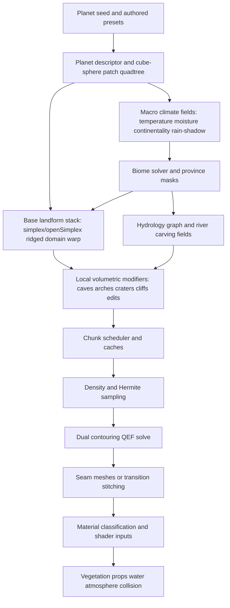
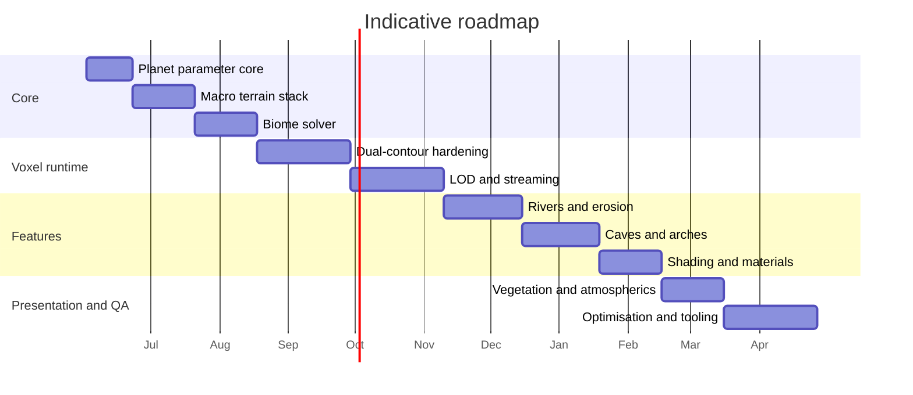

# High-Fidelity Procedural Terrain for Dual-Contour Voxel Planets

## Executive summary

Public material on *No Man’s Sky* makes two things clear. First, Hello Games treats procedural generation as a full world-building architecture rather than a single terrain algorithm: public GDC talks describe continuous real-time planet generation, “realistic and alien terrains”, and programmer-generated worlds and art; recent official *Worlds* updates emphasise varied biomes, dramatic terrain, improved lighting, water, and atmospheric presentation. Second, the visual target is not achieved by noise alone, but by layering macro landform generation, biome logic, materials, lighting, water, vegetation, and streaming into one coherent pipeline. A voxel engine that wants comparable *perceived* quality should therefore copy the *architecture of layered systems*, not search for one “best noise”. citeturn20search0turn20search2turn56image0

For an existing dual-contour voxel engine, the strongest architecture is a **hybrid planetary shell**: keep a low-frequency planetary surface definition in spherical space, but instantiate **near-surface sparse voxel chunks** only where the player can interact, dig, fly low, or see silhouettes that benefit from true volumetrics. That gives you what heightfields cannot—overhangs, arches, cave mouths, stacked strata, undercuts, and destructibility—without paying to voxelise an entire planet at high resolution. Dual Contouring of Hermite data remains a strong basis because it supports octrees, preserves sharp features from intersection points and normals, and was explicitly developed to avoid restricted-octree assumptions and crack patching *within* the signed octree contouring method itself. In production, however, cross-chunk and cross-LOD stitching still needs explicit engineering. citeturn30view0turn32view0turn18search12turn35view0turn35view1

The recommended terrain synthesis stack is: **Simplex/OpenSimplex2/SuperSimplex for the main coherent field**, **ridged fractals for mountains**, **domain warping for large-scale irregularity**, **Worley/cellular signals for cliffs, talus, cracked rock, and biome breakup**, and **hydrology-driven river generation plus selective erosion/weathering** to create the landforms that players actually read as “real”. Perlin remains useful for compatibility and some 2D masks, but modern guidance from practitioners and algorithm authors points to simplex-style families as better defaults when isotropy and higher-dimensional behaviour matter. Worley remains valuable not as a base height function, but as a structural secondary signal. citeturn23view0turn25view0turn53view0turn55view0turn27view0turn9search3

Biome quality should come from **climate-driven fields plus spatial provinces**, not from a single biome noise texture. The most robust solution is a hybrid of temperature, moisture, altitude, continentality, rain-shadow, and drainage, perturbed by Voronoi-style macro regions and multi-scale noise, then blended with spline remaps and transition bands. That approach is consistent with ecological temperature/precipitation biome mapping, with multi-biome terrain research such as AutoBiomes, and with production tool pipelines such as Ubisoft’s *Far Cry 5*, which publicly described procedural tools for biomes, freshwater networks, terrain texturing, cliffs, and vegetation. citeturn13search4turn13search3turn45search0turn45search4turn46view0turn14search6turn14search12

If I had to compress the implementation advice to one sentence, it would be this: **treat terrain as a deterministic field stack with three scales—planet-scale climate and geology, regional hydrology and biome segmentation, and local voxel volumetrics—then mesh only the local volumetric band with dual contouring and spend serious engineering effort on seams, material blending, and art direction**. That is the most credible path to a high-end result on unspecified target platforms. citeturn20search2turn43view0turn41view0turn30view0turn51view0

## Survey of algorithms and techniques

### Noise synthesis for macroform, relief, and detail

Ken Perlin’s 2002 “Improving Noise” paper is still foundational because it fixed two practical issues in classic noise: the old interpolant had second-order discontinuities, and the old gradient set had directional bias. The improved formulation uses a quintic interpolant with zero first and second derivatives at the endpoints and a carefully chosen gradient direction set, and Perlin reported roughly a ten percent speed-up over the older implementation in his benchmark. That makes improved Perlin a valid baseline, especially for 2D control maps and compatibility work. citeturn23view0

For new terrain work, simplex-style noise is the better default. Gustavson’s tutorialised simplex paper notes lower computational complexity than classic Perlin in higher dimensions, continuous gradients, fewer directional artefacts, and cheap evaluation; FastNoise2’s current guidance similarly calls Simplex the “defacto go-to” for high-quality coherent noise, with better isotropy and fewer grid artefacts than Perlin. In practice, that matters in voxel engines because you often evaluate 3D and 4D fields—for density, domain warp, cave masks, animated clouds, and time-varying effects—not just 2D height functions. citeturn25view0turn53view0

OpenSimplex/OpenSimplex2 are best understood as implementation families rather than one paper-standard algorithm. The OpenSimplex2 repository documents why newer variants were introduced: legacy OpenSimplex had less consistent contrast in 3D/4D and broke down in higher dimensions, while OpenSimplex2 revisits layouts and gradient tables for better probability symmetry and uniformity. The same repository explicitly recommends OpenSimplex2S as a particularly good choice for ridged-noise use cases when you are feeding individual layers into an absolute-value transform. That makes OpenSimplex2S a strong candidate for mountain and cliff fields in a voxel terrain stack. citeturn55view0

Steven Worley’s cellular basis function is not a replacement for coherent gradient noise; it is a complement. Worley’s original paper defines functions such as **F1** and **F2** as distances to the closest and second-closest feature points, shows that **F2 − F1** accentuates Voronoi boundaries into vein-like tracery, and notes that fractal combinations of these bases produce visually rich results such as crusts, flagstone, crumpled surfaces, and water-like roughness. Modern noise libraries expose the same logic as cellular distance variants and cell-value lookups. In terrain, the best use is secondary structure: cracked desert crust, cliff banding, weathered rock, canyon wall breakup, region colouring, and province masks. citeturn27view0turn53view0

Ridged multifractals remain one of the highest-value terrain transforms because they turn otherwise soft noise into peak-and-canyon structure. Libnoise describes ridged-multifractal noise as Perlin-like octave summation with absolute-value modification; FastNoise2 describes ridged fractals as creating sharp ridges and valleys, especially suitable for mountain ranges. The practical implication is important: **do not** build all mountains from plain fBm. Use ridged fields for the main relief skeleton, then add lower-amplitude fBm and cellular breakdown for realism. citeturn9search3turn54view0

Domain warping is where many terrain systems become materially more convincing. FastNoise2’s documentation is useful here because it is operational rather than purely theoretical: it exposes warp amplitude, feature scale, gain, weighted strength, octaves, lacunarity, and both “progressive” and “independent” fractal warp modes. The production lesson is that even modest warp of low-frequency fields removes recognisable grid regularity, while progressive multi-octave warping produces continent, ridge, shoreline, and badlands shapes that look considerably less synthetic than plain octave sums. citeturn54view3turn54view4

My recommended **starting ranges** for a high-end voxel terrain stack are these. Use them as tuning seeds, not dogma. For macro continentality or large mountain provinces, use simplex or OpenSimplex2 with **2–4 octaves**, **gain 0.35–0.55**, **lacunarity 1.8–2.2**, and **domain-warp amplitude around 0.15–0.5 of the base feature size**. For major mountain relief, use ridged simplex/OpenSimplex2S with **3–5 octaves**, **gain 0.45–0.6**, **lacunarity 2.0–2.4**, then apply a separate erosion/strata stage rather than pushing octave count too high. For local breakup, add cellular **F2 − F1** or cell lookups at **5–20 percent** of local relief amplitude. For cave density masks, stay conservative: **2–4 octaves** of 3D coherent noise plus hand-shaped tunnel graphs or worm splines beats brute-force thresholding of many octaves. These recommendations are an implementation inference based on the behaviour documented in the cited noise sources and on the fact that each extra octave and each independent field multiplies generation cost. citeturn53view0turn54view0turn54view1turn54view4turn55view0turn27view0

### Biomes, distribution, and blending

The biome problem is part ecology, part art direction, part streaming. Climate literature and ecological visualisation commonly map terrestrial biomes in temperature/precipitation space, and Whittaker-style diagrams remain a useful abstraction because they explain *why* desert, grassland, forest, taiga, tundra, and rainforest should appear where they do. In procedural terrain terms, that means a biome should usually be a function of **temperature, moisture, altitude, drainage, and sometimes insolation**, not only latitude or an arbitrary biome noise. citeturn13search4turn13search3

Research systems that explicitly target multi-biome landscapes now tend to adopt climate-aware logic. AutoBiomes combines procedural terrain generation with DEM-style sources, a simplified climate simulation, and automated asset placement to create plausible biome distributions; the extended Voronoi approach by Choroś and Topolski uses Voronoi regions plus Gaussian blur for different biome zones that still blend smoothly. Put together, these point toward a strong production strategy: **use climate fields for ecological plausibility, Voronoi/province fields for macro regional identity, and noise perturbation for natural borders**. citeturn45search0turn45search4turn46view0

For a procedural planet intended to feel rich rather than repetitive, I recommend **12–16 primary terrestrial biome archetypes**, plus **modifier biomes** rather than dozens of hard-coded top-level biome classes. Primary archetypes should cover ocean, coast/beach, desert dunes, rocky desert/badlands, shrubland, grassland/savanna, temperate broadleaf forest, temperate conifer forest, rainforest/jungle, wetland/swamp, alpine meadow, high mountain rock, boreal forest/taiga, tundra, glacier/icecap, and one “barren or exotic” catch-all for hostile or alien planets. Then add modifiers such as volcanic, cratered, geothermal, fungal, crystal/mineral, riverbank, oasis, canyon, and cave-interior. This yields a manageable authoring scope while creating far more than sixteen *perceived* biomes through material and prop variation. That recommendation is consistent with ecological classification, multi-biome terrain work, and official *No Man’s Sky* messaging around varied biomes and dramatic terrain. citeturn13search4turn13search3turn45search0turn56image0

Blending is where many engines lose quality. Hard biome assignment creates visible “strategy-game borders”. The better approach is **multi-scale weighted blending**. Compute continuous weights from climate fields, then modulate them with province masks and local terrain attributes such as slope, curvature, wetness, and soil depth. Use spline remaps to shape the transitions, and preserve a transition band wide enough that both biome materials and props can cross-fade. The Voronoi-plus-blur literature explicitly targets smooth boundaries, and production terrain systems likewise rely on layered textures, freshwater networks, cliffs, and vegetation rather than isolated biome blocks. citeturn46view0turn14search6turn14search12

A robust practical formula is: **macro biome = climate weight field; meso biome = province mask; micro biome = terrain-condition override**. That lets you say, for example, “temperate forest climate, but exposed ridge override, swamp override in concavities near slow water, alpine override above snowline, and geothermal override around volcanic fissures.” This is also the cleanest path to avoiding sameness on planets: not by exploding the biome count, but by composing biomes with terrain-condition overlays. citeturn45search0turn43view0turn41view0

### Erosion, rivers, caves, materials, texturing, and art layers

Terrain layering should be treated as a physical stack and an art stack. A sound production hierarchy is: **base terrain**, then **erosion/weathering**, then **sediment and soils**, then **water and wetness**, then **vegetation placement**, then **procedural detail props**, then **atmosphere and clouds**. Št’ava et al. are especially relevant because their hydraulic erosion work is explicitly *layered*: multiple materials with different erosion properties, exposed-layer erosion, sediment deposition into top layers, slippage of banks, and a GPU implementation designed for interactive feedback. That layered view is much closer to how game terrain should be authored than the older “single noise heightmap” paradigm. citeturn41view0turn42view1

For rivers, the strongest published guidance is to generate **drainage structure first**, then carve and texture the terrain around it. Genevaux et al. define a hierarchical drainage network as a geometric graph, build watersheds from it, classify river elements, and generate the final terrain from a construction tree of hills, mountains, valleys, and river primitives combined by blending and carving operators. That is an excellent match for a voxel engine because the graph can be computed coarsely in spherical or surface space, then projected down into voxel density edits and material masks in active chunks. Ubisoft’s *Far Cry 5* production material reinforces the same point from the industry side: biomes, freshwater networks, cliffs, and vegetation were developed as one procedural ecosystem. citeturn43view0turn44view1turn14search6turn14search12

My recommendation is to separate rivers into **three representations**. Use a **coarse hydrology graph** for drainage logic and persistence; use a **surface carve field** for terrain shaping, banks, terraces, and floodplains; and use a **render water spline or flow field** for the visible water. Trying to derive all three from the same local voxel simulation is wasteful. Instead, run the graph at low resolution, derive flow accumulation and river class from it, and bake those into local chunk modifiers. Then reserve real local simulation for special set pieces, erosion events, or player-driven edits. That follows the performance implications of the hydrology and erosion literature while retaining controllability. citeturn43view0turn41view0

Caves should not be generated by one method only. The FDG cave paper proposes a three-step GPU pipeline—L-system structural growth, noise-perturbed metaball carving, and isosurface extraction—and explicitly notes that cave believability in games comes from balancing structure, speed, and controllability. Its discussion section is particularly relevant here because it identifies a future path toward Hermite data and Dual Contouring or Dual Marching Cubes. In a dual-contour voxel game, the production-grade solution is therefore usually a **hybrid**: tunnel graphs or worm splines for connectivity and navigation, 3D noise/carving for wall richness, cellular automata only for selected sub-biome cave chambers, and material/humidity logic for interior differentiation. citeturn48view0turn49view1

Materials are as important as geometry. Unreal’s documentation on virtual texturing is explicit that runtime virtual textures are well suited to complex, procedurally generated, layered materials and to landscapes, while triplanar mapping is a standard terrain-oriented projection method precisely because hand-authored UVs are impractical on large terrain surfaces. Unity’s contemporary terrain-layer documentation is also revealing as an industry proxy: terrain layers hold diffuse, normal, and mask-map data; mask maps commonly encode metallic, AO, height, and smoothness; and the number of simultaneously assigned layers impacts rendering cost, with single-pass HDRP support capped at eight visible layers per terrain tile and older pipelines effectively encouraging four layers per pass for maximum performance. These are engine-specific implementations, but they strongly support a general production rule: **distinguish your total material library from the number of materials you blend simultaneously in a draw call**. citeturn51view0turn51view1turn51view2turn52view0turn52view1

My recommended material policy is this. Maintain a **global reusable terrain material library of roughly 24–40 families** across the game, but restrict a given terrestrial planet to **8–14 active material families** and a given chunk or draw to **4–8 concurrent blends until virtual texturing is in place**. Choose materials using rules from **biome weights, altitude, slope, curvature, convexity/concavity, flow accumulation, soil depth, cave humidity, and local rock/strata noise**. Then add colour and roughness variation through biome palettes, depth-based stratification, and low-frequency hue/value modulation, instead of authoring a unique material for every place. That recommendation is an engine-side inference from the cited terrain-layer and VT documentation and from what production pipelines expose as economically scalable. citeturn51view0turn51view1turn52view0turn52view1

Finally, the art layers that create “premium” planetary terrain are publicly documented enough to state with confidence. Ubisoft’s procedural-world pipeline explicitly extended into vegetation, while Unreal’s foliage documentation shows the expected production pattern of multiple foliage types, blocking volumes, landscape materials, and terrain-driven placement. For atmosphere, Bruneton’s classic work established ground-to-space atmospheric scattering, and Hillaire’s later production-ready method emphasised a physically based approach that is cheap to compute and avoids some LUT-artifact issues. Frostbite cloud work further shows the practical value of combining Perlin and Worley noise for dynamic volumetric clouds projected over a planetary dome. In other words: once your terrain core works, the visual jump to a *No Man’s Sky*-class impression comes disproportionately from **flora distribution, cloudscape, aerial perspective, wetness, shadows, and palette discipline**. citeturn14search12turn51view4turn50search3turn50search1turn50search8

## Recommended dual-contour voxel architecture

The best architecture for adapting an existing dual-contour voxel engine to very high-quality procedural planets is a **five-layer data model**.

At the top is a **planet descriptor**: seed, radius, axial tilt, sea level, climate constants, biome palette set, noise graph IDs, geological presets, and atmosphere/cloud parameters. Public talks about *No Man’s Sky* underline the importance of this deterministic “parameter pack” approach: worlds are generated continuously from mathematics, and recent update messaging shows that terrain, lighting, water, and biome variety are all parameterisable presentation layers rather than hand-built worlds. citeturn20search0turn20search2turn56image0

The second layer is a **surface-space macrofield cache**, ideally on a cube-sphere or other planet-friendly patching scheme. For each surface patch, cache low-frequency temperature, moisture, rain-shadow, continentality, tectonicness, erosion susceptibility, and biome weights at a coarse resolution. These fields are cheap compared with voxel density and should be cached aggressively because they are reused in every local chunk query. A quadtree on the six cube faces is usually the most practical implementation because it gives straightforward patch LOD and avoids singularities at the poles. The literature here does not prescribe one planet parameterisation, but the clipmap and continuous-world sources strongly support a viewer-centred multiresolution surface cache. citeturn20search2turn37view0turn38view1

The third layer is a **near-surface voxel shell**. This is the key architectural recommendation. Do not instantiate the whole planet as uniform voxels. Instead, for active regions, define a shell band around the procedural reference surface—deep enough to contain caves, arches, river cuts, craters, and editing, but shallow enough to remain sparse. Each active brick stores corner samples for a density field, plus compact metadata. A sensible initial payload per lattice sample is: **16-bit density**, **dominant material ID or packed material pair**, **small flag field**, and nothing else that you cannot cheaply recompute. Avoid permanently storing large biome-weight vectors or derived slope/curvature; those should come from the macro caches or be recomputed per chunk. The main reason is simple memory hygiene: dual contouring already needs sampling, intersection tests, normals, QEF solves, and mesh buffers. citeturn30view0turn39view0turn17search16

The fourth layer is an **edit and feature stack**. Represent density as a composition:

\[
D(\mathbf{p}) = D_{\text{planet}}(\mathbf{p}) + D_{\text{biome/macro}}(\mathbf{p}) + D_{\text{rivers}}(\mathbf{p}) + D_{\text{caves}}(\mathbf{p}) + D_{\text{props/landmarks}}(\mathbf{p}) + D_{\text{player edits}}(\mathbf{p})
\]

This mirrors the construction-tree logic in the hydrology paper and fits dual contouring well because each term can supply density and, ideally, an analytic or semi-analytic gradient for Hermite normals. If analytic gradients are not available for every feature, use central differences as a fallback. Reserve persistent storage for the final edit deltas and authored landmarks, not for all procedurally generated base density. citeturn43view0turn30view0turn32view0

The fifth layer is a **render and simulation façade** over the density field: material classifier outputs, water surface representations, vegetation spawn points, collision simplifications, and atmospheric parameters. This separation matters because water rendering, foliage, and cloud rendering often want continuous surface-space data even when the terrain under them is locally volumetric. citeturn51view0turn51view4turn50search1

A practical mesh-generation path for each active chunk is: sample density corners with a 1-voxel apron; find sign-changing edges; compute edge intersections and normals; build one QEF per active cell; solve the QEF using a numerically stable method with mass-point fallback for rank-deficient cases; emit topology from the sign structure; then run mesh post-passes for seam ownership, collision extraction, and material weights. Ju et al. define the Hermite formulation and octree contouring; Schaefer and Warren add important implementation details around QEF storage, numerically stable QR-based handling, rank deficiency, and geometry updates during CSG-style edits. citeturn30view0turn32view0turn33view0

On LOD, I recommend a two-part policy. **Inside one adaptive octree region**, keep dual contouring as coherent as possible so you benefit from its crack-free adaptive properties. **At chunk and brick boundaries**, especially if your existing engine is already chunked, treat seam generation as a separate production system. Lengyel’s Transvoxel work is not dual contouring, but it is still highly instructive because it tackles the general problem that voxel terrain LOD seams are substantially harder than heightfield seams, and it shows how transition cells can stitch cracks, holes, and shading artefacts between different resolutions. If your current engine already has chunked independent meshing, it is usually cheaper to add deterministic seam ownership and transition meshes than to rebuild the whole terrain runtime as one monolithic octree. citeturn35view0turn35view1turn35view3turn36view0

For far-field storage and streaming, there are two scalable options. The first is **dense active bricks plus procedural regeneration**, which is the best route early on. The second is a **sparse voxel octree or paged brick hierarchy** for cached or edited regions. Laine and Karras show how sparse voxel octrees can compactly encode voxels, shading attributes, and contour information with out-of-core-friendly pointer structures, while out-of-core SVO construction work shows the value of Morton ordering and streaming construction. In a game engine, that translates to this rule: keep the edit hot set in dense brick pools for fast access, and push colder edited content into a sparse paged hierarchy when players move away. citeturn39view0turn40view1turn17search16

Collision should follow the same tiered logic. Use an **exact or near-exact collision mesh** for nearby gameplay chunks, a **simplified mesh or lower-frequency SDF** for mid-range interactions, and no fine collision at distances where gameplay cannot be affected. Unity’s terrain documentation is a reminder that even simple terrain systems add explicit “thickness” controls to keep collision robust; in a voxel engine, the equivalent is to keep a coherent signed field or simplified collision façade instead of assuming the render mesh alone is sufficient everywhere. citeturn52view1

The overall data and generation flow should look like this:

This flow is a synthesis of the dual contouring literature, hydrology/erosion research, terrain LOD work, virtual texturing practice, and public production talks on procedural worlds. citeturn30view0turn43view0turn41view0turn37view0turn51view0turn20search2

## Implementation plan and validation

The following roadmap assumes one experienced engine programmer, one part-time technical artist, and existing dual-contour meshing already in place. If you have a stronger tools, rendering, and content team, several steps can run in parallel.

| Milestone | Main deliverable | Effort | Indicative duration | Validation gates |
|---|---|---:|---:|---|
| Planet parameter core | Deterministic planet descriptor, patch quadtree, coarse climate cache, debug seed browser | Medium | 3 weeks | Same seed reproduces identical planets; patch seams stable in spherical space; climate maps render correctly |
| Macro terrain stack | Hybrid simplex/OpenSimplex/ridged/domain-warp landform graph with altitude, slope, curvature outputs | Medium | 4 weeks | Horizon silhouette variety; no obvious grid artefacts; parameter presets produce recognisably different planet classes |
| Biome solver | Temperature/moisture/province-based biome weights with spline blending and palette presets | Medium | 4 weeks | Biome heatmaps stable across patch borders; no hard seams; Whittaker-style scatter plots show plausible coverage |
| Dual-contour integration hardening | Stable QEF solver, rank-deficiency handling, deterministic border ownership, active-chunk shell band | High | 6 weeks | No mesh cracks on same-LOD chunk borders; no catastrophic QEF spikes; edit operations regenerate locally only |
| LOD and streaming | Chunk scheduler, cache eviction, multiresolution chunk selection, seam/transition system | High | 6 weeks | Free-flight over varied terrain shows no holes, flicker, or popping beyond target tolerance; memory stays inside budget |
| Rivers and erosion | Coarse drainage graph, river classes, carve masks, wetness/flow maps, selective erosion pass | High | 5 weeks | Every major river has an outlet or basin; rivers flow downhill in coarse validation; riverbanks and floodplains look intentional |
| Caves and arches | Tunnel graph + 3D noise carving + cave biome/material logic + cave-aware collision | High | 5 weeks | Cave connectivity metrics pass; entrances look natural; overhangs and arches survive meshing and LOD |
| Shading and materials | Triplanar, material masks, RVT-ready path, biome palettes, strata modulation, wetness | Medium | 4 weeks | Steep cliffs show no UV stretching; material transitions are height/slope aware; repeated tiling not obvious |
| Vegetation and atmospherics | Biome-aware flora and rock spawning, placement masks, aerial perspective, sky/cloud integration | Medium | 4 weeks | Props follow biome rules; silhouettes read at multiple scales; atmosphere improves depth without crushing colour |
| Optimisation and tooling | Compute or job parallelism, profiling HUD, debug overlays, tuning presets, regression tests | High | 6 weeks | Chunk generation time, memory, and visible-triangle targets achieved on low/mid/high presets |

The single most important validation strategy is to make every layer debuggable in isolation. You want live overlays for **density slices, QEF error, border ownership, active LOD level, climate maps, biome weights, slope, curvature, flow accumulation, river classes, cave occupancy, material weights, vegetation candidates, and GPU/CPU timings**. Without these, procedural terrain tuning becomes guesswork. That conclusion follows directly from both the public procedural-world talks and the structure of the research pipelines, which all separate generation stages and intermediate fields. citeturn20search0turn14search6turn45search0turn43view0

Automated tests should include **determinism**, **chunk border continuity**, **LOD seam stability**, **mesh topology sanity**, **river downhill validity on the coarse graph**, **cave connectivity**, and **distributional tests** that catch content collapse, such as “all planets becoming mountain-heavy” or “desert appearing at implausibly cold temperatures”. For dual contouring specifically, add regression scenes containing flat planes, sharp polyhedral cuts, thin walls, arches, caves, non-manifold sign configurations, and repeated edits, because these are exactly the scenarios highlighted in the contouring and seam literature. citeturn30view0turn32view0turn35view0

An indicative timeline, assuming serial delivery, looks like this:

If schedule pressure is high, the best cut is **full erosion simulation**. You can ship a convincing first version with hydrology-graph rivers, terrain carving, biome-aware texturing, caves, and strong art direction, then add selective hydraulic erosion later. The second-best cut is **runtime virtual texturing**; triplanar plus good masks can carry quite far before VT is required. citeturn41view0turn43view0turn51view0turn51view2

## Comparative tables

The tables below combine source-stated properties and implementation recommendations. Where a row contains a numeric range, treat it as a **recommended starting point** derived from the cited research and documentation, not as a universal constant. citeturn23view0turn25view0turn27view0turn53view0turn54view0turn54view4turn55view0

### Noise types and recommended use

| Noise family | Primary strengths | Main weaknesses | Best role in a voxel planet stack | Recommended starting range |
|---|---|---|---|---|
| Improved Perlin | Familiar, stable baseline; smooth quintic interpolation; good 2D masks | More directional bias than simplex-style noise; poorer high-dimensional behaviour | 2D climate masks, compatibility, some local deformation | 3–5 octaves, gain 0.45–0.55, lacunarity 1.9–2.1 |
| Simplex | Good isotropy, good quality/speed trade-off, scales better to higher dimensions | Not always a visual drop-in for classic Perlin | Default coherent base for 3D density and 4D effects | 4–6 octaves for fBm; gain 0.4–0.55; lacunarity 1.8–2.2 |
| OpenSimplex2F / 2S | Better uniformity than legacy OpenSimplex; good 3D/4D behaviour; 2S especially good for ridged usage | Implementation choice matters; slightly more niche ecosystem | Main field for mountains, organic terrain, animated detail | 2S for ridged mountains; 4–5 octaves; gain 0.45–0.6 |
| Worley / Cellular | Structural breakup, natural cells, cracks, boundaries, province masks, region IDs | Poor direct base-height candidate for most terrain | Cliff breakup, crater rims, cracked ground, biome provinces, cave wall texture | Grid jitter about 0.7–1.0; mix at 5–20% of local relief |
| Ridged fractal | Excellent mountain skeletons, sharp crests and canyons | Overused alone looks synthetic and “procedural” | Mountain chains, serrated ridges, mesas after erosion pass | 3–5 octaves; gain 0.45–0.6; lacunarity 2.0–2.4 |
| Domain warp | Kills regularity, creates natural coastline and ridge distortion | Extra cost; too much warp destroys readability | Macro landform irregularity, biome border perturbation, badlands | Warp amplitude around 0.15–0.5 of base feature scale; 2–4 warp octaves |
| Hybrid stack | Highest realism and controllability | Highest tuning complexity | Final production terrain | Base simplex + ridged mountains + cellular breakup + domain warp + river/cave modifiers |

### Biome architecture for high-quality procedural planets

| Recommended biome tier | Suggested archetypes | Notes |
|---|---|---|
| Primary terrestrial biomes | Ocean, coast/beach, dunes, rocky desert/badlands, shrubland, grassland/savanna, temperate broadleaf forest, temperate conifer forest, rainforest/jungle, wetland/swamp, alpine meadow, high mountain rock, taiga, tundra, glacier/icecap, barren/exotic | This 12–16 biome range is the best balance between richness and authoring cost |
| Modifier biomes | Riverbank, floodplain, canyon, oasis, geothermal, volcanic, cratered, fungal, crystal/mineral, cave interior | Use as overlays, not as independent world-scale classes |
| Climate drivers | Temperature, precipitation/moisture, altitude, continentality, drainage, rain-shadow, latitude/insolation | Temperature/precipitation pairing is the ecological backbone |
| Spatial organisation | Climate field + Voronoi/province masks + multi-scale perturbation | Gives both plausibility and strong regional identity |
| Blending strategy | Continuous biome weights, spline remaps, transition bands, local terrain-condition overrides | Avoid hard biome IDs except for tools and content tagging |

The ecological and procedural basis for this table comes from Whittaker-style climate reasoning, multi-biome procedural terrain work, smooth Voronoi biome techniques, and production tool pipelines that tie terrain, freshwater, cliffs, and vegetation together. citeturn13search4turn13search3turn45search0turn46view0turn14search6turn14search12

### Practical material counts

| Scope | Recommended count | Why |
|---|---:|---|
| Global reusable terrain material library | 24–40 families | Large enough to support multiple planet categories without asset explosion |
| Active terrain material families on one terrestrial planet | 8–14 | Enough for biome diversity, strata, deposits, snow/ice, wetness, volcanic overlays |
| Simultaneously blended materials per chunk without VT | 4–8 | Beyond this, shader bandwidth and texture sampling usually become uncomfortable |
| Simultaneously blended materials with VT/RVT path | 8–12 | More practical once texels are cached on demand and layered materials are flattened |
| Distinct prop families per primary biome | 6–20 | Needed to avoid visual repetition more than extra base materials |

This recommendation is an inference informed by modern terrain-layer systems and virtual texturing practice: mainstream terrain renderers expose limited efficient simultaneous layers, while VT exists precisely to make large layered materials more memory-stable and performant. citeturn51view0turn51view1turn52view0turn52view1

### Performance and memory trade-offs

| Design choice | Visual upside | Cost / risk | Recommended stance |
|---|---|---|---|
| 32³-cell active chunks | Good locality, manageable mesh jobs, simple scheduling | More chunks to manage | Best default |
| 64³-cell active chunks | Fewer chunk boundaries, better local continuity | Heavier generation spikes, worse latency, larger transient memory | Use only on high-end or offline preprocessing |
| Full-planet voxels | Conceptual simplicity | Catastrophic storage and streaming cost | Avoid |
| Near-surface voxel shell | Preserves caves/arches/destruction with bounded memory | Requires good shell-depth policy | Strongly recommended |
| Dense brick hot set | Fast edit and meshing path | Less compact than far sparse storage | Use for active regions |
| Sparse voxel hierarchy for cold data | Better out-of-core behaviour | More complex update path | Add after core pipeline is stable |
| CPU job-system meshing first | Easier debugging, deterministic logging | Higher CPU cost | Best for first shipped version |
| GPU density and meshing early | Excellent throughput potential | Harder debugging and seam correctness | Phase in after correctness passes |
| No virtual texturing | Simpler renderer | Layer count and material richness limited | Acceptable for milestones, not ideal final state |
| VT / RVT path | Bigger material space, flatter runtime cost | More tooling and render integration work | Recommended for final quality tier |

The LOD and storage rows are grounded in the clipmap, Transvoxel, and sparse-voxel literature; the material rows are grounded in VT and terrain-layer documentation. citeturn37view0turn35view0turn35view3turn39view0turn17search16turn51view0turn52view0

## Key papers, talks, and limitations

The most useful papers and talks to keep on your desk while building this system are these: Ken Perlin’s **“Improving Noise”** for the improved Perlin baseline; Stefan Gustavson’s **“Simplex Noise Demystified”** for simplex intuition; Steven Worley’s **“A Cellular Texture Basis Function”** for cellular patterns and practical combinations; Ju, Losasso, Schaefer, and Warren’s **“Dual Contouring of Hermite Data”** for the meshing backbone; Schaefer and Warren’s **“Dual Contouring: The Secret Sauce”** for QEF implementation details; Lengyel’s **voxel terrain dissertation / Transvoxel** material for multiresolution voxel seams; Losasso and Hoppe’s **Geometry Clipmaps** for viewer-centred terrain caching; Št’ava et al.’s **hydraulic erosion** paper for layered erosion; Genevaux et al.’s **hydrology-based terrain generation** for river graphs and construction trees; the **Sean Murray** and **Innes McKendrick** GDC talks for a public view into continuous procedural planet generation; Ubisoft’s **Far Cry 5** procedural world-generation talk for tool-based biome/freshwater/vegetation production; and Hillaire/Bruneton atmosphere work for ground-to-space sky rendering. citeturn23view0turn25view0turn27view0turn30view0turn32view0turn18search20turn37view0turn41view0turn43view0turn20search0turn20search2turn14search6turn50search1turn50search3

Two limitations matter. The first is that **the exact internal terrain implementation of *No Man’s Sky* is not fully public**; this report uses public talks and official update text as a quality benchmark, not as a reverse-engineered statement of Hello Games’ current production code. The second is that **published production guidance on dual-contouring seam handling is thinner than the marching-cubes/Transvoxel literature**, so the seam recommendations above are partly inferential: they are well supported by the general multiresolution voxel literature, but your exact implementation will depend on how chunked, editable, and GPU-driven your current engine already is. citeturn20search0turn20search2turn56image0turn30view0turn35view0turn18search12

The highest-confidence bottom line is therefore straightforward: **build a climate-aware, hydrology-aware, layered field stack over a sparse near-surface voxel shell; keep simplex/OpenSimplex2 and ridged/domain-warped hybrids at the core; spend major effort on chunk seams, materials, and art-directed presentation; and let dual contouring do what it is best at—preserving local volumetric complexity where heightfields fail.** That is the most rigorous and scalable route to very high-quality procedural terrain in a voxel planet engine. citeturn30view0turn43view0turn53view0turn55view0turn51view0