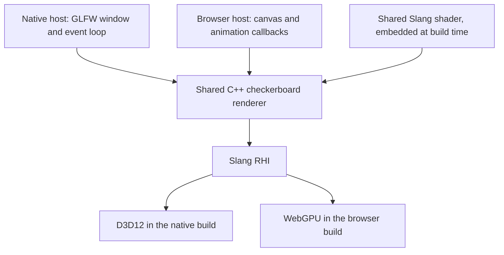

# Native and browser rendering baseline

OFG currently renders a checkerboard through Slang RHI on Windows D3D12 and browser WebGPU. This small application is the executable reference for adding the terrain laboratory. Build and run commands live in [DEVELOPING.md](../DEVELOPING.md); future milestones live in the [bootstrap plan](plans/terrain-lab-bootstrap.md).

## One renderer, two hosts

Each build compiles the shared C++ sources with its own toolchain. The native executable does not run through WebAssembly. The browser builds that C++ into WebAssembly and uses Emscripten's WebGPU port; it does not build a desktop Dawn checkout.

| Source | Responsibility |
| --- | --- |
| [src/main.cpp](../src/main.cpp) | Creates the native device/window, polls events, handles resize and presents frames. Also provides the finite `--check-device` path. |
| [src/web-main.cpp](../src/web-main.cpp) | Creates the browser device/surface, sizes the canvas in physical pixels and submits frames from animation callbacks. |
| [web/shell.html](../web/shell.html) | Owns the HTML canvas, visible status/error messages and small automation readiness signals. |
| [src/checkerboard.cpp](../src/checkerboard.cpp) | Creates the Slang shader program and render pipeline, then submits a full-target draw. Its [header](../src/checkerboard.h) defines the two shared operations. |
| [shaders/checkerboard.slang](../shaders/checkerboard.slang) | Generates one full-screen triangle and alternating 64-pixel squares without vertex buffers or texture assets. |
| [external/CMakeLists.txt](../external/CMakeLists.txt) | Selects the platform's RHI backend and adds GLFW only for native builds. |

The shader is embedded in a generated header by root CMake. Editing it triggers regeneration and recompilation. At runtime, Slang compiles the embedded source for the selected backend. This avoids working-directory-dependent shader paths and currently requires shipping the Slang compiler with each application.

The shared renderer receives a queue, pipeline and target texture. It submits work; the host owns presentation and lifecycle. There is no general engine layer or second graphics abstraction over RHI.

## Ownership and frame flow

The native host creates a device, GLFW window, surface, graphics queue and pipeline. Each frame polls events, updates the surface if its framebuffer size changed, acquires an image, draws and presents. Minimized windows wait for events. Queue completion precedes swap-chain recreation and teardown. RHI handles use `ComPtr`; the surface is released before the window is destroyed.

The browser host initializes once and transfers its application state to Emscripten's animation loop. RHI device initialization yields through Asyncify while browser promises complete. Frames adjust the canvas to CSS size multiplied by device pixel ratio, acquire an image, draw and present without a blocking per-frame wait. On a reported rendering failure, the loop is cancelled before its application state is released. Normal browser lifetime ends with page teardown; reload is part of the smoke check.

Keep future shared rendering independent of GLFW, the DOM and platform event loops. Hosts should own those differences. Add helpers when repeated behavior or a real lifetime contract requires them. Future terrain addressing, generation and residency logic should be independently testable without a GPU; that separation is a design direction, not an existing CPU library.

## Build and verification boundaries

| Preset | Target and output | Verification |
| --- | --- | --- |
| `native-debug` | `ofg` and `ofg-render-test` in `build/native` | CTest device startup and doctest offscreen pixel checks; visual inspection of the window. |
| `web` | `ofg-web`, producing HTML/JS/WASM in `build/web` | Playwright screenshot checks, console diagnostics, resize, reload and missing-WebGPU messaging. |

The full C++ test suite stays native, as requested. [The browser smoke script](../tools/browser-smoke.mjs) checks presentation without porting every native test. It owns an isolated Chrome instance and temporary loopback server and closes both afterward. Node packages are browser tooling dependencies, not native build dependencies.

Verified baseline: native D3D12 device/render tests and window interaction pass; the same shader renders in Chrome WebGPU with resize and reload. Native offscreen tests compare every RGBA8 pixel at small/odd dimensions. Browser screenshots check cell boundaries and allow the surface's consistent UNORM or sRGB encoding. Neither test suite establishes all graphics features or long-running resource residency.

Screenshots and diagnostic reports are local, ignored outputs under `artifacts/checkerboard` and `artifacts/browser-smoke`. Regenerate them with the documented workflow; the source, test scripts and recorded outcomes are the durable checkpoint. The [native build skill](../.agents/skills/build-native/SKILL.md) and [browser build skill](../.agents/skills/build-web/SKILL.md) guide agents through those workflows.

## Current limits

The browser WASM includes the Slang compiler and is about 26 MB before compression. Emscripten warns about mixing Asyncify and WASM exceptions; the settings follow the pinned RHI preset, and only the exercised paths are verified. Browser adapter descriptions may be empty and must not be inferred from the native GPU. The preferred native and browser color formats may differ.

ImGui, texture sampling, compute, GPU-independent CPU tests, terrain and streaming are still ahead. The checkerboard is the current example; extend the application in small tested steps and preserve this render check as the baseline.
