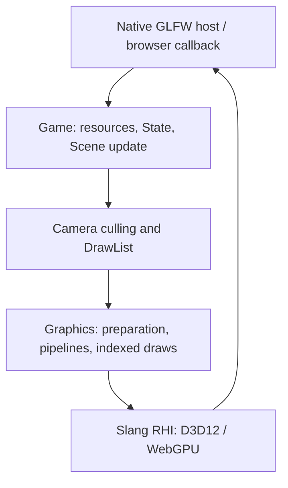

# Scene rendering architecture

OFG renders the [PBR sphere laboratory](pbr.md) through shared C++ and Slang on native Windows D3D12 and browser WebGPU. The original textured cube scene (`--scene` / `?demo=scene`) and checkerboard remain diagnostics. Build/run commands are in [DEVELOPING.md](../DEVELOPING.md); the original scene foundation is tracked by the [scene-object plan](archived/scene-object-rendering.md).

## Frame flow and ownership

The hosts create the device, queue and surface and call `Game::frame(deltaSeconds, target)` before presentation. Native supplies the acquired image as the final output target; HDR intermediate targets belong to Graphics. Browser renders into a host-owned texture, then acquires the canvas image and draws a fullscreen image-load pass into it without yielding: canvas textures expire across event-loop turns. They own window/canvas events and resize. Graphics retains the device/queue through an explicit initialize/shutdown lifecycle. Native drains its queue before swap-chain recreation and shutdown. Browser callbacks do not block the JavaScript event loop. The pinned RHI yields through Asyncify during initial buffer uploads and per-command-buffer uniform staging maps; Emscripten pauses/resumes the main loop during those yields. The OFG/RHI call chains and Emscripten callback thunks are instrumented explicitly, while the embedded Slang compiler is excluded. No explicit per-frame queue drain is added.

Game owns one current Scene and root State. A frame updates Resources, then State, then the current Scene (including any scene installed by State), then extracts and renders. State hook signatures are unchanged; behavior can read `Game::deltaSeconds()`. A null target performs updates only; no selected camera renders the background. Frame reentry, shutdown inside a frame, invalid delta and missing initialization fail explicitly. Shutdown destroys State storage without synthesizing leave hooks.

Scene uniquely owns stable Entity, Camera and MeshRenderer allocations. Entity owns local TRS and a lazy world matrix. Camera uses its Entity's inverse world matrix and a perspective projection. MeshRenderer owns shared Mesh and nullable material overrides. Mesh owns submesh default Materials; Material owns a shared Shader. Resources use shared ownership and a weak keyed lookup independently of scene observers. There are no owning back-references.

DrawList construction conservatively tests the eight mesh-bound corners against the six homogeneous clip planes. It emits one entry per visible submesh in creation order with shared Mesh/Material, submesh index and a copied world matrix. A list survives scene clear; materials must not change between extraction and submission. Graphics classifies PBR queues and sorts transparent object origins back-to-front. There is no spatial index or batching.

## CPU and GPU boundaries

`ofg-core` owns math, observers, State, Scene/components, resource descriptions and draw extraction. It builds and tests without RHI. `ofg-render` owns Graphics, Game, the fixture, and checkerboard rendering, and links both core and RHI. Mesh, Shader, Texture and Sampler privately own forward-declared graphics data; their public headers contain no RHI types.

Graphics lazily creates immutable vertex/index buffers and shader programs. Weak tracking allows shutdown to reset surviving assets' GPU handles. Pipeline entries observe Shader ownership identity, color format, alpha/cull state, mirrored winding and fullscreen classification. Expired Shader entries are pruned each rendered frame; factor changes and clones reuse pipelines. Vertices include position/normal/UV0/tangent/UV1/color; indices are uint32 triangles. Scene geometry uses single sampling and D32Float/Less depth. Blended materials disable depth writes; double-sided materials disable culling. The PBR pass/output contract is detailed below.

Each draw receives independent RHI shader-object storage. Reflection validates every direct `material` field and the required `draw.clipFromLocal` float4x4. Scalars and vectors are explicitly packed; matrices respect reflected row/column storage. Slang compilation uses unique internal module names and paths because its session caches both; resource source names remain in diagnostics. The compiler session may retain compiled modules until device/session destruction; weak application caches do not claim to evict compiler internals.

RHI command buffers retain referenced buffers, pipelines, attachments and bindings. Native queues retain submitted command buffers until completion; WebGPU owns submitted backend work. Assets may be released after submission. No application-level retirement system or permanent owning asset registry is added. Reinitialization recreates GPU data from surviving CPU descriptions.

## Source responsibilities

| Location | Responsibility |
| --- | --- |
| `src/main.cpp`, `src/web-main.cpp`, `web/shell.html` | Device/surface, events, callbacks, acquisition, presentation and error reporting. |
| `src/game.*` | Shared frame order and scene/State ownership. |
| `src/scene/` | Stable entity hierarchy, transform cache and typed components. |
| `src/resources/` | Cooperative loading and immutable Mesh/Shader descriptions, editable Materials. |
| `src/render/draw-list.*` | GPU-independent culling and draw extraction. |
| `src/render/graphics.*`, `resource-gpu-data.h` | Direct RHI preparation, binding, pipelines and GPU lifetime. |
| `src/render/present.*`, `shaders/present.slang` | Final image-load presentation without uniform staging; needed because browser canvas images expire across yields. |
| `src/lab/scene-fixture.*`, `shaders/mesh.slang` | Original cube fixture, on-demand checker image and embedded sampled-color shader. |
| `src/checkerboard.*`, `shaders/checkerboard.slang` | Original full-screen diagnostic and exact pixel regression. |

Shader sources are embedded by CMake; launch does not depend on the working directory. Native and web use separate toolchains/build directories and the same shared code. Native does not depend on Emscripten, Dawn or Python at runtime.

## Verification and limits

CPU tests establish scene/resource/culling contracts. Native offscreen tests establish indexed draws, depth, independent uniforms, scalar/vector/matrix binding, reflected errors, pipeline reuse/separation and release after submission. Native window evidence covers presentation, resize, minimize/restore and normal close. Browser smoke covers scene structure, tint/checker regions, resize/reload, original checkerboard and missing-WebGPU messaging. Evidence and current results are recorded in the plan and DEVELOPING.md.

Scene values are floats near the origin. There is one selected perspective camera and no individual entity/component removal or reparenting. Model import, compute, terrain, streaming, large-world coordinates and custom update components are future work. The dockable ImGui workspace is described below. Lighting and an explicit PBR forward pass sequence are implemented; there is no general render graph. PNG/JPEG material textures and internal GPU mip passes are implemented. No performance or long-running residency claim is made. Emscripten's existing Asyncify/WASM-exception warning remains a portability limitation beyond exercised paths.

The [Khronos PBR source guide](research/khronos-pbr-reference.md) maps the downloaded reference renderer and its shader dependencies. The [PBR integration plan](plans/pbr-rendering.md) records the implementation and validation. Transmission/scattering remain deferred.

## Sampled texture preparation

Texture and Sampler descriptions stay in ofg-core; TextureView retains a Texture and a mip range. Graphics owns `src/render/texture-renderer.*`, which performs base uploads, view/sampler preparation and one render pass per generated mip using `shaders/mipmaps.slang`. All preparation precedes the scene pass and, on web, precedes canvas acquisition. CPU descriptions remain ready independently of GPU compilation/allocation. Resources retain only base pixels for reinitialization.

UNORM8/sRGB8 and float16/float32 in the supported channel layouts share this path. Browser fp32 is gated against the actual RHI device using the generated-source format-report adaptation in `cmake/rhi-webgpu-formats.cmake`; no dependency pin is changed. WebGPU mip attachments use Clear because this RHI maps DontCare to an undefined WebGPU load operation. The [texture contracts](resources.md#sampled-textures-views-and-samplers) describe ownership, filtering, asynchronous I/O, limits and exclusions. The [texture ExecPlan](archived/texture-support.md) records verification.

## PBR forward path

The default fixture is now the [material sphere grid](pbr.md). Shared CPU descriptions include explicit scene lighting,
baked Environment resources, PBR material construction and extended mesh attributes. Graphics retains its direct RHI
ownership and weak program/resource caches, with HDR opaque lighting, output mapping, unlit/sorted-alpha composition
and a final transfer pass. The browser still acquires the canvas only after host-owned rendering is complete. Numerical
semantic indices keep the PBR vertex ABI consistent with the pinned RHI WebGPU layout. Texture/diagnostic paths remain
available. Transmission/scattering and glTF import are separate follow-ups; this does not establish general glTF conformance.

## Laboratory UI

[Workspace](imgui.md) is host-owned and uses one explicit ImGui context. ofg-ui depends on ofg-render and pinned ImGui; ofg-core remains independent. Native uses the upstream GLFW platform backend, while browser input is adapted from Emscripten canvas callbacks. Menu/panel construction determines the physical scene viewport size before Game::frame. The scene renders into display-linear RGBA16F, UI composes into another full-window RGBA16F target, and the resource-only presentation shader performs destination-appropriate transfer. All yielding work precedes browser canvas acquisition.

ImGuiRenderer owns its pipeline/sampler and font texture snapshots. Submitted commands retain immutable per-frame vertex/index buffers and sampled textures; 16-bit index uploads are padded to four-byte lengths for WebGPU without changing draw counts. Workspace owns layout, non-owning entity selection, and initial fixture lighting for reset. No UI API enters scene/core headers except independent Entity display-name accessors. The existing checkerboard and --no-ui / ?ui=0 paths remain diagnostic baselines.
