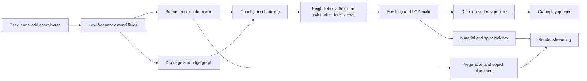
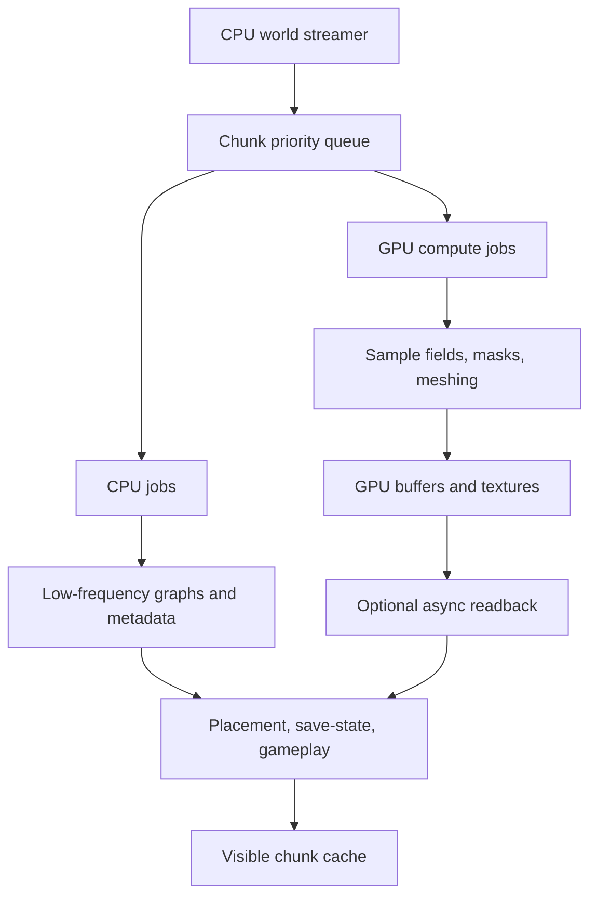

# Real-Time Infinite Procedural Terrain for Games

## Executive summary

The current design space for real-time, effectively infinite procedural 3D terrain is no longer dominated by a single “best” technique. Heightfields remain the simplest and most production-proven option for large outdoor worlds because they are compact, stream well, map naturally to clipmaps, geomipmapping, quadtree LOD, and engine-native terrain systems, and enjoy strong tooling in Unreal and Unity. Their fundamental limitation has not changed: a single-valued heightfield cannot represent overhangs, caves, arches, or truly vertical subsurface structures without auxiliary geometry or a second representation. Volumetric methods based on density fields, signed distance fields, voxel grids, octrees, or sparse volumes solve that limitation, but they replace heightfield simplicity with heavier memory traffic, meshing cost, collision complexity, and more demanding LOD stitching. The most robust modern answer is therefore usually **hybrid**: heightfield or mesh-terrain for the far field and broad traversable landmass, plus local volumetric patches for caves, cliffs, deformable terrain, and authored points of interest. citeturn10view1turn20view2turn10view0turn22view0turn22view1turn25search0

For terrain *synthesis*, classic coherent noise is still the runtime workhorse. Perlin/Simplex-style gradient noise, fBm, ridged variants, cellular fields, and domain warping remain attractive because they provide deterministic random access, cheap evaluation, and clean composition into chunk pipelines. Modern practice has shifted from using one noise function to using **node-graph compositions** of multiple signals and masks; projects such as FastNoise2 formalise this by keeping blends and modifiers inside SIMD-friendly graphs for throughput. More advanced bases such as Gabor noise, sparse convolution noise, and wavelet noise are valuable when directional texture, spectral control, anisotropy, or fewer artefacts matter more than minimal implementation cost. Machine learning has progressed quickly for *authoring* and *style transfer*, but only the newest work begins to address the procedural virtues of terrains—seed consistency, infinite extent, constant-memory access, and local editability. Those ML approaches are promising, but except for a few recent papers and demos they are not yet as mature as noise plus simulation in production game pipelines. citeturn18search3turn36search1turn36search4turn5search16turn17search5turn37view2turn38view1

The strongest recent research emphasis is not on raw noise, but on **multi-scale structure**: biomes, drainage basins, tectonic uplift, erosion, sediment movement, and landform descriptors. The most convincing terrains are increasingly built as a hierarchy. First, generate very-low-frequency continental or regional structure; then biome/climate masks; then drainage and ridge skeletons; then medium-scale landforms from uplift, stream power, meanders, and erosion; finally add high-frequency rock, talus, gullies, deposits, and material layers. Recent work on tectonic uplift plus fluvial erosion, multi-scale erosion amplification, hydrology-based terrain generation, and meandering rivers all point to the same conclusion: **interesting terrain is correlated with physically or geomorphologically meaningful organisation**, not merely with “better noise.” citeturn27view0turn32search8turn26view5turn29search4turn28search1

If the target platform is unspecified, the most defensible implementation plan is to design around three concentric goals. First, ensure deterministic chunk generation and streaming with a representation that supports random access and stable regeneration from seed. Second, keep the visual result structured by drainage, biome, and landform graphs rather than relying purely on stochastic detail. Third, reserve volumetric terrain for places where it actually pays off: caves, overhangs, terrain editing, destruction, and landmark zones. In practice, that usually means a CPU-managed world/chunk/streaming scheduler, GPU-assisted synthesis and meshing where beneficial, and a data model that can degrade from fully volumetric near-field chunks to simpler far-field terrain pages. This recommendation is an inference from modern engine documentation, open-source terrain systems, and recent terrain research rather than a claim that one public source prescribes a single architecture. citeturn10view3turn10view8turn30view5turn30view3turn10view6turn40view0turn40view2

## Terrain representations and synthesis

The main representation choice is a trade between **topological freedom**, **streaming cost**, and **tool maturity**. Heightfields maximise throughput and editing convenience but restrict topology. Volumetric representations maximise freedom but increase memory, meshing, and LOD complexity. Hybrid systems deliberately separate broad terrain support from local exceptions, and that is increasingly where both research and engine practice are heading. Unreal’s classic Landscape is explicitly a regular heightfield with low memory per vertex and background LOD streaming, while Epic’s newer experimental Mesh Terrain exists specifically because classic heightfield workflows cannot express tunnels, overhangs, or variable local resolution. OpenVDB and NanoVDB illustrate the other end of the spectrum: sparse volumetric structures designed for efficient sparse access, narrow-band level sets, and GPU-friendly sparse volume traversal. citeturn10view1turn10view0turn22view0turn22view1

### Representation comparison

| Technique | Brief description | Pros | Cons | Implementation complexity | Typical performance characteristics | Best-use cases | References |
|---|---|---|---|---|---|---|---|
| Heightfield | One elevation value per `(x,z)` sample on a regular grid | Small memory footprint; simple collision; excellent quadtree/clipmap LOD; strong engine support; easy to stream and author | No caves/overhangs in the core rep; cliffs and rivers need workaround geometry; difficult subsurface editing | Low | Usually highest throughput per visible km² because evaluation, storage, and LOD are all simple; tends to be bandwidth-efficient | Large landscapes, racing, flight, survival, strategy, open worlds without heavy subterranean gameplay | citeturn20view2turn10view1turn11search7turn11search19 |
| Dense voxel grid | Scalar density or material values in a uniform 3D grid | Full topological freedom; supports caves, destruction, CSG, volumetric editing | Memory-expensive; chunk meshing cost rises quickly with resolution; difficult far-field scaling | Medium | Good for local chunks; poor for large worlds unless heavily chunked/compressed | Destruction, sandbox digging, local cave systems, tight near-field areas | citeturn24search0turn22view0turn25search0 |
| Sparse voxel octree | Adaptive 3D hierarchy storing occupied/interesting regions at varying resolution | Better asymptotic scaling than dense voxels; good empty-space skipping; natural multiresolution structure | Complex editing and meshing; update locality and stitching are nontrivial; toolchain weaker than heightfields | High | Strong when empty space dominates and traversal can skip aggressively; best for sparse volumes or ray-based usage | Very large sparse volumetric scenes, cave-heavy worlds, ray traversal, sparse distance-field queries | citeturn35view1turn22view0turn25search0 |
| Signed distance field | Stores signed distance to surface rather than raw occupancy | Smooth blends, CSG, stable normals, good for extraction and collision queries; useful for implicit modelling | Higher evaluation cost than simple heightfields; requires meshing or ray-marching; narrow-band management can be complex | High | Excellent for local procedural evaluation; practical with sparse storage or chunked extraction; random access cost depends on field function | Smooth caves, erosion masks, composable primitives, local implicit sculpting | citeturn22view0turn23view3turn6search6 |
| Sparse VDB-style volume | Hierarchical sparse tree with tiles, background values, and active voxels | Very memory-efficient for sparse data; narrow-band level sets are a first-class use case; good CPU/GPU story with NanoVDB | Static-topology GPU variants limit dynamic topology edits; bespoke tooling required for games | High | Good cache behaviour and sparse traversal; NanoVDB is designed for faster read access and GPU support | Sparse SDF terrain, offline/online hybrid pipelines, ray-traced or sampled volumetric terrain | citeturn22view0turn22view1 |
| Hybrid heightfield + volumetric patches | Heightfield or mesh terrain for broad terrain; volumetric chunks for caves, overhangs, POIs | Best production trade-off; preserves cheap far field while enabling local topological freedom | Multiple collision/render/shader paths; asset and gameplay systems must understand two terrain types | High | Near-field cost only where needed; far field remains clipmap/quadtree friendly | Open worlds with occasional caves, cliffs, digging, bespoke landmarks | citeturn10view0turn30view3turn10view7turn10view8 |

A practical nuance is that “hybrid” increasingly includes not just mixed *topology* but mixed *resolution logic*. Unreal’s Mesh Terrain emphasises non-uniform resolution and non-destructive modifiers, while open-source examples such as Terraxel use volumetric meshing near the player and simpler 2D terrain chunks farther away. That pattern is important because it is a concrete answer to the “infinite world” problem: do not insist that the entire world use the same representation at every distance. citeturn10view0turn30view3

### Noise and synthesis methods

Classic procedural noise remains dominant because chunk generation needs deterministic evaluation, low memory, and random access without simulation history. The procedural-noise literature frames most noise models in terms of spectral control: choosing how much energy appears at which scales, whether features are isotropic or directional, and how the basis behaves under filtering or combination. In current practice, even when developers say “Perlin terrain”, they usually mean a layered graph of octaves, masks, ridged transforms, warps, and biome blends rather than a single raw basis function. citeturn18search3turn36search1turn36search8

| Technique | Brief description | Pros | Cons | Implementation complexity | Typical performance characteristics | Best-use cases | References |
|---|---|---|---|---|---|---|---|
| Perlin / Simplex / gradient noise | Smooth lattice-based coherent noise; often used via fBm or ridged stacks | Deterministic; cheap; easy derivatives or finite-difference normals; ideal for chunked procedural worlds | Can look synthetic if used naively; poor large-scale coherence by itself; axis artefacts depend on basis | Low | Excellent for runtime generation; especially strong with SIMD or GPU batching | Base terrain, masks, ridges, domain warp inputs, material distributions | citeturn18search3turn36search1turn36search4 |
| Spectral synthesis / fBm / multifractals | Build terrain by summing scales with controlled amplitudes; FFT-based and fractal variants exist | Direct control over roughness and scale hierarchy; easy to combine with domain warping and biome masks | Still statistically synthetic without geomorphic structure; global control does not imply semantic structure | Low to Medium | Very strong when evaluated procedurally; FFT-based approaches are more batch-oriented than random-access-friendly | Broad landmass shaping, macro-to-micro detail layering, terrains that must remain purely procedural | citeturn18search1turn18search3turn36search8 |
| Gabor noise | Sparse sum of directionally controlled kernels | Better anisotropy and directional control; useful for oriented striations and sedimentary patterns | Less common in game terrain stacks; parameter choice is less intuitive than gradient noise | Medium | Usually more expensive per sample than simple gradient noise, but still local/procedural | Sedimentary bands, dunes, directional micro-relief, rock texturing | citeturn5search16turn18search3 |
| Sparse convolution noise | Sum of randomly located kernels or impulses | Good spectral control; supports irregular features and non-grid feel | Heavier than simple lattice noise; fewer off-the-shelf game libraries | Medium | Moderate sampling cost; useful when detail density is sparse | Irregular rocky detail, point-process-like features, shell or spot textures | citeturn18search18turn18search3 |
| Wavelet noise | Tileable band-limited procedural noise with improved filtering properties | Better anti-aliasing behaviour; less repetition; mathematically elegant multiscale behaviour | More complex implementation and weaker mindshare in game tools | Medium | Good for shader-space detail and filtered evaluation; not the common first choice for terrain stacks | Fine displacement, shading detail, filtered procedural patterns | citeturn5search17turn18search3 |
| Domain warping | Feed one or more noise fields into the coordinate system of another | Cheap route to more organic complexity; good at breaking up obvious fBm repetition | Easy to overdo; can break navigation readability or generate incoherent large-scale forms | Low | Very good when composed in SIMD/GPU node graphs | Transition zones, canyoning, shoreline breakup, stylised worlds | citeturn36search8turn30view5 |
| cGAN terrain authoring | Learn terrain synthesis from examples and sketches using conditional GANs | Strong artist control from sparse inputs; good for style transfer and example-driven authoring | Training data and mode coverage matter; bounded outputs; harder to make seed-stable and infinite | High | Better suited to authoring/offline or semi-online synthesis than random-access runtime evaluation | Editor tools, terrain amplification, example-based authoring | citeturn39search2turn39search5 |
| Diffusion-based terrain authoring | Conditional diffusion models for sketches, styles, or upsampling | Better perceptual quality and richer control than older GAN approaches in recent papers | Still expensive; bounded canvases are the default; iterative editing coherence remains a challenge | High | Interactive authoring is possible on strong hardware, but not yet the most mature runtime core | Designer-facing tools, style-conditioned terrain drafts, super-resolution | citeturn37view2turn39search6turn38view0 |
| Infinite diffusion terrain | Emerging work aiming for seed-consistent, unbounded, random-access terrain generation with learned models | Potentially closes the gap between realism and procedural utility | Preprint-stage and immature compared with classical pipelines; production evidence is limited | Very High | Claims interactive consumer-GPU performance, but practical deployment risk remains high today | R&D, experimental engines, hybrid learned terrain layers | citeturn38view1 |

The main analytical conclusion is that **noise should usually provide local detail and controllable variation, not world-scale semantics**. Large-scale semantics come more reliably from climate fields, river graphs, uplift maps, feature primitives, and explicit biome logic. When ML is introduced, it currently makes the most sense as an authoring, amplification, or style-conditioning layer on top of a deterministic world structure, not as the sole runtime foundation. citeturn32search8turn27view0turn37view2turn38view0

## Shaping large-scale worlds

A convincing infinite world is fundamentally a **multi-scale composition problem**. The best pipelines separate low-frequency structure from high-frequency detail and couple terrain generation to physically meaningful descriptors such as drainage area, slope, uplift, curvature, and accessibility. Recent terrain literature stresses this strongly: terrain methods are increasingly compared not just by visual plausibility but by whether they recover meaningful geomorphology and provide artist control over that hierarchy. citeturn33search8turn28search1

### Biomes, erosion, tectonics, and sediment

Simple “biome blending” by temperature and moisture masks remains useful, but the frontier has moved toward combining procedural terrain, DEM-informed priors, simplified climate simulation, and ecosystem placement. AutoBiomes explicitly combines procedural methods, digital elevation models, climate simulation, and asset placement in a usability-oriented pipeline; Unreal’s PCG Biome sample similarly exposes BiomeMap, flow textures, sun exposure arrays, recursive subgraphs, and runtime hierarchical generation as authoring primitives. This is a strong signal that modern biome systems are no longer just colour maps: they are *control fields* for terrain, rivers, and object placement together. citeturn34search0turn34search2turn10view4turn10view5

Tectonic structure is still expensive if simulated literally, but uplift maps and plate-inspired models are increasingly practical. Cordonnier et al. combine uplift and hydraulic erosion to generate visually plausible terrains with stream graphs and flow embedded at world scale, while Procedural Tectonic Planets shows that plate-driven structure can be authored procedurally without full geophysics. These approaches are valuable because they generate mountain chains, drainage divisions, and basin structure that noise alone struggles to reproduce. citeturn16search6turn27view0turn16search1turn16search14

Hydraulic and thermal erosion remain among the most useful realism multipliers. Houdini’s heightfield tools expose hydraulic, thermal, hydro-sliding, debris, sediment, flow, and flow-direction layers explicitly, and recommend chaining erosion at multiple scales; Gaea and World Machine similarly position erosion as the central realism step in terrain design. Recent research extends this with interactive stream-power models and multi-scale erosion amplification, aiming to preserve user control while retaining hydrological consistency. citeturn14search0turn14search4turn14search16turn14search20turn14search1turn14search2turn30view1turn29search4

| Technique | Brief description | Pros | Cons | Implementation complexity | Typical performance characteristics | Best-use cases | References |
|---|---|---|---|---|---|---|---|
| Biome-mask layering | Blend terrain functions by climate/moisture/elevation masks | Simple, fast, deterministic, easy to art-direct | Can look “painted” if masks are not tied to drainage, slope, exposure | Low | Excellent runtime cost; fits chunk-based generation well | Open worlds needing broad ecological variety quickly | citeturn34search2turn10view5 |
| Simplified climate simulation | Approximate rain shadow, moisture transport, sun exposure | Produces more plausible biome boundaries and vegetation zones | Adds global dependencies and tuning burden | Medium | Usually precomputed or region-level rather than per-frame | Large overworlds, strategy/survival games, climate-aware ecosystems | citeturn34search0turn10view5 |
| Hydraulic erosion | Simulate water transport and channel carving | Strong realism boost; creates dendritic structure and flow-consistent valleys | Costly if fully simulated online; sensitive to stability and resolution | Medium to High | Best used offline, amortised, or interactively on lower-res control maps | Valleys, ravines, alluvial fans, high-relief terrain | citeturn14search8turn30view1turn32search8 |
| Thermal erosion | Talus-driven downslope material relaxation | Good for scree, smoothing, slope stability, ridge softening | Alone it rarely creates convincing fluvial networks | Low to Medium | Lighter than full hydraulic models; can be iterated per patch | Rocky slopes, debris aprons, post-process refinement | citeturn14search20turn14search8 |
| Stream-power erosion | Use geomorphology-inspired flow/uplift equations | Better large-scale control and interactivity than brute-force droplet simulation | Requires robust drainage graph handling and parameterisation | High | Suitable for interactive authoring at control-map scale; less suited to brute-force per-chunk runtime | Mountains, long valleys, large-scale world shaping | citeturn30view1turn27view0 |
| Tectonic uplift + fluvial coupling | Uplift defines major relief, erosion defines drainage and incision | Produces coherent mountain belts and watershed structure | More global coupling; weaker fit for tiny local runtime chunks | High | Usually editor-time or async world-build step | Continents, planet surfaces, regional terrain generation | citeturn27view0turn16search1 |
| Multi-scale erosion amplification | Amplify existing low-res terrain by simulated detail across scales | Excellent for enhancing authored bases while preserving structure | More complex than pure noise amplification | High | Best as authoring or precompute-plus-streaming stage | Up-resing authored landscapes, adding realism without losing intent | citeturn29search4turn29search18 |

### Rivers and hydrology

Hydrology is one of the most important signals separating “interesting” terrain from generic noise. Génevaux et al.’s hydrology-based terrain generation shows that terrain can be driven from river and drainage logic rather than merely decorated with rivers afterwards. Procedural Riverscapes goes further by generating river geometry and real-time water-motion structures from river trajectories carved into bare-earth heightfields. Recent work on meandering rivers adds vector-based, interactive river migration with control over cutoffs, avulsions, sinuosity, and wavelength metrics. citeturn32search8turn32search3turn26view5

The implementation choice depends on what rivers *mean* in your game. If they are mostly scenic constraints on topography, a graph-based drainage network often provides the best cost-to-believability ratio. If rivers must dynamically reshape terrain, affect traversal, or feed simulation, then stream-power or hydraulic erosion approaches become more relevant. If your rivers are a *hero feature*—meanders, floodplains, oxbow lakes—vector river simulation is the highest-fidelity path, but it should usually operate over a lower-frequency control terrain rather than directly over the highest-resolution render mesh. citeturn30view1turn26view5turn30view2

### River approach comparison

| Technique | Brief description | Pros | Cons | Implementation complexity | Typical performance characteristics | Best-use cases | References |
|---|---|---|---|---|---|---|---|
| Flow accumulation / drainage graph | Compute downhill flow, basins, and channel hierarchy on a heightfield or control graph | Very strong structural value; cheap relative to full hydraulic sim; informs rivers *and* biomes | Static unless recomputed; less detailed local sediment behaviour | Medium | Good for worldgen and chunk metadata; modest memory footprint | Basin layout, river masks, settlement logic, biome steering | citeturn32search8turn28search1 |
| River-first terrain carving | Define river paths first, then construct heights around them | Strong art control and readable worlds | Risk of unnatural results if carving ignores watershed context | Medium | Efficient if done on a control graph or low-res field | Mission-critical rivers, authored overworld layouts | citeturn30view2turn32search8 |
| Hydraulic erosion simulation | Water and sediment iteratively alter height | High realism and emergent channels | More expensive; harder to stabilise and parallelise well | High | Usually better offline or async; chunk-scale online versions are coarse or stylised | Terrain that must evolve or visibly weather | citeturn14search8turn32search17 |
| Stream-power landscape authoring | Uplift plus erosion around outflow-consistent water network | Interactive large-scale realism with user control | More specialised and math-heavy than simple droplet methods | High | Designed for interactive authoring rather than per-frame gameplay sim | Mountains and drainage-driven worlds | citeturn30view1turn27view0 |
| Procedural riverscape generation | Derive trajectories, carve beds, generate water-surface flow structures | Strong midground presentation for rivers as visual set pieces | More river-presentation focused than full terrain evolution | High | Good compromise between realism and controllability | Open-world rivers that need visual identity and animation | citeturn32search1turn32search3 |
| Meander network simulation | Vector graph simulates channel migration, cutoffs, oxbows, avulsions | Best for believable mature meandering rivers | Overkill for tiny streams; depends on larger-scale terrain context | High | Interactive in the cited work, but typically not per-frame over whole worlds | Hero rivers, floodplains, historical-map aesthetics | citeturn26view5turn30view0 |

### Vegetation and object placement

Object placement should be treated as part of terrain generation, not a separate decoration pass. The standard stack remains: terrain descriptors or biome control fields determine candidate density; Poisson-disk or blue-noise sampling distributes points; local rules reject or adapt placement based on slope, exposure, soil class, proximity to rivers/roads, and neighbourhood competition; GPU or HISM/instancing systems render the result. Bridson’s Poisson-disk method is still the canonical fast blue-noise sampler, and engine documentation from Unreal and Unity continues to reinforce instancing as the practical way to render forests and detail objects at scale. citeturn13search0turn13search10turn20view0turn20view1

Modern authoring systems increasingly expose ecological rather than geometric controls. Unreal’s foliage and open-world tools support procedural spawning and instance components; Godot Voxel Tools includes an instancing system for foliage and rocks on terrain surfaces; research systems such as AutoBiomes and data-driven ecosystem authoring use climate, disturbance, and terrain descriptors to drive object populations. This is the right mental model for implementation planning: think in terms of **distribution fields plus instance streaming**, not hand placing millions of objects. citeturn13search1turn13search7turn10view7turn34search0turn34search1

## Caves and overhangs

If caves and overhangs are mandatory, a pure heightfield core is insufficient. You either need a volumetric representation, local mesh-terrain patches with arbitrary topology, or procedural mesh inserts that behave like terrain. Epic now states this directly for Mesh Terrain: the feature exists because classic heightfield workflows cannot express tunnels, overhangs, or sheer freeform geometry. Open-source voxel systems for Godot and Unity likewise foreground overhangs, tunnels, in-game editing, and chunked multiresolution meshing as defining advantages over heightmaps. citeturn10view0turn10view7turn10view6

At the mesh-extraction level, Marching Cubes remains the default baseline because it is simple, ubiquitous, and embarrassingly parallel at the cell level. Its long-known drawbacks are topological ambiguities, skinny triangles, crack issues under multiresolution, and weak sharp-feature reconstruction. Dual Contouring improves sharp features by placing one representative vertex per cell from Hermite-like intersection information. Dual Marching Cubes targets crack-free adaptive polygonisation on dual grids and is notably stronger on thin features. Transvoxel addresses the specific problem of stitching different voxel LOD resolutions seamlessly, which is indispensable for infinite voxel terrain. Recent work on Dual Contouring of Signed Distance Data is important because it reduces dependence on explicit gradient access and improves reconstruction from sampled SDFs, but it is new research rather than a battle-tested game-engine standard. citeturn24search0turn6search6turn23view2turn25search0turn23view3

For cave *layout*, not just cave meshing, there has also been notable progress. Real-time GPU cave pipelines, geologically coherent cave networks, and KarstNSim all move away from “just 3D noise” toward **graph- and geology-informed subsurface structure**. That matters because interesting caves are not only hollow spaces; they have branching logic, chambers, vertical variation, and geological plausibility. If caves matter to exploration gameplay, it is often worth generating a cave graph first and meshing second. citeturn23view0turn31search18turn31search10turn31search19

### Cave and overhang approach comparison

| Technique | Brief description | Pros | Cons | Implementation complexity | Typical performance characteristics | Best-use cases | References |
|---|---|---|---|---|---|---|---|
| Voxel density field + Marching Cubes | Sample scalar field and triangulate sign changes cell by cell | Simplest smooth-voxel baseline; parallel-friendly; abundant code/examples | Ambiguities, skinny triangles, weak sharp features, LOD cracks without extra work | Medium | Good chunk meshing speed; triangle count can grow quickly with resolution | Smooth caves, deformable terrain, first volumetric prototype | citeturn24search0turn25search0 |
| Dual Contouring | Use Hermite intersections and cell vertices to preserve features | Better sharp edges and corners; generally cleaner low-poly surfaces | Needs gradients/intersections; trickier corner cases; heavier implementation | High | Often lower triangle count than MC at equivalent feature fidelity | Sharp rock cuts, stylised or chiselled terrain, editor-driven implicit modelling | citeturn6search6turn10view6 |
| Dual Marching Cubes | Crack-free adaptive polygonisation on dual grids | Strong thin-feature reproduction; manifold, adaptive surfaces | Much rarer in game code; more complex than MC | High | Attractive where thin walls/tubes matter and octree adaptation is needed | Thin arches, tunnels, compact high-quality extraction | citeturn23view2 |
| Transvoxel | Special transition cells stitch multiresolution voxel meshes | Solves the practical voxel-LOD seam problem; local retriangulation only | Works with MC-style multiresolution assumptions; adds implementation overhead | High | Essential enabler for smooth LOD’d voxel terrain | Infinite voxel terrain with multiple LOD rings | citeturn25search0turn10view7 |
| Sparse SDF / VDB / NanoVDB | Store narrow-band or sparse signed-distance data in sparse trees | High topological freedom with strong sparsity efficiency; good query behaviour | Harder to edit dynamically than dense chunks; specialised tooling | High | Very good for sparse volumes, especially if read-mostly | Large sparse cave fields, implicit geological structures, ray or query-heavy terrain | citeturn22view0turn22view1 |
| Cave graph + procedural meshing | Generate cave network topology first, then expand to volumes and mesh | Strong gameplay/readability and geological control | Two-stage pipeline; needs graph-to-volume conversion | High | Good because graph is light and only local geometry is expanded | Exploration-heavy cave networks, karst worlds, authored underground routes | citeturn31search18turn31search10turn31search19 |

## LOD, streaming, and runtime architecture

The terrain-LOD literature is large, but for game implementation planning the short version is clear. **ROAM** is historically important and offers fine-grained view-dependent refinement, but it is CPU-heavy and complex by modern standards. **Geomipmapping** and **Chunked LOD** simplify the problem with quadtree tiles and pre-baked or regular patch structures; both are easier to integrate into game engines. **Geometry clipmaps** remain one of the cleanest answers for very large heightfields because they use nested regular grids that move with the viewer and map naturally onto GPU rendering. **CDLOD** is a widely adopted refinement of the quadtree regular-grid idea that combines fixed patch meshes with continuous distance-based selection. For volumetric terrain, **Transvoxel-style chunk LOD** is the practical equivalent: use chunked meshing and explicit seam stitching. citeturn11search0turn11search1turn12search0turn11search7turn11search19turn11search2turn25search0

Engine practice confirms this. Unreal World Partition is grid-cell streaming with background load/unload tied to distance from streaming sources; Landscape stores render data as textures and streams out unused LODs. Unity terrain exposes pixel error, maximum complexity, base-map distance, and maximum heightmap LOD, which is a classic heightfield-triangle-budget pipeline. Godot Voxel Tools pages blocks in and out for near-unlimited terrain size and explicitly warns that caching generated blocks speeds queries but raises memory usage. citeturn10view3turn10view1turn20view3turn20view4turn8search12turn10view8

### LOD and streaming strategy comparison

| Technique | Brief description | Pros | Cons | Implementation complexity | Typical performance characteristics | Best-use cases | References |
|---|---|---|---|---|---|---|---|
| ROAM | Fine-grained CPU-driven adaptive triangle mesh with error metrics | High geometric adaptivity and tight error control | CPU-heavy; intricate data structures; weaker fit for modern GPU-centric engines | High | Often bottlenecked by CPU management rather than GPU rasterisation | Specialist simulation/visualisation, not the default first choice today | citeturn11search0turn11search9 |
| Geomipmapping | Quadtree tiles rendered at discrete mesh resolutions | Simple, robust, practical, easy texturing | Discrete LOD steps; seam handling needed | Medium | Usually good CPU/GPU balance and easy batching | Indie/AA heightfield terrain, engine integration, moderate world sizes | citeturn11search1turn10view1 |
| Chunked LOD | Precomputed or regular chunk hierarchy in a quadtree | Low CPU load; good out-of-core handling; practical texture workflow | Precomputation or preprocessing usually needed; less continuous than clipmaps | Medium | Strong for large heightfields with tile paging | Streaming heightfield worlds, flight/racing/open-world terrain | citeturn12search0 |
| Geometry clipmaps | Nested regular grids centred on viewer | Very elegant for huge heightfields; mostly fixed topology; GPU-friendly | Heightfield-only; transitions and updates must be handled carefully | Medium | Excellent far-field throughput; uniform frame-time behaviour is a core design goal | Massive continuous outdoor terrain, planet patches, flight and exploration | citeturn11search7turn11search19turn35view0 |
| CDLOD | Quadtree of regular patches displaced from source heightmap | Good LOD distribution; predictable meshes; popular practical compromise | Still heightfield-centric; seam logic and morphing need care | Medium | Strong modern baseline for heightfield terrain engines | General-purpose real-time heightfield terrain | citeturn11search2 |
| GPU tessellation / displacement | Keep coarse mesh and refine on GPU from height data | Can reduce CPU mesh management | Hardware/path variability; waning centrality versus mesh shaders/Nanite-like approaches | Medium | Best when coarse control mesh is stable and displacement textures are efficient | Legacy GPU terrain renderers, local displacement | citeturn9search0turn9search3 |
| Sparse voxel octree traversal | Use sparse multiresolution volumetric tree for rendering/query | Great for sparse empty-space skipping and volumetric worlds | Complex update path and content pipeline | High | Often strongest when combined with ray traversal or sparse queries rather than traditional raster terrain | Sparse volumetric worlds, specialised renderers | citeturn35view1turn22view1 |
| Ray-cast heightfield | Intersect rays directly with heightfield plus acceleration structure | Very scalable for some workloads; avoids explicit mesh construction | Different renderer architecture; not mainstream engine terrain path | High | Can scale with display and dataset resolution when well accelerated | Specialist renderers, research engines, terrain-heavy visualisation | citeturn12search2 |
| Chunked voxel LOD with Transvoxel | Mesh voxel chunks at multiple resolutions and stitch transitions | Practical volumetric answer to infinite worlds | Heavier meshing pipeline than heightfields | High | Good when chunk meshing is asynchronous and only dirty chunks are rebuilt | Minecraft-like but smooth terrain, caves, editable worlds | citeturn25search0turn10view7turn10view6 |

The architectural commonality across successful systems is **chunking plus asynchronous work**. Terrain generation, meshing, collision build, texture synthesis, and placement should almost never happen on the main thread synchronously with camera movement. Even purely procedural worlds benefit from treating generated data as cacheable paged chunks, because gameplay systems, query systems, and physics all need temporal coherence even when render geometry is ephemeral. citeturn10view3turn8search12turn30view5

This runtime decomposition is consistent with modern chunked terrain systems, Unreal World Partition-style distance streaming, Voxel Tools paging, and GPU-friendly patch or chunk generation. citeturn10view3turn8search12turn30view5turn10view8

### GPU versus CPU generation

The modern split is not “GPU or CPU”, but **which stage gains most from parallel throughput and which stage requires complex branching, caches, and world-state coordination**. Compute shaders are well suited to embarrassingly parallel sampling, mask generation, erosion passes on regular grids, instance-candidate generation, and meshing kernels. Microsoft’s compute-shader documentation highlights high-speed general-purpose GPU computation, parallel dispatch, memory sharing, and synchronisation. Unreal’s async-compute and RDG documentation show how compute passes can overlap with graphics work and be scheduled with explicit fences. Unity’s AsyncGPUReadback makes it practical to generate on the GPU and retrieve results later without a stall, at the cost of added frame latency. citeturn40view0turn40view1turn40view2turn21search0

The CPU remains better for world orchestration: chunk prioritisation, dependency management, save/load deltas, navigation partitioning, deterministic edit histories, network replication, and irregular graph algorithms. FastNoise2’s guidance is a good practical reminder that performance depends on *how* the API is used: batching and keeping operations inside SIMD graphs matter more than the abstract noise choice alone. The same principle applies on GPU: compute is excellent when the workload is batched and regular, but less attractive when every chunk requires divergent logic and immediate CPU-side consumption. citeturn36search1turn36search4

### Memory and paging considerations

Memory is usually the limiting system before arithmetic is. Epic’s Landscape docs quantify the basic strength of heightfields: regular terrain uses far less memory per vertex than equivalent static meshes and stores render data in textures that can stream unused LODs out and back in. Sparse volume systems attack the same problem from the volumetric side by storing large uniform regions as tiles or background values and reserving full voxel storage only for active regions. NanoVDB then linearises the sparse structure for better GPU support and read access. citeturn10view1turn22view0turn22view1

On modern graphics APIs, sparse or tiled resources are directly relevant to terrain paging. Vulkan sparse resources allow `VkBuffer` and `VkImage` objects to be bound non-contiguously and support 3D sparse residency on capable devices; Direct3D’s tiled and volume-tiled resources exist for similar reasons, namely treating large logical resources as partially resident in physical memory. That makes them especially relevant for virtual texturing, sparse clipmap pages, and large 3D density fields. They are powerful, but they raise engine complexity because residency and synchronisation become application responsibilities. citeturn41search4turn41search1turn41search15turn41search17turn41search2turn41search5turn41search10turn41search11

The most stable production design is therefore: CPU for scheduling and long-lived world state; GPU for regular field evaluation, texture/mask synthesis, erosion passes on grids, and sometimes meshing; and a strict cache budget for near-field chunks, far-field proxies, and placement instances. citeturn40view0turn40view2turn21search0turn41search4

## Authoring, artist control, and evaluation

Terrain systems fail in production less often because their algorithms are too weak than because they do not expose the right **control abstractions**. Houdini heightfields expose erosion, masks, hydro layers, sediment, thermal weathering, and scale-specific chaining. Gaea markets a non-destructive, artist-friendly workflow with erosion as the central realism step. World Machine similarly centres erosion and thermal devices in its graph. Unreal’s PCG Biome sample exposes reusable control textures, assemblies, runtime hierarchical generation, and optional landscape integration. Taken together, these tools point to a clear authoring lesson: represent terrain not only as elevation or density, but also as a package of *control layers*—flow, slope, debris, uplift, biome IDs, exposure, settlement suitability, cave masks, and material strata. citeturn14search0turn14search4turn14search12turn14search1turn14search5turn14search2turn14search10turn10view4turn10view5

Recent research tightens this further. Gradient Terrain Authoring proposes authoring through gradients/slope fields rather than raw elevation alone; diffusion-based authoring combines sketches and style conditioning; cGAN-based terrain authoring uses sketch-to-terrain synthesis; and newer VR or diffusion systems aim to accelerate early-stage ideation. These approaches are significant because they expose what artists actually want to manipulate—ridges, drainages, cliffs, flat regions, style signatures—rather than forcing them to paint raw heights directly. citeturn29search7turn37view2turn39search2turn39search5turn14search3turn39search10

### Evaluating interesting terrain

“Interesting” terrain is partly perceptual and partly structural, so evaluation should combine both. PTRM is explicitly a perceived terrain realism metric and is useful if the goal is *human* plausibility. The broader PCG-evaluation literature recommends expressive-range style analyses: do not ask only whether one terrain is realistic, but whether the generator covers the intended design space. The recent terrain-descriptor review argues that terrain work in graphics often over-relies on aesthetic judgement and should make fuller use of descriptors already common in geomorphology. citeturn37view0turn15search0turn15search16turn28search1

For implementation planning, the most useful metric set is usually a mixed dashboard:

| Metric family | What it captures | Why it matters for games | Example metrics and sources |
|---|---|---|---|
| Perceptual realism | Whether humans judge the terrain as terrain-like | Helps compare synthesis methods or authoring workflows | PTRM; controlled user studies citeturn37view0turn29search9 |
| Roughness and ruggedness | Local heterogeneity and traversal difficulty | Predicts readability, line-of-sight, traversal pacing | Terrain Ruggedness Index; roughness reviews citeturn15search7turn15search3turn15search18 |
| Hydrological structure | Drainage plausibility and river organisation | Strong predictor of terrain believability | Drainage area, basin structure, stream hierarchy, sinuosity, wavelength citeturn28search1turn26view5 |
| Relief distribution | Whether height is distributed like believable landforms | Distinguishes mesas, mountains, plains, youthful vs mature basins | Hypsometric integral / curve citeturn15search14turn15search10 |
| Landform diversity | Breadth of forms generated by a system | Avoids worlds that are realistic but monotonous | Descriptor-space coverage; expressive range citeturn15search0turn28search1 |
| Gameplay affordance | Traversability, cover, visibility, buildability, settlement viability | Directly affects fun, navigation, AI, and POI density | Slope, accessibility, visibility/light, flatness, drainage-derived suitability citeturn28search1turn13search2 |

The most useful design rule is this: do not optimise for “interesting noise”; optimise for **descriptor targets**. Decide how much ruggedness, drainage density, slope variance, landmark frequency, traversable area, and cave density the game needs, and then use those as measurable acceptance criteria for your terrain generator. That makes iteration far more disciplined than informal screenshot judging alone. citeturn28search1turn15search0turn37view0

## Implementation patterns and reference projects

For later implementation planning, three architectures stand out.

The first is the **heightfield-first open-world stack**: world seed → continental/biome fields → drainage graph → heightfield synthesis → optional erosion amplification → clipmap or CDLOD/quadtree rendering → instance-streamed vegetation. This is the lowest-risk route for broad outdoor games and maps well onto Unreal Landscape, Unity Terrain, World Partition-style streaming, and many custom engines. citeturn10view1turn10view3turn20view3turn11search7turn11search2

The second is the **hybrid overworld plus volumetric landmarks stack**: use the heightfield-first system for the majority of the world, but reserve local volumetric chunks for settlements carved into cliffs, mine entrances, hero caves, overhangs, destructible zones, and bespoke dungeons. This is a strong fit when caves matter to gameplay but do not dominate the whole map. It is also the architecture most consistent with Mesh Terrain-style thinking and open-source demonstrations that mix 2D far-field and nearby voxel meshing. citeturn10view0turn30view3turn10view7

The third is the **voxel-native sandbox stack**: chunked density field or SDF, Transvoxel seam stitching, asynchronous chunk meshing, sparse caches, and instance placement driven by sampled surface descriptors. This is the right answer when digging, editing, terrain destruction, or extensive caves are central mechanics, but it imposes the strongest memory and tooling burden. citeturn25search0turn10view7turn10view6

The following open-source projects and official samples are especially worth studying because they expose practical trade-offs rather than only idealised papers:

| Project or sample | Why it is useful | Key lessons | References |
|---|---|---|---|
| **Zylann/godot_voxel** | Mature open-source volumetric terrain framework | Paging, Transvoxel LOD, generators, foliage instancing, save/stream split | citeturn10view7turn10view8turn8search12 |
| **Tuntenfisch/Voxels** | GPU-based Unity dual contouring terrain | Dual contouring in practice, chunked LOD, graph-based generation | citeturn10view6 |
| **Terraxel-Unity** | Explicit hybrid near/far terrain strategy | Marching Cubes + Transvoxel near player, simpler far chunks | citeturn30view3 |
| **tschie/geo-clipmap** | Minimal geometry-clipmap demo | Viewer-centred nested grids, seam handling, camera snapping | citeturn30view4 |
| **ProceduralTerrainToolkit** | Modern Unity chunk-streaming package | Burst jobs, optional GPU noise, AsyncGPUReadback, biome signals | citeturn30view5 |
| **FastNoise2** | Practical modern noise library | SIMD graphs, batching, domain warp, blend operators | citeturn36search0turn36search1turn36search4 |
| **Meandering-rivers** | Reference code for hero-river simulation | Vector meanders, cutoffs, avulsions, research-to-code gap | citeturn30view0 |
| **StreamPowerErosion** | Interactive large-scale erosion authoring | Uplift-map workflows and drainage-consistent mountain authoring | citeturn30view1 |
| **KarstNSim_Public** | Cave-network generation focused on geology | Cave graphs before meshing; geologically driven subsurface structure | citeturn31search19turn31search10 |
| **Unreal PCG Biome sample** | Official biome/world-control example | Control maps, runtime hierarchical generation, reusable graph workflows | citeturn10view4turn10view5 |

If the ultimate goal is a later implementation plan, the highest-confidence synthesis from the literature and engine practice is:

A **heightfield or mesh-terrain broad phase** remains the best ergonomic and performance foundation for infinite outdoor worlds. Add a **hydrology-aware structural layer** early, because rivers, drainage, and uplift do more for terrain plausibility than higher-octave noise. Use **erosion selectively and multi-scale**, often on control maps or editor-time representations rather than brute-force at the maximum runtime resolution. Introduce **volumetric terrain only where topology demands it**, and if you do, plan Transvoxel-grade LOD stitching and an asynchronous meshing pipeline from day one. Treat **vegetation and object placement as streaming instance generation over descriptor fields**. Use ML primarily for **authoring, amplification, or style control** unless your project explicitly aims to push the research frontier. citeturn27view0turn32search8turn29search4turn25search0turn13search0turn37view2turn38view1

### Open questions and limitations

Some of the newest material in this report is promising but not yet mature enough to treat as settled production guidance. That applies especially to InfiniteDiffusion/Terrain Diffusion as a foundation for infinite runtime terrain, to 2026 Dual Contouring of Signed Distance Data as a practical game-engine meshing default, and to Epic’s experimental Mesh Terrain as a shipping-standard replacement for classical landscapes. The available evidence shows momentum and real technical value, but not yet the same production maturity as heightfield-plus-clipmap or chunked-volumetric-plus-Transvoxel pipelines. citeturn38view1turn23view3turn10view0

Another limitation is that “typical performance” in terrain systems is deeply sensitive to chunk size, view distance, collision policy, edit frequency, material layering, foliage density, and whether the rendering path is rasterised, ray-cast, or hybrid. The comparisons above therefore use qualitative bands and architectural tendencies rather than pretending that one paper’s benchmark transfers directly to an arbitrary production game. Where engine documentation gives hard operational facts—such as Unity’s terrain LOD controls, Unreal Landscape memory properties, or NanoVDB’s static topology and GPU focus—those have been treated as stronger evidence than isolated benchmark numbers. citeturn20view3turn20view4turn10view1turn22view1