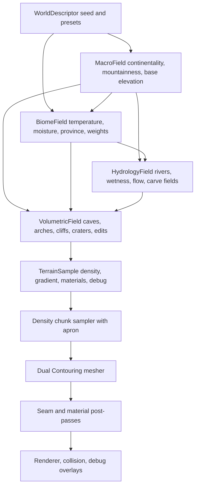

# Terrain System Plan

This is the living implementation plan for taking OFG from its current seed
terrain to a high-grade procedural terrain system. It is based on
[terraingenresearch.md](terraingenresearch.md), especially:

- [Survey of algorithms and techniques](terraingenresearch.md#survey-of-algorithms-and-techniques)
- [Biomes, distribution, and blending](terraingenresearch.md#biomes-distribution-and-blending)
- [Erosion, rivers, caves, materials, texturing, and art layers](terraingenresearch.md#erosion-rivers-caves-materials-texturing-and-art-layers)
- [Implementation plan and validation](terraingenresearch.md#implementation-plan-and-validation)

This document is the continuity source for terrain work. Progress notes must be
updated as milestones are started, changed, completed, deferred, or blocked. If an
AI agent resumes after context compaction, or is unsure what terrain work was last
planned, it must reread this plan before continuing implementation.

The core lesson from the research is that high quality terrain is a layered world
generation architecture, not a single better noise function. The target is a
deterministic field stack with three scales:

1. Planet or world-scale climate, geology, and macro landforms.
2. Regional hydrology, biome segmentation, and material logic.
3. Local voxel volumetrics for caves, overhangs, edits, and silhouettes.

For the current project, we will build this as a local-world system first. The APIs
should remain compatible with a later planet or cube-sphere patch system, but the
next visible wins should come from better local landforms, debugging tools, seams,
and materials.

## Current State

Implemented:

- 3D terrain density chunks with 32x32x32 cells and 33x33x33 samples.
- Deterministic simplex noise with analytic gradients.
- Seed density field with low-frequency x/z height preference and 3D detail noise.
- Editable terrain source with subtract-sphere edit support.
- Dual Contouring Hermite extraction and guarded QEF placement.
- Runtime terrain streamed as per-chunk neighbor-aware Dual Contouring meshes
  with deterministic same-LOD seam ownership.
- Triplanar terrain albedo sampling from a checked-in LFS PNG atlas.
- Browser smoke screenshots for first-person, debug fly, and streamed terrain.

Known limitations:

- The current terrain generator is still a simple noise-based field.
- Runtime meshing is same-LOD only; there is no LOD transition strategy yet.
- No biome, hydrology, strata, material-weight, cave, or LOD systems yet.
- Player grounding still uses a compatibility `heightAt(x, z)` query.
- QEF placement is guarded but not yet high-quality or sharp-feature robust.

## Target Data Flow



## Core Interfaces

These are proposed direction-setting contracts. Names can change during
implementation, but the responsibilities should stay stable.

```ts
type WorldDescriptor = {
  seed: number;
  seaLevel: number;
  terrainPreset: TerrainPresetId;
  climatePreset: ClimatePresetId;
  materialPalette: TerrainMaterialPaletteId;
};

type TerrainGenerator = TerrainDensitySource & {
  readonly descriptor: WorldDescriptor;
  macroAt(position: Vec3): MacroSample;
  biomeAt(position: Vec3): BiomeSample;
  hydrologyAt(position: Vec3): HydrologySample;
  surfaceAt(position: Vec3): TerrainSurfaceSample;
  heightAt(x: number, z: number): number;
};

type TerrainSurfaceSample = {
  density: number;
  gradient: Vec3;
  materialWeights: readonly TerrainMaterialWeight[];
  biomeWeights: readonly BiomeWeight[];
  debug: TerrainDebugChannels;
};
```

Implementation rule: runtime generation should be deterministic from descriptor
and position. Persistent storage should be reserved for edits and authored
landmarks, not for every generated sample.

## Milestone Summary

| # | Milestone | Main Deliverable | Validation Gate |
|---:|---|---|---|
| 1 | Generator core | `WorldDescriptor` and `TerrainGenerator` replacing seed field | Same seed gives same samples/chunks |
| 2 | Macro landforms | Ridged, warped, cellular-enhanced terrain presets | Better silhouettes, no obvious periodic grid |
| 3 | Debug terrain lab | Browser overlays and screenshot scripts for generation layers | Every field can be inspected in isolation |
| 4 | Dual Contouring hardening | Per-chunk neighbor-aware meshing and seam ownership | No same-LOD chunk cracks or QEF spikes |
| 5 | Biome solver | Climate/province-driven biome weights | Stable biome heatmaps, no hard borders |
| 6 | Material classification | Material weights from slope, altitude, biome, wetness, strata | Terrain blends 4-8 materials predictably |
| 7 | Hydrology and rivers | Coarse river graph, carve field, wetness map | Rivers flow downhill or terminate validly |
| 8 | Caves and local volumes | Tunnel graph plus 3D noise carving | Navigable caves and natural entrances |
| 9 | Streaming and LOD | Chunk scheduler, caches, LOD/seam transition plan | Free-flight remains hole-free within budget |
| 10 | Presentation layers | Vegetation masks, water rendering, atmosphere improvements | Terrain reads at multiple scales |
| 11 | Optimisation path | Profiling, budgets, Rust/WASM decision gates | Generation and rendering meet target budgets |

## Milestone 1: Generator Core

Goal: introduce a deterministic terrain generator above `TerrainDensitySource`
without breaking the current runtime.

Implementation:

- Add `src/engine/world/terrainGenerator.ts`.
- Add `WorldDescriptor`, terrain preset IDs, climate preset IDs, and seed handling.
- Move current seed field behavior behind `TerrainGenerator`.
- Keep `heightAt(x, z)` for player grounding, implemented by surface search.
- Expose `densityAt`, `sampleAt`, `macroAt`, and placeholder `biomeAt` methods.
- Keep old `createSeedTerrainField()` as a compatibility wrapper if needed, but
  mark it as legacy in docs once callers migrate.

Tests:

- `terrainGenerator.test.ts`: same descriptor returns identical samples.
- `terrainGenerator.test.ts`: different seeds produce different macro samples.
- `terrainGenerator.test.ts`: `densityAt` and `sampleAt().density` agree.
- `terrainGenerator.test.ts`: `heightAt` lands near the zero-density surface.
- Existing `TerrainChunkStreamer` tests pass without behavioral regression.

Progress notes:

| Date | Status | Notes |
|---|---|---|
| 2026-05-31 | Initial implementation complete | Added `TerrainGenerator`/`WorldDescriptor`, moved the existing seed field behind it, kept `createSeedTerrainField()` as a compatibility wrapper, and added generator determinism/sampling/surface tests. `npm test` passes. |

## Milestone 2: Macro Landforms

Goal: replace the current simple terrain with a layered macro terrain stack.

Research basis:

- The research recommends simplex-style coherent fields, ridged fractals, domain
  warping, and Worley/cellular secondary structure rather than plain fBm
  [terraingenresearch.md](terraingenresearch.md#survey-of-algorithms-and-techniques).

Implementation:

- Add ridged fractal sampling on top of the existing simplex implementation.
- Add domain warp helpers with deterministic gradients where practical.
- Add cellular/Worley-style 2D and 3D utilities for cliff/region breakup.
- Define `MacroSample`:

```ts
type MacroSample = {
  baseElevation: number;
  mountainness: number;
  continentality: number;
  erosionSusceptibility: number;
  ridge: number;
  warp: Vec3;
};
```

- Create at least three presets:
  - rolling hills
  - mountain valley
  - badlands or rocky highland

Tests:

- Noise helpers are deterministic for seed and position.
- Ridged fields stay in expected ranges and have sharper peaks than fBm.
- Domain warp does not produce NaN gradients or discontinuous jumps.
- Adjacent chunk seams sample matching macro values at shared positions.
- Distribution tests assert each preset has useful height variation without
  collapsing into all-flat or all-mountain terrain.
- Browser smoke captures each macro preset from a fixed debug camera.

Progress notes:

| Date | Status | Notes |
|---|---|---|
| 2026-05-31 | Initial implementation complete | Added tested ridged fractal, domain warp, and cellular noise helpers; wired `seed`, `rollingHills`, `mountainValley`, and `rockyHighland` presets into `TerrainGenerator`; made `rollingHills` the default. Added `?terrainPreset=` app selection and `npm run smoke:terrain-presets` to capture every preset. `npm test`, `npm run smoke:terrain-presets`, and browser smoke pass. Visual tuning remains iterative. |

## Milestone 3: Debug Terrain Lab

Goal: make every terrain layer inspectable before adding more complexity.

Research basis:

- The research calls isolated debug overlays the most important validation strategy
  [terraingenresearch.md](terraingenresearch.md#implementation-plan-and-validation).

Implementation:

- Add a debug mode for terrain overlays:
  - density slice
  - normal/gradient
  - slope
  - chunk borders
  - QEF error
  - macro elevation
  - mountainness
  - biome weights
  - material weights
  - wetness/flow
  - cave occupancy
- Add keyboard-controlled overlay cycling or a compact debug panel.
- Extend browser smoke or add `tools/terrain-debug-smoke.mjs` to capture fixed
  overlay screenshots.

Tests:

- Overlay state is deterministic and can be toggled without crashing.
- Debug render data can be built without WebGPU for unit tests.
- Browser screenshot tests verify overlays are nonblank and visually distinct.
- Console errors fail smoke runs.

Progress notes:

| Date | Status | Notes |
|---|---|---|
| 2026-05-31 | In progress | Added a CPU-built debug overlay pipeline with browser canvas display, `F2` cycling, `?terrainDebug=` startup selection, and debug API controls. Current overlay modes: macro elevation, mountainness, slope, normal, density slice, material weights, QEF error, and chunk borders. Added unit coverage and `npm run smoke:terrain-debug`; `npm test`, terrain debug smoke, and browser smoke pass. Remaining work: biome-specific overlays once biome solver exists, hydrology/wetness/cave overlays once those systems exist, and fuller in-app controls. |

## Milestone 4: Dual Contouring Hardening

Goal: turn the current stitched-window prototype into a reliable chunk meshing
system.

Research basis:

- The research identifies Dual Contouring as a good Hermite-data basis but warns
  that chunk and LOD seams need explicit engineering
  [terraingenresearch.md](terraingenresearch.md#implementation-plan-and-validation).

Implementation:

- Add 1-cell apron sampling for each meshed chunk.
- Define deterministic ownership for border quads.
- Make `meshChunkDualContouring` neighbor-aware.
- Keep stitched-window meshing as a fallback/debug path during migration.
- Improve QEF:
  - mass-point fallback
  - rank deficiency handling
  - condition/quality metrics
  - per-cell QEF error output for debug overlays
- Add material-weight interpolation at Hermite intersections.
- Separate render mesh extraction from collision mesh extraction.

Tests:

- Adjacent chunks share seam densities, gradients, material weights, and border
  topology.
- No invalid indices or duplicate zero-area triangles.
- Flat plane, diagonal plane, sphere, cliff, arch, and thin-wall fixtures mesh
  without holes.
- QEF tests cover clean solve, underconstrained solve, out-of-cell solve, sharp
  corner, and noisy Hermite planes.
- Browser smoke verifies no visible cracks at chunk boundaries from close and
  grazing angles.

Progress notes:

| Date | Status | Notes |
|---|---|---|
| | In progress | Current QEF has an out-of-cell guard; runtime still uses centroid placement. |
| 2026-05-31 | In progress | Added `analyzeDualContouringCellVertex()` diagnostics with QEF/centroid error, fallback reasons, and arbitrary-bounds Hermite extraction for debug overlays. `qefError` overlay is now captured by terrain debug smoke. Runtime meshing still uses centroid placement via `TerrainChunkStreamer`; per-chunk neighbor-aware meshing remains next. |
| 2026-05-31 | In progress | Added `meshChunkDualContouringWithNeighbors()` with deterministic edge ownership and vertex compaction. Tests prove a two-chunk flat-plane seam is emitted by exactly one per-chunk mesh and sums to the stitched mesh topology. Runtime still needs migration from stitched-window rendering to per-chunk neighbor-aware rendering. |
| 2026-05-31 | In progress | Migrated `TerrainChunkStreamer` to render per-chunk neighbor-aware meshes using a positive 1-cell apron instead of one stitched render window. The streamer keeps render chunks inside the loaded density window, skips all-air/all-solid chunks before apron sampling, and browser smoke now validates per-chunk render ownership. |
| 2026-05-31 | In progress | Added `npm run smoke:terrain-seams`, which uses deterministic debug camera placement to capture x-seam, z-seam, and chunk-corner grazing views. The smoke verifies render coverage on both sides of the target seams and checks screenshots for valid rendered output. |

## Milestone 5: Biome Solver

Goal: add climate and province-based biome weights instead of hard biome IDs.

Research basis:

- The research recommends climate fields plus spatial provinces, then continuous
  blending with local terrain-condition overrides
  [terraingenresearch.md](terraingenresearch.md#biomes-distribution-and-blending).

Implementation:

- Define primary biome archetypes:
  - coast/beach
  - rocky desert/badlands
  - grassland
  - temperate forest
  - wetland
  - alpine meadow
  - high mountain rock
  - tundra/ice
  - cave interior
- Define biome modifiers:
  - riverbank
  - floodplain
  - canyon
  - cratered
  - volcanic/geothermal
- Add climate fields:
  - temperature
  - moisture
  - altitude
  - continentality
  - drainage/wetness
  - province ID/mask
- Output normalized biome weights with transition bands.

Tests:

- Biome weights sum to 1 within tolerance.
- Same position/seed gives same biome weights.
- Neighboring positions transition smoothly except where an intentional hard
  override exists.
- Cold/dry/wet/high-altitude sample fixtures map to plausible archetypes.
- Province seams are blended, not hard strategy-map borders.
- Debug heatmaps render for each biome weight.

Progress notes:

| Date | Status | Notes |
|---|---|---|
| | Not started | |

## Milestone 6: Material Classification

Goal: move from one triplanar atlas sample to terrain material weights driven by
terrain and biome conditions.

Research basis:

- The research recommends a larger global material library but limiting each
  planet/chunk/draw to a smaller set of blended materials
  [terraingenresearch.md](terraingenresearch.md#erosion-rivers-caves-materials-texturing-and-art-layers).

Implementation:

- Define `TerrainMaterialId` and `TerrainMaterialWeight`.
- Start with 6-8 active material families:
  - grass
  - soil
  - exposed rock
  - cliff rock
  - gravel/talus
  - wet mud
  - sand
  - snow/ice later
- Generate material weights from:
  - biome weights
  - slope
  - altitude
  - curvature/concavity
  - wetness
  - strata noise
  - cave humidity
- Update mesh format or chunk render metadata to carry material weights.
- Update WGSL triplanar path to sample and blend multiple material tiles.

Tests:

- Material weights are normalized and capped to the supported blend count.
- Steep slopes prefer rock/cliff material.
- Low wet concavities prefer mud/wet material.
- High cold areas prefer snow/ice once implemented.
- Adjacent chunks produce matching material weights on seams.
- Shader tests verify material-weight inputs and blend contract.
- Browser screenshots compare slope, valley, and flatland material results.

Progress notes:

| Date | Status | Notes |
|---|---|---|
| | In progress | Single atlas and triplanar flag exist; material weights do not. |

## Milestone 7: Hydrology And Rivers

Goal: add coarse drainage logic before full erosion simulation.

Research basis:

- The research recommends separating rivers into hydrology graph, carve field, and
  visible water representation
  [terraingenresearch.md](terraingenresearch.md#erosion-rivers-caves-materials-texturing-and-art-layers).

Implementation:

- Build a low-resolution surface graph over macro terrain cells.
- Compute downhill flow direction, accumulation, basins, and outlets.
- Classify water features:
  - dry channel
  - stream
  - river
  - floodplain
  - lake/basin
- Project hydrology into local terrain:
  - river carve density modifier
  - bank/floodplain material weights
  - wetness field
  - optional water spline/render primitive
- Defer full hydraulic erosion simulation until the graph/carve path works.

Tests:

- Flow directions do not climb uphill except for explicit basin handling.
- Major rivers have outlet or valid basin termination.
- River carve field is deterministic and continuous across chunks.
- Wetness increases near river paths and decays with distance.
- Browser smoke captures a fixed river valley preset.

Progress notes:

| Date | Status | Notes |
|---|---|---|
| | Not started | |

## Milestone 8: Caves And Local Volumetrics

Goal: use the voxel nature of the engine for overhangs, caves, arches, and edits.

Research basis:

- The research recommends hybrid cave generation: structural tunnel graphs plus
  3D noise/metaball-style wall richness, with cave material logic
  [terraingenresearch.md](terraingenresearch.md#erosion-rivers-caves-materials-texturing-and-art-layers).

Implementation:

- Define cave/tunnel graph primitives:
  - tunnel spline
  - chamber
  - entrance
  - vertical shaft
  - arch/bridge volume
- Convert graph primitives to density modifiers.
- Add 3D noise wall perturbation.
- Add cave biome/material override:
  - damp rock
  - mineral streaks
  - exposed strata
- Make subtract-sphere edits part of the same modifier stack.

Tests:

- Cave graph generation is deterministic.
- Tunnel graph connectivity metrics pass.
- Entrances intersect terrain surface cleanly.
- Generated caves remain inside configured shell depth.
- Dual Contouring meshes cave fixtures without holes.
- Player/camera smoke can enter or view a cave test preset.

Progress notes:

| Date | Status | Notes |
|---|---|---|
| | Not started | |

## Milestone 9: Streaming And LOD

Goal: make the terrain scale beyond the current small loaded window.

Research basis:

- The research recommends dense active chunks early, sparse or paged hierarchy
  later, and explicit seam/transition systems at chunk/LOD boundaries
  [terraingenresearch.md](terraingenresearch.md#implementation-plan-and-validation).

Implementation:

- Keep 32-cell chunks as the default active brick size.
- Add chunk priority scheduling:
  - near chunks
  - visible silhouette chunks
  - collision-critical chunks
  - low-priority background chunks
- Add cache eviction for density chunks and meshes.
- Add far-field simplified terrain representation before full voxel LOD.
- Define LOD transition strategy:
  - same-LOD seams first
  - lower-detail far meshes second
  - transition meshes only after the above is stable
- Add generation timing and memory counters.

Tests:

- Chunk scheduler requests deterministic chunk sets for fixed camera paths.
- Cache eviction does not remove active collision/render chunks.
- Free-flight smoke has no holes or missing terrain.
- Memory and chunk count stay under configured budgets.
- LOD transition fixtures do not show cracks once implemented.

Progress notes:

| Date | Status | Notes |
|---|---|---|
| | Not started | |

## Milestone 10: Presentation Layers

Goal: make the terrain read as a place, not just a mesh.

Research basis:

- The research notes that perceived high-end terrain quality depends heavily on
  vegetation, cloudscape, aerial perspective, wetness, shadows, and palette
  discipline
  [terraingenresearch.md](terraingenresearch.md#erosion-rivers-caves-materials-texturing-and-art-layers).

Implementation:

- Add placement masks for:
  - grass tufts
  - shrubs
  - rocks
  - trees later
  - cave props later
- Start with impostor/simple mesh props before heavy instancing.
- Add water rendering for river/lake surfaces.
- Improve sky with atmospheric depth/aerial perspective.
- Add wetness and color palette modulation.
- Add debug tools for prop candidates and density.

Tests:

- Prop candidate generation is deterministic.
- Props respect slope, biome, water, cave, and clearance masks.
- Browser screenshots show prop density from multiple distances.
- Render budgets stay within target for a fixed test scene.

Progress notes:

| Date | Status | Notes |
|---|---|---|
| | Not started | |

## Milestone 11: Optimisation And Rust/WASM Gates

Goal: keep the TypeScript implementation correct and inspectable, then migrate hot
paths only when there is evidence.

Implementation:

- Add profiling HUD or debug stats:
  - density sample time
  - chunk generation time
  - meshing time
  - GPU upload time
  - triangle count
  - active chunk count
  - memory estimate
- Add benchmark scripts for fixed seeds and camera paths.
- Decide Rust/WASM migration only after APIs are stable.
- Candidate migration paths:
  - noise/macro sampling
  - density chunk sampling
  - Dual Contouring meshing
  - hydrology preprocessing

Tests:

- Benchmark scripts produce machine-readable JSON.
- Performance budgets are explicit and versioned.
- Rust/WASM output, if introduced, must match TypeScript golden fixtures.
- Browser smoke remains the final integration gate.

Progress notes:

| Date | Status | Notes |
|---|---|---|
| | Not started | |

## Cross-Cutting Validation

Every terrain milestone should preserve these checks:

- `npm test`
- `npm run check:shaders` when shader artifacts change
- `npm run smoke:browser` for visual, camera, render, streaming, material, or
  browser integration changes
- `git diff --check`

Terrain-specific regression suites to build over time:

- Determinism fixtures for sample fields.
- Chunk seam fixtures for density, gradient, topology, and material weights.
- Dual Contouring fixtures for flat plane, sphere, diagonal plane, sharp corner,
  thin wall, cave, arch, and repeated edits.
- Distribution fixtures for macro landforms and biome weights.
- Hydrology graph fixtures for flow validity.
- Screenshot fixtures for representative terrain presets.

## Deferred Work

Do not start these until the earlier systems are working and measured:

- Full spherical planet/cube-sphere runtime.
- Full hydraulic erosion simulation.
- Runtime virtual texturing.
- GPU terrain meshing.
- Sparse voxel octree cold storage.
- Large vegetation/foliage system.

These are all compatible with the target architecture, but doing them too early
would make the system harder for AI agents to understand and test.

## Open Questions

| Question | Current Leaning | Notes |
|---|---|---|
| Local terrain first or planet patches now? | Local terrain first | Keep APIs planet-compatible. |
| OpenSimplex2 vs current Simplex only? | Current Simplex first, add variants if needed | Avoid algorithm churn before debug tools. |
| Material weights in vertex data or chunk side buffer? | Start with vertex data | Simpler for current renderer. |
| Terrain collision source? | Near render mesh first, then simplified collision mesh | Needs player movement upgrade. |
| When Rust/WASM? | After mesher and field contracts stabilize | Must be golden-tested against TypeScript. |
