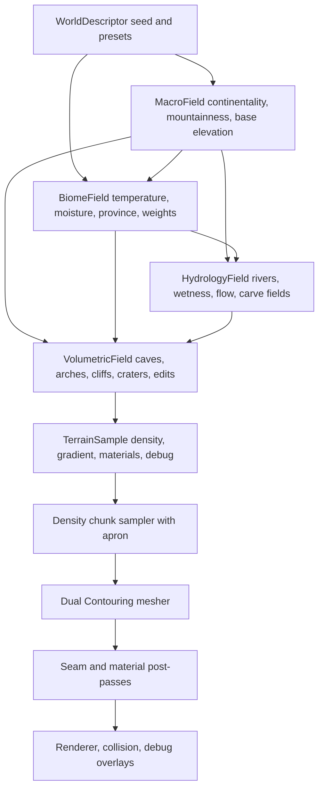

# Terrain System Plan

This is the living implementation plan for taking OFG from its current seed
terrain to a high-grade procedural terrain system. It is based on
[terraingenresearch.md](terraingenresearch.md), especially:

- [Survey of algorithms and techniques](terraingenresearch.md#survey-of-algorithms-and-techniques)
- [Biomes, distribution, and blending](terraingenresearch.md#biomes-distribution-and-blending)
- [Erosion, rivers, caves, materials, texturing, and art layers](terraingenresearch.md#erosion-rivers-caves-materials-texturing-and-art-layers)
- [Implementation plan and validation](terraingenresearch.md#implementation-plan-and-validation)

This document is the continuity source for terrain work. Treat it as a cared-for
shared memory: progress notes must be updated as milestones are started, changed,
completed, deferred, or blocked, including the reason for meaningful pivots. If an
AI agent resumes after context compaction, or is unsure what terrain work was last
planned, it must reread this plan before continuing implementation.

The engine ownership direction is now Rust-first and is tracked in
[RUST_ENGINE_PLAN.md](RUST_ENGINE_PLAN.md). Terrain work should align with that
plan: TypeScript may remain browser/UI glue during migration, but terrain
streaming, scheduling, world state, render extraction, and eventually WebGPU
rendering should move into Rust rather than growing new TypeScript-side
workarounds.

The core lesson from the research is that high quality terrain is a layered world
generation architecture, not a single better noise function. The target is a
deterministic field stack with three scales:

1. Planet or world-scale climate, geology, and macro landforms.
2. Regional hydrology, biome segmentation, and material logic.
3. Local voxel volumetrics for caves, overhangs, edits, and silhouettes.

For the current project, we will build this as a local-world system first. The APIs
should remain compatible with a later planet or cube-sphere patch system, but the
next visible wins should come from better local landforms, debugging tools, seams,
and materials.

## Current State

This section should stay bluntly current. The project now has a real terrain
generation/rendering pipeline, but only the first layers of the high-grade terrain
plan are implemented.

Supported:

- Deterministic 3D terrain density chunks with 32x32x32 cells and 33x33x33
  samples.
- Rust-owned deterministic simplex, ridged, domain-warp, and cellular macro noise
  helpers inside `crates/terrain_core`.
- A browser-facing `WorldDescriptor`/terrain descriptor contract for seed and
  preset selection. Runtime generation itself is Rust-owned.
- `seed`, `rollingHills`, `mountainValley`, and `rockyHighland` terrain presets.
  `rollingHills` is the default.
- URL-selectable terrain presets and seeds through `?terrainPreset=...` and
  `?terrainSeed=...`, primarily for repeatable verification captures.
- Macro channels for base elevation, large feature value, mountainness,
  continentality, erosion susceptibility, ridge, and warp.
- First weighted biome solver for grassland, temperate forest, wetland,
  coast/beach, dry badland, alpine meadow, high mountain rock, and snow/tundra.
- Terrain density formed from macro base elevation plus 3D detail noise. This is
  still fundamentally a height-biased field, but Dual Contouring can represent
  local non-heightfield detail where the density field creates it.
- Editable terrain source with subtract-sphere edit support.
- Rust-owned Dual Contouring chunk mesh emission, material/biome classification,
  triangle-local material palette expansion, and per-chunk neighbor-aware meshing
  with deterministic same-LOD seam ownership.
- Runtime streaming of per-chunk terrain render meshes inside the loaded density
  window.
- A 16-material Poly Haven CC0 terrain library imported under
  `assets/textures/polyhaven`.
- Global WebGPU texture arrays for terrain albedo, normal, and roughness maps.
- Terrain samples that emit biome/slope/altitude/macro-driven material weights.
- Terrain mesh vertices that pack the strongest four material layers and weights.
- A terrain mesh post-pass that expands triangles to coherent local material
  palettes, preventing interpolated weights from referring to different texture
  layers at each triangle corner.
- WGSL triplanar blending of terrain albedo and roughness from the texture arrays.
- Browser smoke coverage for regular gameplay render, refresh/blank-frame
  regression, terrain streaming after player movement, terrain presets, and
  seam/corner views.
- A Rust terrain core crate at `crates/terrain_core`, built to
  `wasm32-unknown-unknown` and emitted as `assets/wasm/terrain_core.wasm`.
- Deterministic generated TypeScript metadata for the terrain WASM artifact.
- Rust/WASM exports for terrain core versioning, preset count, macro base
  elevation, density, compatibility height sampling, and 33x33x33 density chunk
  filling, plus neighbor-aware runtime chunk mesh generation.
- Node/WASM tests that instantiate the WASM artifact and validate deterministic
  height/density samples, density chunk filling, emitted mesh buffers, retained
  density stores, stream scheduling, and worker-pool behavior.
- Runtime terrain streaming requires the generated WASM artifact in the browser
  and uses it to build renderable terrain chunk meshes. The compiled TypeScript
  terrain generator/noise reference has been deleted; Rust is now the browser
  terrain source of truth.
- Runtime streaming treats density chunks as a retained lowest-detail streaming
  layer. The Rust scheduler computes the density window, including positive
  apron chunks, before render meshing; the Rust/WASM core prepares and retains
  that density window so mesh generation reuses stored chunks.
- Browser runtime terrain schedules Rust/WASM density and LOD0 mesh jobs through
  `TerrainCoreWorkerStreamer`, a browser bridge over Rust-owned scheduler and
  worker-pool state. Rust owns desired sets, rendered/empty status, in-flight task
  records, generation tokens, stale completion rejection, and immediate tuning
  invalidation.
- The scheduler now models density readiness as an explicit chunk stage. It
  schedules density-field jobs across the widest active radius first, then only
  schedules render mesh jobs for chunks whose 2x2x2 positive-apron density
  dependencies are ready.
- Density jobs now return retained `Float32Array` density payloads to the
  TypeScript streamer. Mesh jobs receive their exact 2x2x2 apron density
  dependencies and install those payloads into the worker-local Rust/WASM density
  store before contouring, so the scheduler-owned density layer is the source of
  truth for mesh dependencies.
- A release-WASM benchmark, `npm run bench:terrain:wasm`, reports density
  fill-only, density fill-plus-copy, retained density-window preparation, and
  chunk mesh-build-plus-copy milliseconds and writes JSON under
  `artifacts/terrain-wasm-bench/`.
- `crates/terrain_core` now has a first tested Rust-owned terrain stream
  scheduler core for desired density sets, LOD0 render sets, density-apron
  dependencies, priority, in-flight work, reset generations, stale completions,
  retryable density failures, empty chunks, and pruning.
- The browser runtime now wires that Rust stream scheduler through
  `terrain_core.wasm`. `TerrainCoreWorkerStreamer` executes Rust-selected
  density/LOD jobs and reports completions back to Rust while TypeScript remains
  the worker transport and render-upload shell.
- Scheduler-backed browser streaming now stores completed density payloads in the
  main `terrain_core.wasm` density store instead of a TypeScript-owned payload
  map. Mesh job submission loads the required 2x2x2 apron payloads from that
  Rust store before sending them to a worker.
- The dev and browser-smoke server now serves the app cross-origin isolated, and
  the playable Rust scheduler bridge uses `SharedArrayBuffer`-backed density
  dependency payloads for LOD0 mesh jobs when available. Browser smoke asserts
  `densityTransferMode: "shared"` so refresh/worker regressions fail loudly.
- Rust now owns the terrain worker-pool model through `terrain_core.wasm`:
  worker count, slot assignment, request IDs, in-flight task records, reset
  generations, stale completion rejection, and completion mismatch detection.
  TypeScript uses a generic browser Worker group as transport, and browser smoke
  asserts `workerPoolRuntime: "rust"`.
- Runtime terrain worker mesh results are uploaded directly into
  `RustBrowserGame` chunk-keyed Rust/wgpu terrain mesh handles. The older
  `terrain_core.wasm` terrain mesh packet store remains tested, but it is no
  longer the playable browser mesh handoff, and TypeScript no longer adapts
  terrain packets into CPU-side `Mesh` objects before renderer upload.
- The compiled TypeScript scene/component model has been retired. The app no
  longer assembles a compiled TypeScript `RenderWorld`, and it no longer passes
  engine render snapshots into the browser renderer. `RustBrowserGame` now owns
  the active player/camera tick state, terrain-height grounding, renderer
  mesh/texture/object handles, render resource pruning, live terrain draw set,
  and the debug player marker mesh/material. `src/app` now forwards browser
  input axes/debug commands through a coarse `RustBrowserGameRuntime` shell and
  calls `tick`/`renderFrame`; that shell uploads terrain mesh bytes by terrain
  chunk key when worker jobs complete and uploads the three terrain texture
  arrays through a terrain-specific facade call while the remaining transport is
  collapsed into Rust.
- Rust/wgpu is now the playable browser renderer through `crates/engine_web` and
  generated `assets/wasm/engine_web/` wasm-bindgen artifacts. Rust owns the
  WebGPU canvas surface, adapter/device/queue, surface configuration, depth
  texture, shader modules, pipeline layouts, pipelines, buffers, texture arrays,
  samplers, bind groups, render-pass submission, frame/resource counts, and GPU
  resource pruning. Rust also owns the fixed terrain material recipe,
  material packet construction, material-to-texture selection, shader uniform
  packing for frame and object draw data, and object normal-matrix calculation.
  Browser smoke asserts
  `rendererRuntime: "rust-wgpu"` and captures first-person, refreshed,
  debug-fly, and streamed terrain screenshots.

Partially supported or placeholder-only:

- `climatePreset` and `materialPalette` exist on `WorldDescriptor`, but do not
  yet drive distinct generation behavior.
- `biomeAt()` now emits weighted biome archetypes plus temperature, moisture, and
  a cellular province ID, but it is still a first pass. There are no authored
  biome rules, biome-specific debug heatmaps, hard ecological constraints, or
  hydrology inputs yet.
- Material classification uses biome weights, slope, altitude, sea-level
  proximity, and macro values. It does not yet use hydrology/wetness fields,
  curvature, strata, cave humidity, or authored geological regions.
- Snow, cliff, mud, sand, grass, moss, rock, and red-soil materials can appear,
  but their placement is still heuristic and only lightly biome-driven.
- Normal and roughness texture arrays are loaded; roughness is sampled for
  lighting, but normal maps are not yet applied to perturb terrain normals.
- Terrain variation screenshots now prove several material and biome-weight
  regions existed during the TypeScript-generator era. That survey tool was
  retired with the TypeScript generator; comparable Rust debug/survey snapshots
  need to be rebuilt from Rust debug APIs.
- The Rust core now owns the browser runtime density-to-render-mesh path for
  generated terrain chunks, including material/biome classification, centroid
  Dual Contouring, same-LOD neighbor seam ownership, and triangle-local material
  palette expansion. It has a first retained density chunk store, and the
  browser scheduler-backed path now uses that Rust/WASM store as the retained
  density payload owner for mesh submissions. Mesh dependencies are now backed
  by `SharedArrayBuffer` in the isolated browser runtime, and Rust owns the
  worker-pool/request lifecycle, but mesh workers still copy/install those
  payloads into local Rust/WASM stores; this is not yet Rust-managed wasm
  threads, partition-aware worker ownership, multi-resolution streaming, or
  mesh-upload optimized.
- TypeScript still owns the browser Worker transport and shared-density payload
  wrapping inside `RustBrowserGameRuntime` and `TerrainCoreWorkerStreamer`. It
  also still has a temporary render adapter that receives worker mesh bytes,
  uploads them by terrain chunk key, uploads the three terrain texture arrays
  through a terrain-specific Rust facade call, tracks live chunk keys for
  debug/smoke, and mirrors chunk retention/removal into Rust at stream-event
  time. Rust owns the
  renderer handle maps, terrain mesh handles, terrain texture handles, terrain
  identity world matrices, fixed terrain renderer vertex stride, fixed terrain
  material recipe, material packet construction, material-to-texture selection,
  live terrain draw-set retention, stale resource pruning, active player/camera
  state, render-frame construction, player-marker transform derivation, packet
  validation, normal-matrix computation, and WGSL shader uniform packing.
  `TerrainCoreWorkerStreamer` is now a small browser bridge that executes Worker
  jobs selected by `terrain_core.wasm`, asks Rust for LOD0 density dependency
  coordinates, stores density and mesh payloads in Rust, and feeds terrain
  packets toward the temporary Rust renderer adapter. It is now hidden beneath
  the coarse TypeScript `RustBrowserGameRuntime`, but this is still a bridge, not
  full Rust-managed browser threading or Rust-owned worker spawning.
- The Rust engine migration has moved past the render-packet bridge for the
  active browser player/camera path. `engine_web` now composes `engine_core` and
  `terrain_core` as Rust library dependencies, owns the active tick state, and
  renders through `renderGameFrame` without an engine snapshot from TypeScript.
  Terrain chunk packet storage is Rust-owned for the playable path, and the old
  TypeScript `SceneRenderExtractor`/`MeshRenderer`/`RenderWorld` path has been
  deleted. TypeScript still acts as a browser transport for mesh bytes, texture
  assets, worker messages, and UI/debug hooks until Rust owns the remaining
  terrain worker/asset transport behind a coarse end-to-end game facade.

Not yet supported:

- Mature biome solver, authored biome provinces, biome heatmap screenshots, or
  polished biome transition bands.
- Hydrology: no river graph, flow accumulation, drainage, lakes, river carving,
  floodplains, beaches driven by water bodies, or wetness propagation.
- Erosion simulation or erosion-inspired post-processing beyond simple macro
  noise channels.
- Geological strata, sediment layers, cliffs formed by rock layers, talus fields
  driven by curvature, or regional material palettes.
- Caves, arches, tunnels, overhang-focused volumetric features, or cave entrance
  placement.
- Far-field terrain, LOD, LOD transition meshes, or mature view/visibility
  priority scheduling.
- Rust-managed wasm threads, partition-aware multi-resolution density/mesh
  streaming, batch density jobs, fine-grained cancellation queues beyond
  generation-token invalidation, or mesh upload preparation.
- Rust debug snapshots for macro/biome/material/QEF/stream overlays. The old
  TypeScript debug overlay was deleted with the TypeScript generator.
- Saveable human-facing terrain tuning knobs.
- Terrain collision/grounding based on the generated mesh. Player grounding still
  uses a compatibility `heightAt(x, z)` query.
- High-quality sharp-feature Dual Contouring. The current Rust runtime path is
  good enough for same-LOD chunk terrain, but not feature-preserving at
  production quality.

Current believability gap:

- The terrain can now produce distinct biome/material regions in sampled
  screenshots, but it does not yet read as a fully believable world.
- The main missing layer is regional structure with stronger composition:
  hydrology-informed wetness and river corridors, better biome province shaping,
  and geology/strata that explains cliffs, badlands, talus, and rock color.
- The immediate blocker is iteration speed and view distance. Human material and
  biome tuning will not be productive while changing one number takes seconds and
  the camera can only inspect a few chunks.
- The next visible win should therefore be realtime terrain iteration: move the
  expensive chunk sampling/meshing path behind Rust/WASM, add generation timing
  counters, widen the visible terrain window, then expose saveable tuning knobs.
  The chunk sampling/meshing path is now Rust/WASM-owned; the current Rust/WASM
  worker pipeline separates density from meshing and
  retains density payloads in Rust/WASM. LOD0 mesh dependencies now travel to
  Workers through shared browser buffers, and Rust owns worker-pool task
  assignment/completion bookkeeping, but each Worker still copies density into
  local WASM memory before contouring and the system has not yet proven a larger
  view distance budget. Browser CPU parallelism is still Worker-backed;
  Rust-managed worker creation or true wasm threads will need a wasm-threads
  runtime slice.
  Hydrology and better biome composition remain the next believability layer once
  the terrain can regenerate fast enough to tune.

## Target Data Flow



## Core Interfaces

These are direction-setting contracts, not literal current TypeScript APIs. Names
can change during implementation, but the responsibilities should stay stable and
Rust-owned.

```ts
type WorldDescriptor = {
  seed: number;
  seaLevel: number;
  terrainPreset: TerrainPresetId;
  climatePreset: ClimatePresetId;
  materialPalette: TerrainMaterialPaletteId;
};

type RustTerrainFacade = {
  configure(descriptor: WorldDescriptor): void;
  heightAt(x: number, z: number): number;
  densityAt(position: Vec3): number;
  fillDensityChunk(coord: TerrainChunkCoord, cellSize: number): DensityChunkPacket;
  buildChunkMesh(coord: TerrainChunkCoord, lod: number): TerrainMeshPacket;
  resetStreaming(center: TerrainChunkCoord): void;
  tickStreaming(center: TerrainChunkCoord): TerrainStreamWorkSummary;
  debugSnapshot(): TerrainDebugSnapshot;
};

type TerrainSurfaceSample = {
  density: number;
  gradient: Vec3;
  materialWeights: readonly TerrainMaterialWeight[];
  biomeWeights: readonly BiomeWeight[];
  debug: TerrainDebugChannels;
};
```

Implementation rule: runtime generation should be deterministic from descriptor
and position. Persistent storage should be reserved for edits and authored
landmarks, not for every generated sample. TypeScript should consume coarse Rust
facade calls and debug snapshots rather than owning sampling or meshing logic.

## Milestone Summary

| # | Milestone | Main Deliverable | Validation Gate |
|---:|---|---|---|
| 1 | Generator core | `WorldDescriptor` and Rust terrain facade replacing seed field | Same seed gives same samples/chunks |
| 2 | Macro landforms | Ridged, warped, cellular-enhanced terrain presets | Better silhouettes, no obvious periodic grid |
| 3 | Debug terrain lab | Browser overlays and screenshot scripts for generation layers | Every field can be inspected in isolation |
| 4 | Dual Contouring hardening | Per-chunk neighbor-aware meshing and seam ownership | No same-LOD chunk cracks or QEF spikes |
| 5 | Biome solver | Climate/province-driven biome weights | Stable biome heatmaps, no hard borders |
| 6 | Material classification | Material weights from slope, altitude, biome, wetness, strata | Terrain blends 4-8 materials predictably |
| 7 | Hydrology and rivers | Coarse river graph, carve field, wetness map | Rivers flow downhill or terminate validly |
| 8 | Caves and local volumes | Tunnel graph plus 3D noise carving | Navigable caves and natural entrances |
| 9 | Streaming and LOD | Chunk scheduler, retained stores, LOD/seam transition plan | Free-flight remains hole-free within budget |
| 10 | Presentation layers | Vegetation masks, water rendering, atmosphere improvements | Terrain reads at multiple scales |
| 11 | Realtime Rust/WASM terrain path | Rust/WASM hot paths, profiling, worker scheduling, tuning persistence | Terrain edits and tuning regenerate fast enough for human iteration |
| 12 | Rust engine migration | Rust-owned world, terrain streaming, render extraction, and Rust/wgpu renderer | TypeScript is reduced to browser shell and UI glue |

## Recommended Next Slice: Realtime Terrain Iteration

Goal: make terrain regeneration fast enough that a human can tune believable,
varying terrain by feel. This should happen before more biome/material/hydrology
polish, because slow feedback makes every knob hard to judge.

Architectural note: this slice should now be executed as part of the Rust engine
migration, not as further TypeScript scene optimization. The intended end state is
Rust-owned terrain streaming and render packets feeding a Rust/wgpu renderer, with
TypeScript limited to browser shell and UI.

Proposed order:

1. Add a focused benchmark/profiling harness for the current terrain hot path.
   (First Rust density chunk benchmark complete.)
   - Measure density chunk fill, Hermite extraction, QEF placement, mesh buffer
     emission, GPU upload preparation, active chunk count, and triangles.
   - Write machine-readable JSON for fixed seeds, presets, and camera paths.
   - Validation: budgets are explicit enough that future Rust/WASM migrations can
     prove they helped.
2. Move density chunk sampling into Rust/WASM. (First runtime slice complete.)
   - Export a flat chunk-fill API that writes the 33x33x33 density/gradient sample
     layout needed by `TerrainChunk`.
   - Keep TypeScript as the reference implementation and compare full chunk
     fixtures at boundaries, negative coordinates, and multiple presets.
   - Validation: Rust/WASM density chunks match TypeScript fixtures and reduce
     chunk generation time.
3. Wire Rust/WASM density chunks into runtime streaming behind a narrow adapter.
   (First runtime slice complete.)
   - Keep the existing scene/component/render boundaries.
   - Historical: a TypeScript fallback path existed while the migration was young;
     the playable browser terrain runtime now requires Rust/WASM terrain core.
   - Validation: browser smoke remains visually stable and chunk seam tests still
     pass.
4. Move Dual Contouring meshing hot paths next if profiling still shows chunk
   rebuilds are too slow. (First runtime WASM mesh path complete.)
   - Start with Hermite extraction and QEF placement, then mesh buffer emission.
   - Validation: mesh summaries and seam ownership match TypeScript golden
     fixtures before runtime promotion.
5. Add worker-backed scheduling and retained streaming-layer budgets.
   (First worker scheduler, density stage, and shared density payload slices
   complete.)
   - Main thread should stop blocking on expensive terrain rebuilds.
   - Treat density chunks as the lowest current LOD generated over the widest
     active radius, so apron reuse falls out of the streaming model.
   - Next: reduce worker-local WASM install cost, add Rust-owned batch or
     partition-aware density work, move more execution behind a coarse Rust
     facade, and measure wider view-distance budgets before increasing view
     distance aggressively.
   - Validation: free-flight remains hole-free while visible radius increases.
6. Add a terrain tuning panel with save/load only after regeneration is responsive.
   - Knobs should cover seed, preset, macro scales, ridge strength, detail
     amplitude, biome/material weights, and later hydrology.
   - Validation: saved descriptors reproduce the same terrain and screenshots.

After that, return to believable variation work: biome heatmap overlays,
hydrology/wet corridors, geological strata, normal-map shading, and broader
material art direction. The artistic work will go much better once the engine can
answer back quickly.

Progress notes:

| Date | Status | Notes |
|---|---|---|
| 2026-06-01 | In progress | Added `?terrainSeed=` support and `npm run smoke:terrain-variation`. The smoke samples all current terrain presets across seeds `246`, `7001`, `112358`, and `424242`, scores representative meadow, wet lowland, dry soil, mossy ridge, rocky slope, and red cliff targets, captures browser screenshots, and writes a report with macro/biome/material evidence. |
| 2026-06-01 | In progress | Added the first weighted biome solver and made the variation smoke require at least three distinct dominant biome regions. Current captures include grassland, wetland, dry badland, and high mountain rock evidence. Next work should add biome heatmap overlays and hydrology/water shaping. |
| 2026-06-01 | Pivoted | Screenshots still read too similar, but further material tuning is blocked by slow iteration and short view distance. The recommended next slice is now Rust/WASM-backed realtime terrain generation, then tuning knobs and save/load, then renewed biome/hydrology/material polish. |
| 2026-06-01 | In progress | Added a Rust/WASM density chunk fill API for the 33x33x33 `TerrainChunk` sample layout, copied it into `TerrainDensityChunk`, and wired `TerrainChunkStreamer` to use it at runtime when the browser loads `assets/wasm/terrain_core.wasm`. Browser smoke passes with no fallback warnings. Next target is profiling plus moving meshing/worker scheduling enough to widen view distance. |
| 2026-06-01 | In progress | Added `npm run bench:terrain:wasm` to measure release WASM density chunk generation directly. Initial fill-only median was about 36.8 ms per 33x33x33 chunk, which confirmed the Rust path was still too slow. Caching macro terrain once per x/z column inside chunk fill reduced the quick benchmark to about 6.6 ms fill-only median and 6.5 ms fill-plus-copy median, with machine-readable JSON in `artifacts/terrain-wasm-bench/`. |
| 2026-06-01 | In progress | Moved the browser runtime generated-terrain chunk mesh path into Rust/WASM. `ofg_build_chunk_mesh` now builds the density apron, extracts Hermite intersections, performs centroid Dual Contouring with same-LOD seam ownership, classifies biome/material weights, expands triangle-local material palettes, and returns renderable vertex/index buffers to TypeScript. Browser smoke passes. Quick benchmark now shows density fill around 6.5 ms median and full mesh build plus copy around 62.7 ms median per chunk. Added an apron-density phase estimate: filling the eight 33x33x33 density chunks needed for one mesh costs about 52.5 ms median, leaving about 10.2 ms median for contouring/material/palette/copy. The next target is a retained density streaming layer, then worker-backed scheduling. |
| 2026-06-01 | In progress | Reframed apron reuse as a streaming-layer problem rather than an ad hoc cache. The streamer now builds a retained density window that includes apron chunks, and Rust/WASM exposes `ofg_prepare_density_chunk_window` plus density-store counters. The benchmark now separates cold mesh generation from prepared mesh generation: on the development run, cold mesh plus copy was about 61.8 ms median per chunk, while prepared mesh plus copy was about 9.7 ms median. Density-window preparation is still main-thread-bound and can spike, so the next target is worker-backed preparation, priority/cancellation, and then widening view distance. |
| 2026-06-01 | In progress | Added the first worker-backed terrain scheduler. `TerrainChunkStreamer` now behaves like a ticked scheduler: it compares desired density/render sets with rendered, empty, and in-flight chunks, submits nearest missing render chunks up to a worker-pool concurrency limit, and ignores stale completions after reset. The app exposes `resetTerrainStreaming()` and stream status through `window.__ofgDebug`, giving future tuning UI a direct instant-regenerate path. Browser smoke waits for worker completion and passes. Remaining scheduler work: separate density jobs, shared or partition-aware density stores across workers, better queue cancellation, and wider view-distance budgets. |
| 2026-06-01 | In progress | Split the scheduler state into explicit stages: not present, density-field ready, and renderable LOD 0/empty. Worker messages now include density jobs as a separate stage, and the streamer only schedules a chunk mesh after its positive-apron density dependencies are marked ready. This matches the intended multi-stage architecture and sets up future LOD N stages. Caveat: Rust density storage is still local to each worker, so the next architecture step is a shared or partition-aware density store rather than just logical readiness in TypeScript. |
| 2026-06-01 | In progress | Added the first properly shared density payload layer. Density jobs transfer generated 33x33x33 `Float32Array` chunks back to `TerrainChunkStreamer`, the streamer retains them by chunk key, and mesh jobs receive the exact 2x2x2 apron payloads they depend on before installing them into worker-local Rust/WASM storage. This makes the TypeScript scheduler's density-ready state physically meaningful across workers. Caveat: payloads are still copied into mesh workers, not backed by `SharedArrayBuffer` or persistent partition-owned worker stores. |
| 2026-06-01 | In progress | Moved the scheduler-backed retained density payload owner from the TypeScript streamer map into the main Rust/WASM terrain core. `TerrainChunkStreamer` now writes completed density payloads into the Rust density store, loads mesh apron dependencies from that store, and exposes `densityStoreRuntime: rust` for browser smoke. Caveat: mesh workers still receive copied payloads and install them into worker-local Rust/WASM stores; partition-aware worker ownership and shared-memory transfer remain next. |
| 2026-06-02 | In progress | Enabled the first browser shared-memory density transfer path. The dev/smoke server now sends COOP/COEP/CORP headers, `TerrainCoreWorkerStreamer` wraps LOD0 apron dependencies from the Rust density store in `SharedArrayBuffer` payloads when available, and browser smoke asserts cross-origin isolation plus `densityTransferMode: "shared"`. Caveat: TypeScript still hosts Workers, and each worker still copies shared payload contents into its own `terrain_core.wasm` density store before meshing; Rust-managed wasm threads and partition-owned worker stores remain next. |
| 2026-06-02 | In progress | Moved the terrain worker-pool/request model into Rust. `terrain_core.wasm` now assigns worker slots and request IDs, tracks in-flight density/LOD tasks, bumps reset generations, rejects stale completions, and detects mismatched completions. TypeScript now uses a generic browser Worker group for transport; the intended end state remains a coarse Rust facade close to `game.tick()`. |
| 2026-06-02 | Cleanup complete | Deleted the compiled legacy TypeScript terrain manager/renderer path: `TerrainChunkStreamer`, `TerrainRenderer`, the old TypeScript terrain packet store, the highest-surface chunk mesher, and the heightfield mesh builder/tests. No reference copy was kept in `src`; remaining TypeScript terrain was narrowed to browser bridge/debug/parity code at that point. |
| 2026-06-02 | Rust source of truth promoted | Deleted the compiled TypeScript terrain generator/noise reference, TypeScript Dual Contouring/debug overlay path, and old terrain debug/variation smoke tools. At that point `terrain_core.wasm` became the browser terrain source of truth for height, density, chunk fill, mesh emission, stream scheduling, density storage, worker-pool state, and terrain mesh packet storage. Later slices moved the playable mesh handoff directly into `RustBrowserGame`; see the 2026-06-03 notes. |

## Milestone 1: Generator Core

Goal: introduce deterministic terrain generation behind a descriptor without
breaking the runtime.

Current status: the original TypeScript implementation for this milestone was
retired on 2026-06-02. The live generator behavior now belongs to
`crates/terrain_core`; TypeScript keeps only `terrainDescriptor.ts` for seed and
preset configuration.

Implementation:

- Maintain `WorldDescriptor`, terrain preset IDs, climate preset IDs, and seed
  handling as a browser-facing config contract.
- Keep Rust `heightAt(x, z)` for player grounding until movement becomes
  density/mesh aware.
- Expose Rust density, macro, biome/material, surface, and debug snapshot APIs
  through coarse WASM facades as needed.

Tests:

- Rust/WASM tests verify same descriptor returns deterministic samples.
- Different seeds and presets produce meaningfully different macro samples.
- Rust `heightAt` lands near the zero-density surface.
- Browser smoke passes without a TypeScript generation fallback.

Progress notes:

| Date | Status | Notes |
|---|---|---|
| 2026-05-31 | Initial implementation complete | Added `TerrainGenerator`/`WorldDescriptor`, moved the existing seed field behind it, kept `createSeedTerrainField()` as a compatibility wrapper, and added generator determinism/sampling/surface tests. `npm test` passes. |
| 2026-06-02 | Retired from TypeScript | Deleted the compiled TypeScript `TerrainGenerator` and promoted `terrain_core.wasm` as the browser terrain source of truth. |

## Milestone 2: Macro Landforms

Goal: replace the current simple terrain with a layered macro terrain stack.

Research basis:

- The research recommends simplex-style coherent fields, ridged fractals, domain
  warping, and Worley/cellular secondary structure rather than plain fBm
  [terraingenresearch.md](terraingenresearch.md#survey-of-algorithms-and-techniques).

Implementation:

- Add ridged fractal sampling on top of the existing simplex implementation.
- Add domain warp helpers with deterministic gradients where practical.
- Add cellular/Worley-style 2D and 3D utilities for cliff/region breakup.
- Define `MacroSample`:

```ts
type MacroSample = {
  baseElevation: number;
  mountainness: number;
  continentality: number;
  erosionSusceptibility: number;
  ridge: number;
  warp: Vec3;
};
```

- Create at least three presets:
  - rolling hills
  - mountain valley
  - badlands or rocky highland

Tests:

- Noise helpers are deterministic for seed and position.
- Ridged fields stay in expected ranges and have sharper peaks than fBm.
- Domain warp does not produce NaN gradients or discontinuous jumps.
- Adjacent chunk seams sample matching macro values at shared positions.
- Distribution tests assert each preset has useful height variation without
  collapsing into all-flat or all-mountain terrain.
- Browser smoke captures each macro preset from a fixed debug camera.

Progress notes:

| Date | Status | Notes |
|---|---|---|
| 2026-05-31 | Initial implementation complete | Added tested ridged fractal, domain warp, and cellular noise helpers; wired `seed`, `rollingHills`, `mountainValley`, and `rockyHighland` presets into `TerrainGenerator`; made `rollingHills` the default. Added `?terrainPreset=` app selection and `npm run smoke:terrain-presets` to capture every preset. `npm test`, `npm run smoke:terrain-presets`, and browser smoke pass. Visual tuning remains iterative. |
| 2026-06-02 | Promoted to Rust | Deleted the compiled TypeScript noise helpers. The live macro landform helpers and presets now live in `crates/terrain_core`; `npm run smoke:terrain-presets` remains the browser preset validation path. |

## Milestone 3: Debug Terrain Lab

Goal: make every terrain layer inspectable before adding more complexity.

Research basis:

- The research calls isolated debug overlays the most important validation strategy
  [terraingenresearch.md](terraingenresearch.md#implementation-plan-and-validation).

Implementation:

- Add a debug mode for terrain overlays:
  - density slice
  - normal/gradient
  - slope
  - chunk borders
  - QEF error
  - macro elevation
  - mountainness
  - biome weights
  - material weights
  - wetness/flow
  - cave occupancy
- Add keyboard-controlled overlay cycling or a compact debug panel.
- Rebuild debug snapshots from Rust terrain data. The old TypeScript overlay
  smoke was retired with the TypeScript generator.

Tests:

- Overlay state is deterministic and can be toggled without crashing.
- Debug render data can be built without WebGPU for unit tests.
- Browser screenshot tests verify overlays are nonblank and visually distinct.
- Console errors fail smoke runs.

Progress notes:

| Date | Status | Notes |
|---|---|---|
| 2026-05-31 | In progress | Added a CPU-built debug overlay pipeline with browser canvas display, `F2` cycling, `?terrainDebug=` startup selection, and debug API controls. Current overlay modes: macro elevation, mountainness, slope, normal, density slice, material weights, QEF error, and chunk borders. Added unit coverage and `npm run smoke:terrain-debug`; `npm test`, terrain debug smoke, and browser smoke pass. Remaining work: biome-specific overlays once biome solver exists, hydrology/wetness/cave overlays once those systems exist, and fuller in-app controls. |
| 2026-06-02 | Retired pending Rust replacement | Deleted the TypeScript debug overlay and `smoke:terrain-debug` script. Future terrain lab work should use Rust debug snapshots/packets rather than TypeScript sampling/QEF diagnostics. |

## Milestone 4: Dual Contouring Hardening

Goal: turn the original stitched-window prototype into a reliable chunk meshing
system.

Research basis:

- The research identifies Dual Contouring as a good Hermite-data basis but warns
  that chunk and LOD seams need explicit engineering
  [terraingenresearch.md](terraingenresearch.md#implementation-plan-and-validation).

Implementation:

- Add 1-cell apron sampling for each meshed chunk.
- Define deterministic ownership for border quads.
- Make `meshChunkDualContouring` neighbor-aware.
- Keep stitched-window meshing as a fallback/debug path only while it remains
  useful for comparison tests.
- Improve QEF:
  - mass-point fallback
  - rank deficiency handling
  - condition/quality metrics
  - per-cell QEF error output for debug overlays
- Add material-weight interpolation at Hermite intersections.
- Separate render mesh extraction from collision mesh extraction.

Tests:

- Adjacent chunks share seam densities, gradients, material weights, and border
  topology.
- No invalid indices or duplicate zero-area triangles.
- Flat plane, diagonal plane, sphere, cliff, arch, and thin-wall fixtures mesh
  without holes.
- QEF tests cover clean solve, underconstrained solve, out-of-cell solve, sharp
  corner, and noisy Hermite planes.
- Browser smoke verifies no visible cracks at chunk boundaries from close and
  grazing angles.

Progress notes:

| Date | Status | Notes |
|---|---|---|
| | In progress | Current QEF has an out-of-cell guard; runtime still uses centroid placement. |
| 2026-05-31 | In progress | Added `analyzeDualContouringCellVertex()` diagnostics with QEF/centroid error, fallback reasons, and arbitrary-bounds Hermite extraction for debug overlays. `qefError` overlay is now captured by terrain debug smoke. Runtime meshing still uses centroid placement via `TerrainChunkStreamer`; per-chunk neighbor-aware meshing remains next. |
| 2026-05-31 | In progress | Added `meshChunkDualContouringWithNeighbors()` with deterministic edge ownership and vertex compaction. Tests prove a two-chunk flat-plane seam is emitted by exactly one per-chunk mesh and sums to the stitched mesh topology. Runtime migration to per-chunk neighbor-aware rendering was still pending at this point. |
| 2026-05-31 | In progress | Migrated `TerrainChunkStreamer` to render per-chunk neighbor-aware meshes using a positive 1-cell apron instead of one stitched render window. The streamer keeps render chunks inside the loaded density window, skips all-air/all-solid chunks before apron sampling, and browser smoke now validates per-chunk render ownership. |
| 2026-05-31 | In progress | Added `npm run smoke:terrain-seams`, which uses deterministic debug camera placement to capture x-seam, z-seam, and chunk-corner grazing views. The smoke verifies render coverage on both sides of the target seams and checks screenshots for valid rendered output. |

## Milestone 5: Biome Solver

Goal: add climate and province-based biome weights instead of hard biome IDs.

Research basis:

- The research recommends climate fields plus spatial provinces, then continuous
  blending with local terrain-condition overrides
  [terraingenresearch.md](terraingenresearch.md#biomes-distribution-and-blending).

Implementation:

- Define primary biome archetypes:
  - coast/beach
  - rocky desert/badlands
  - grassland
  - temperate forest
  - wetland
  - alpine meadow
  - high mountain rock
  - tundra/ice
  - cave interior
- Define biome modifiers:
  - riverbank
  - floodplain
  - canyon
  - cratered
  - volcanic/geothermal
- Add climate fields:
  - temperature
  - moisture
  - altitude
  - continentality
  - drainage/wetness
  - province ID/mask
- Output normalized biome weights with transition bands.

Tests:

- Biome weights sum to 1 within tolerance.
- Same position/seed gives same biome weights.
- Neighboring positions transition smoothly except where an intentional hard
  override exists.
- Cold/dry/wet/high-altitude sample fixtures map to plausible archetypes.
- Province seams are blended, not hard strategy-map borders.
- Debug heatmaps render for each biome weight.

Progress notes:

| Date | Status | Notes |
|---|---|---|
| 2026-06-01 | In progress | Replaced the placeholder single-biome output with weighted grassland, temperate forest, wetland, coast/beach, dry badland, alpine meadow, high mountain rock, and snow/tundra archetypes. The solver uses altitude, temperature, moisture, continentality, mountainness, erosion susceptibility, and cellular province IDs. Tests cover normalized weights and cold/wet/dry fixtures. Missing: biome heatmap overlays, authored province shaping, hydrology/wetness inputs, and polished transition tuning. |

## Milestone 6: Material Classification

Goal: move from one triplanar atlas sample to terrain material weights driven by
terrain and biome conditions.

Research basis:

- The research recommends a larger global material library but limiting each
  planet/chunk/draw to a smaller set of blended materials
  [terraingenresearch.md](terraingenresearch.md#erosion-rivers-caves-materials-texturing-and-art-layers).

Implementation:

- Define `TerrainMaterialId` and `TerrainMaterialWeight`.
- Start with 6-8 active material families:
  - grass
  - soil
  - exposed rock
  - cliff rock
  - gravel/talus
  - wet mud
  - sand
  - snow/ice later
- Generate material weights from:
  - biome weights
  - slope
  - altitude
  - curvature/concavity
  - wetness
  - strata noise
  - cave humidity
- Update mesh format or chunk render metadata to carry material weights.
- Update WGSL triplanar path to sample and blend multiple material tiles.

Tests:

- Material weights are normalized and capped to the supported blend count.
- Steep slopes prefer rock/cliff material.
- Low wet concavities prefer mud/wet material.
- High cold areas prefer snow/ice once implemented.
- Adjacent chunks produce matching material weights on seams.
- Shader tests verify material-weight inputs and blend contract.
- Browser screenshots compare slope, valley, and flatland material results.

Progress notes:

| Date | Status | Notes |
|---|---|---|
| 2026-06-01 | In progress | Added a 16-material Poly Haven CC0 terrain library imported by `tools/import-polyhaven-terrain.mjs`, tracked through Git LFS, and loaded as global albedo/normal/roughness texture arrays. Terrain samples now emit slope/altitude/macro-driven material weights, Dual Contouring vertices pack the strongest four material layers, runtime meshes expand triangles to coherent local material palettes, and WGSL triplanar-blends albedo plus roughness from the arrays. Normal maps are loaded but not yet sampled for lighting. `npm test`, `npm run check:shaders`, `npm run smoke:browser`, and `npm run smoke:terrain-seams` pass. |
| 2026-06-01 | In progress | Remaining material work for believable variation: feed biome/wetness/strata fields into classification, add a survey smoke that captures representative material/biome regions, and apply terrain normal maps in lighting after regional material choice is readable. |
| 2026-06-01 | In progress | Added the first material-variation survey smoke. It currently finds visually distinct material conditions, but the evidence also shows several categories are still heuristic mixtures rather than true ecological/geological regions. The next classifier improvement should consume real biome weights once Milestone 5 starts. |
| 2026-06-01 | In progress | Material classification now consumes the first biome weights: wetland/coast increase mud and sand, dry badland increases dry/red soil, mountain rock increases rocky materials, alpine adds moss/grass influence, and snow/tundra reinforces snow. This is still heuristic and needs hydrology, curvature, and strata inputs. |

## Milestone 7: Hydrology And Rivers

Goal: add coarse drainage logic before full erosion simulation.

Research basis:

- The research recommends separating rivers into hydrology graph, carve field, and
  visible water representation
  [terraingenresearch.md](terraingenresearch.md#erosion-rivers-caves-materials-texturing-and-art-layers).

Implementation:

- Build a low-resolution surface graph over macro terrain cells.
- Compute downhill flow direction, accumulation, basins, and outlets.
- Classify water features:
  - dry channel
  - stream
  - river
  - floodplain
  - lake/basin
- Project hydrology into local terrain:
  - river carve density modifier
  - bank/floodplain material weights
  - wetness field
  - optional water spline/render primitive
- Defer full hydraulic erosion simulation until the graph/carve path works.

Tests:

- Flow directions do not climb uphill except for explicit basin handling.
- Major rivers have outlet or valid basin termination.
- River carve field is deterministic and continuous across chunks.
- Wetness increases near river paths and decays with distance.
- Browser smoke captures a fixed river valley preset.

Progress notes:

| Date | Status | Notes |
|---|---|---|
| | Not started | |

## Milestone 8: Caves And Local Volumetrics

Goal: use the voxel nature of the engine for overhangs, caves, arches, and edits.

Research basis:

- The research recommends hybrid cave generation: structural tunnel graphs plus
  3D noise/metaball-style wall richness, with cave material logic
  [terraingenresearch.md](terraingenresearch.md#erosion-rivers-caves-materials-texturing-and-art-layers).

Implementation:

- Define cave/tunnel graph primitives:
  - tunnel spline
  - chamber
  - entrance
  - vertical shaft
  - arch/bridge volume
- Convert graph primitives to density modifiers.
- Add 3D noise wall perturbation.
- Add cave biome/material override:
  - damp rock
  - mineral streaks
  - exposed strata
- Make subtract-sphere edits part of the same modifier stack.

Tests:

- Cave graph generation is deterministic.
- Tunnel graph connectivity metrics pass.
- Entrances intersect terrain surface cleanly.
- Generated caves remain inside configured shell depth.
- Dual Contouring meshes cave fixtures without holes.
- Player/camera smoke can enter or view a cave test preset.

Progress notes:

| Date | Status | Notes |
|---|---|---|
| | Not started | |

## Milestone 9: Streaming And LOD

Goal: make the terrain scale beyond the current small loaded window.

Research basis:

- The research recommends dense active chunks early, sparse or paged hierarchy
  later, and explicit seam/transition systems at chunk/LOD boundaries
  [terraingenresearch.md](terraingenresearch.md#implementation-plan-and-validation).

Implementation:

- Treat realtime chunk generation as a prerequisite for widening the view window.
  Farther terrain is only useful if chunks can be generated, meshed, uploaded,
  and evicted without blocking the camera loop.
- Keep 32-cell chunks as the default active brick size.
- Add chunk priority scheduling:
  - near chunks
  - visible silhouette chunks
  - collision-critical chunks
  - low-priority background chunks
- Add eviction for retained density chunks and meshes.
- Add far-field simplified terrain representation before full voxel LOD.
- Define LOD transition strategy:
  - same-LOD seams first
  - lower-detail far meshes second
  - transition meshes only after the above is stable
- Add generation timing and memory counters.

Tests:

- Chunk scheduler requests deterministic chunk sets for fixed camera paths.
- Retained-store eviction does not remove active collision/render chunks.
- Free-flight smoke has no holes or missing terrain.
- Memory and chunk count stay under configured budgets.
- LOD transition fixtures do not show cracks once implemented.

Progress notes:

| Date | Status | Notes |
|---|---|---|
| 2026-06-01 | Started | Streaming is now a staged scheduler instead of a one-shot chunk builder. It tracks desired density chunks, retained density payloads, render chunks, empty chunks, and in-flight work, then prioritizes nearby missing work up to the worker limit. This is still same-LOD only; far-field LOD, transition meshes, visibility-aware priority, and true multi-resolution density storage remain ahead. |

## Milestone 10: Presentation Layers

Goal: make the terrain read as a place, not just a mesh.

Research basis:

- The research notes that perceived high-end terrain quality depends heavily on
  vegetation, cloudscape, aerial perspective, wetness, shadows, and palette
  discipline
  [terraingenresearch.md](terraingenresearch.md#erosion-rivers-caves-materials-texturing-and-art-layers).

Implementation:

- Add placement masks for:
  - grass tufts
  - shrubs
  - rocks
  - trees later
  - cave props later
- Start with impostor/simple mesh props before heavy instancing.
- Add water rendering for river/lake surfaces.
- Improve sky with atmospheric depth/aerial perspective.
- Add wetness and color palette modulation.
- Add debug tools for prop candidates and density.

Tests:

- Prop candidate generation is deterministic.
- Props respect slope, biome, water, cave, and clearance masks.
- Browser screenshots show prop density from multiple distances.
- Render budgets stay within target for a fixed test scene.

Progress notes:

| Date | Status | Notes |
|---|---|---|
| | Not started | |

## Milestone 11: Optimisation And Rust/WASM Gates

Goal: make terrain generation fast enough that artists, designers, and developers
can tune believable terrain in realtime.

Pivot:

- As of 2026-06-01, Rust/WASM is no longer a distant migration gate. It is the
  next enabling layer because terrain tuning is blocked by slow chunk generation
  and a too-small loaded view distance.
- TypeScript remains the reference implementation until each Rust/WASM slice has
  golden tests. The migration should proceed one hot path at a time, with clear
  contracts and measured budgets.

Implementation:

- Keep the Rust terrain core small and dependency-light while contracts are still
  moving.
- Maintain deterministic generated WASM artifacts under `assets/wasm` with
  generated TypeScript metadata under `src/generated`.
- Move the terrain hot path in slices:
  - scalar field sampling and compatibility height queries
  - density chunk sampling into flat typed arrays
  - material/biome sample channels needed by meshing and debug overlays
  - Dual Contouring Hermite extraction, QEF placement, and mesh buffer emission
  - worker-backed scheduling, cancellation, and result transfer
- Treat retained density chunks as the current lowest LOD and prepare them over
  the widest active streaming radius before meshing nearer render chunks.
- Add profiling HUD or debug stats:
  - density sample time
  - chunk generation time
  - meshing time
  - GPU upload time
  - triangle count
  - active chunk count
  - memory estimate
- Add benchmark scripts for fixed seeds and camera paths.
- Add explicit budgets for a tuning-friendly loop:
  - changing a terrain number should show a nearby terrain update in well under a
    second on the development machine
  - visible view distance should expand beyond the current few chunks without
    hitching
  - expensive chunk work should happen off the main thread before serious tuning
    UI work begins
- Add save/load for tuning descriptors only after regeneration is responsive
  enough to make saved knobs meaningful.

Tests:

- Benchmark scripts produce machine-readable JSON.
- Performance budgets are explicit and versioned.
- Rust/WASM output is now the browser terrain source of truth; fixture tests
  should validate deterministic Rust samples, chunks, meshes, stores, and
  scheduler behavior.
- `npm run check:wasm` verifies generated WASM metadata and asset freshness.
- `npm run bench:terrain:wasm` records release WASM density chunk timing.
- `cargo test -p terrain_core` validates Rust-side deterministic terrain logic.
- WASM tests instantiate the generated artifact and validate density, height,
  chunk, mesh, retained-store, scheduler, and worker-pool fixtures.
- Browser smoke remains the final integration gate.

Progress notes:

| Date | Status | Notes |
|---|---|---|
| 2026-06-01 | Started | Realtime-first pivot accepted. Added `crates/terrain_core`, `tools/build-terrain-wasm.mjs`, generated `assets/wasm/terrain_core.wasm`, and TypeScript WASM metadata/loader tests. The first Rust slice mirrored macro base elevation, density, and compatibility height sampling against the then-current TypeScript terrain generator. |
| 2026-06-01 | In progress | Added density chunk filling to the Rust/WASM core and wired the browser runtime through a narrow `TerrainChunkStreamer` density chunk generator hook. This moved the first real streaming hot path onto WASM while preserving TypeScript golden chunk tests. The playable browser path later stopped using the TypeScript terrain fallback. |
| 2026-06-01 | In progress | Added a retained Rust/WASM density chunk store and a density-window preparation API. `TerrainChunkStreamer` now treats `loadedChunkKeys` as the density window, not just render chunks, so positive apron chunks are generated once at the streaming layer and reused by mesh builds. `npm run bench:terrain:wasm` now reports retained density-window preparation and shows prepared mesh build plus copy at about 9.7 ms median versus about 61.8 ms cold. |
| 2026-06-01 | In progress | Added a browser module-worker pool and scheduler-style streaming loop. Each tick prioritizes nearest missing render chunks, keeps in-flight work bounded by worker count, and uses stream generations plus worker reset so tuning changes can invalidate old work immediately. This is intentionally a first worker slice; density reuse is still local to each worker's Rust store rather than a shared multi-resolution density layer. |
| 2026-06-01 | In progress | Added explicit density-stage scheduling before render mesh jobs. The scheduler now tracks density-ready chunks and requires the 2x2x2 apron dependency before submitting a chunk mesh job, which is the first concrete shape of the future density -> LOD N -> LOD 0 state machine. |
| 2026-06-01 | Prep complete | Split `crates/terrain_core` out of its single epic `lib.rs` into focused Rust modules for facade, field sampling, chunks, density generation, store, meshing, materials, noise, presets, and tests before starting the Rust-owned terrain streaming migration. No behavior change intended. |
| 2026-06-01 | Started | Added the first Rust-owned terrain stream scheduler core in `terrain_core`. It models desired density and LOD0 sets, treats 2x2x2 positive-apron density chunks as LOD0 dependencies, prioritizes nearby jobs, tracks bounded in-flight density/LOD work, rejects stale completions after reset generations, prunes moved-out windows, and has Rust tests for each behavior. Browser runtime still uses the TypeScript scheduler until the next adapter slice. |
| 2026-06-01 | In progress | Wired the Rust stream scheduler into the browser runtime through a `terrain_core.wasm` facade and TypeScript adapter. The worker-backed `TerrainChunkStreamer` asked Rust for desired density/LOD0 sets and ticked jobs, reported density and LOD completions back to Rust, and read Rust status for debug/smoke. Browser smoke asserted `schedulerRuntime: rust` with active workers. Remaining Phase 3 ownership gap at that point: TypeScript still dispatched workers and owned transferred density payload maps/render uploads. |
| 2026-06-01 | In progress | Moved the scheduler-backed retained density payload store into Rust/WASM. Completed density jobs were copied into the main `terrain_core.wasm` density store, mesh dependency reads loaded the required apron chunks from that Rust store, and browser smoke asserted `densityStoreRuntime: rust`. Remaining Phase 3 ownership gap at that point: TypeScript still dispatched workers, copied apron payloads into worker-local WASM stores, uploaded meshes, and mutated `TerrainRenderer`. |
| 2026-06-01 | In progress | Started the Rust render-packet bridge in `engine_core` for camera/light/player-marker snapshots and wired the browser render loop to consume the Rust camera/light packet. Terrain chunks still flowed through `TerrainRenderer` at that point; later slices moved chunk packets to Rust and deleted scene extraction. |
| 2026-06-01 | In progress | Retired the playable app's optional TypeScript terrain fallback. Browser startup now requires `terrain_core.wasm`, the Rust stream scheduler, the Rust density store, and terrain workers. The TypeScript reference/debug code was later deleted when Rust was promoted as source of truth. |
| 2026-06-02 | In progress | Added the first playable terrain render-packet bridge. `TerrainChunkStreamer` targeted a chunk-sink interface, the browser runtime streamed Rust/WASM worker mesh payloads into `TerrainRenderPacketStore`, and `SceneRenderExtractor` appended those packet items to `RenderWorld` instead of discovering playable terrain through `TerrainRenderer`. Browser smoke asserted `terrainRenderPacketRuntime: rust`. Later slices moved packet storage to Rust and deleted scene extraction. |
| 2026-06-02 | In progress | Moved playable terrain mesh packet storage into Rust. `terrain_core.wasm` then validated and stored completed chunk mesh payloads by chunk coordinate/LOD, exposed packet-list and packet-load buffers, and the browser used `TerrainCoreRenderPacketStore` as the then-current WebGPU cache adapter. `TerrainChunkStreamer` passed raw mesh buffers to its sink instead of constructing `Mesh` objects. Remaining ownership gap at that point: TypeScript still owned worker dispatch, density payload transfer into workers, renderer cache objects, WebGPU upload, and scene extraction for marker/static meshes. |
| 2026-06-02 | In progress | Moved scheduler-backed terrain packet pruning into Rust. The mesh packet store now has a retain operation exposed through `terrain_core.wasm`; the scheduler-backed streamer prunes rendered packets through that Rust store and uses Rust scheduler LOD0 ready/empty counts for status instead of treating TypeScript render/empty sets as the source of truth. |
| 2026-06-02 | In progress | Moved the playable terrain worker queue to a Rust-owned bridge. `TerrainCoreWorkerStreamer` now replaces `TerrainChunkStreamer` in the browser app; it executes Worker jobs emitted by the Rust scheduler, loads LOD0 density dependencies from Rust-provided coordinates, stores completed density/mesh payloads in Rust, and exposes `streamerRuntime: rust` in browser smoke. At that point TypeScript still hosted browser Workers and copied payloads until the later shared-transfer slice. |
| 2026-06-02 | In progress | Added SharedArrayBuffer-backed density dependency transfer for the playable Rust worker bridge. The dev/smoke server now enables cross-origin isolation, `TerrainCoreWorkerStreamer` reports `densityTransferMode`, and browser smoke asserts the shared path after refresh. Remaining gap: Workers are still hosted from TypeScript, and shared density payloads are still copied into worker-local WASM memory before contouring; Rust-managed wasm threads remain the next threading slice. |
| 2026-06-02 | In progress | Moved the terrain worker-pool/request model into Rust. `terrain_core.wasm` now owns worker count, slot assignment, request IDs, in-flight task records, reset generation tokens, stale completion rejection, and mismatch detection. TypeScript still constructs browser Workers, but only through a generic worker transport; browser smoke asserts `workerPoolRuntime: rust`. |
| 2026-06-02 | Cleanup complete | Deleted compiled legacy TypeScript terrain streaming/rendering code now superseded by the Rust scheduler/mesh packet path: `TerrainChunkStreamer`, `TerrainRenderer`, old TypeScript terrain packet store, highest-surface chunk mesher, and heightfield mesh builder/tests. |
| 2026-06-02 | Rust terrain source of truth | Deleted the compiled TypeScript terrain generator/noise reference, TypeScript Dual Contouring/debug overlay path, and old terrain debug/variation smoke tools. At that point the app directly assembled `RenderWorld` from Rust camera/light/player-marker packets and Rust terrain mesh packets; the later `renderEngineFrame` slice retired that bridge. TypeScript still handled browser startup, input, Worker transport, shared-density wrapping, debug hooks, and the temporary render adapter. |
| 2026-06-02 | Rust WebGPU bridge started | Added raw `engine_web.wasm` as the first Phase 5 renderer migration slice. The terrain still rendered through the temporary TypeScript `WebGpuRenderer`, but that renderer registered mesh, texture, object, resize, frame, draw, and pruning events with Rust. This bridge was then retired by the Rust/wgpu renderer slice. |
| 2026-06-02 | Rust/wgpu renderer became playable default | Added the `wasm-bindgen`/`wgpu` renderer in `crates/engine_web`, generated `assets/wasm/engine_web/`, deleted the TypeScript `WebGpuRenderer`, raw `engine_web.wasm`, and WebGPU ambient type shim, and routed terrain/player-marker render items through Rust-owned WebGPU resources and draw submission. Browser smoke passed with first-person, refreshed, debug-fly, and streamed terrain screenshots under `artifacts/browser-smoke/2026-06-02T12-27-54-025Z/`. |
| 2026-06-02 | Rust shader uniform packing | Moved frame/object shader uniform packing into `engine_web`. The TypeScript render adapter then sent compact frame, world-matrix, and material packets, while Rust validated packet shape, computed normal matrices, and wrote the WGSL uniform buffers. Later slices moved material packets into `RustBrowserGame`. Deleted the old TypeScript `FrameUniforms` and `ObjectUniforms` modules/tests. |
| 2026-06-02 | TypeScript RenderWorld retired | Added Rust engine-snapshot packet builders and `renderEngineFrame` in `engine_web`. The playable app now sends the raw `engine_core.wasm` render snapshot plus direct terrain mesh packets, while Rust builds the frame packet and player-marker world matrix. Deleted the compiled TypeScript `RenderWorld`, `CameraFrame`, `Lighting`, and `engineRenderPackets` path, and stopped adapting Rust terrain packets into CPU-side `Mesh` objects. |
| 2026-06-02 | Rust browser render facade started | Added `RustBrowserGame` in `engine_web` so Rust owns WebGPU renderer handles, object handles, stale render-resource pruning, and the debug player marker mesh/material. The terrain bridge still loads mesh packets from `terrain_core.wasm`, but TypeScript now uploads bytes by ID and submits item IDs instead of registering/passing renderer handles. |
| 2026-06-02 | Rust material render facade started | Added Rust-owned material packet construction and a `RustBrowserGame` material registry. The terrain render bridge then submitted material IDs and world matrices per frame instead of prepacked material floats or per-item texture arrays. |
| 2026-06-02 | Generic TypeScript render items retired | Deleted the compiled `RenderItemPacket` abstraction. The app loop now hands the Rust terrain packet source to the temporary render adapter directly, so TypeScript no longer builds a generic render item list before calling `RustBrowserGame`. |
| 2026-06-03 | Terrain material definition moved to Rust | Deleted the compiled TypeScript `Material` model and removed material fields from the terrain packet store and worker streamer. At that point the remaining TypeScript terrain render bridge uploaded texture bytes and called Rust's terrain-specific material configuration API; Rust owned the terrain material recipe and no per-chunk material IDs were submitted from TypeScript. |
| 2026-06-03 | Terrain texture handles moved to Rust | Deleted the compiled TypeScript `Texture` model and replaced generic texture registration with a single `upsertTerrainTextures` facade call. TypeScript still fetches and decodes checked-in JPEGs with browser APIs, but Rust owns the resulting terrain texture handles and streamed chunks no longer reference texture IDs. |
| 2026-06-03 | Terrain mesh handles moved to Rust | Replaced generic mesh IDs with terrain chunk keys at the `RustBrowserGame` boundary. At that point TypeScript still loaded terrain mesh packet bytes from `terrain_core.wasm`, but Rust owned the terrain GPU mesh handle map, per-chunk object handles, and stale chunk resource pruning through `upsertTerrainMesh`, `destroyTerrainMesh`, and the then-temporary chunk-keyed `renderEngineFrame` call. Later slices removed chunk keys from `renderEngineFrame` and then retired the playable mesh packet-store mirror. |
| 2026-06-03 | Terrain draw transforms moved to Rust | Deleted the temporary TypeScript terrain `worldMatrix` packet fields and stopped passing `worldMatrices` to `RustBrowserGame.renderEngineFrame`. Terrain chunks are emitted in world space today, so Rust now supplies identity terrain world matrices internally before uniform packing. |
| 2026-06-03 | Terrain renderer vertex stride moved to Rust | Stopped carrying `floatsPerVertex` through TypeScript terrain render packets and the browser game facade. Rust/wgpu now supplies the fixed terrain vertex stride when registering chunk meshes, leaving TypeScript to transport only chunk keys plus raw vertex/index arrays. |
| 2026-06-03 | Per-frame terrain render source retired | The playable frame loop stopped walking `terrain_core.wasm` mesh packets or passing terrain chunk keys into `RustBrowserGame.renderEngineFrame`. At that point the streamer still mirrored completed/removed chunks into both the Rust terrain packet store and Rust/wgpu facade as stream events; the later playable mesh packet-store mirror slice removed that duplicate handoff. |
| 2026-06-03 | Active browser player/tick moved to Rust game facade | Added Rust-owned `BrowserGameState` inside `engine_web`, backed by `engine_core` and `terrain_core`. The playable app deleted `RustPlayerController`, stopped loading `engine_core.wasm` for runtime player/camera state, forwards input axes to `RustBrowserGame.tick`, reads player position/mode from Rust for streaming/debug hooks, and calls `renderGameFrame` without passing an engine snapshot. Browser smoke passed after refresh with the Rust player/render/renderer path active. |
| 2026-06-03 | App terrain wiring hidden behind browser game runtime | Added `RustBrowserGameRuntime` so `src/app/game.ts` no longer constructs the terrain stream scheduler, density store, mesh packet store, worker client, mirrored terrain sink, texture upload path, or height sampler directly. The app now creates one runtime and calls `tick`/`renderFrame`, while the remaining TypeScript terrain worker and asset transport live below that shell boundary. |
| 2026-06-03 | Playable mesh packet-store mirror retired | Completed terrain worker mesh results now go straight to `RustBrowserGame` through the adapter sink. The adapter tracks live terrain chunk keys for debug/smoke, while Rust/wgpu owns the actual mesh handles and active draw set. The older `terrain_core.wasm` mesh packet store remains tested but is no longer used by the playable browser handoff. |
| 2026-06-03 | Browser bridge moved out of game components | Moved `TerrainCoreWorkerStreamer` and browser game input types into `src/engine/web`, deleting the live `src/game/components` source files. Remaining TypeScript terrain code is now framed as browser/WASM shell utility code, not scene/game component architecture. |

## Cross-Cutting Validation

Every terrain milestone should preserve these checks:

- `npm test`
- `cargo test -p terrain_core` when Rust terrain code changes
- `npm run check:shaders` when shader artifacts change
- `npm run check:wasm` when Rust/WASM terrain artifacts change
- `npm run smoke:browser` for visual, camera, render, streaming, material, or
  browser integration changes
- `git diff --check`

Terrain-specific regression suites to build over time:

- Determinism fixtures for sample fields.
- Chunk seam fixtures for density, gradient, topology, and material weights.
- Dual Contouring fixtures for flat plane, sphere, diagonal plane, sharp corner,
  thin wall, cave, arch, and repeated edits.
- Distribution fixtures for macro landforms and biome weights.
- Hydrology graph fixtures for flow validity.
- Screenshot fixtures for representative terrain presets.

## Deferred Work

Do not start these until the earlier systems are working and measured:

- Full spherical planet/cube-sphere runtime.
- Full hydraulic erosion simulation.
- Runtime virtual texturing.
- GPU terrain meshing.
- Sparse voxel octree cold storage.
- Large vegetation/foliage system.

These are all compatible with the target architecture, but doing them too early
would make the system harder for AI agents to understand and test.

## Open Questions

| Question | Current Leaning | Notes |
|---|---|---|
| Local terrain first or planet patches now? | Local terrain first | Keep APIs planet-compatible. |
| OpenSimplex2 vs current Simplex only? | Current Simplex first, add variants if needed | Avoid algorithm churn before debug tools. |
| Material weights in vertex data or chunk side buffer? | Start with vertex data | Simpler for current renderer. |
| Terrain collision source? | Near render mesh first, then simplified collision mesh | Needs player movement upgrade. |
| When Rust/WASM? | Now for terrain hot paths | Realtime iteration is blocking believable terrain tuning; every migrated slice still needs golden tests against TypeScript until promoted. |
