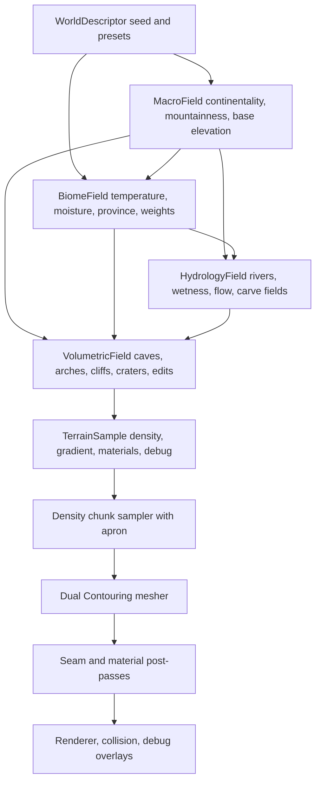

# Terrain System Plan

This is the living implementation plan for taking OFG from its current seed
terrain to a high-grade procedural terrain system. It is based on
[terraingenresearch.md](terraingenresearch.md), especially:

- [Survey of algorithms and techniques](terraingenresearch.md#survey-of-algorithms-and-techniques)
- [Biomes, distribution, and blending](terraingenresearch.md#biomes-distribution-and-blending)
- [Erosion, rivers, caves, materials, texturing, and art layers](terraingenresearch.md#erosion-rivers-caves-materials-texturing-and-art-layers)
- [Implementation plan and validation](terraingenresearch.md#implementation-plan-and-validation)

This document is the continuity source for terrain work. Treat it as a cared-for
shared memory: progress notes must be updated as milestones are started, changed,
completed, deferred, or blocked, including the reason for meaningful pivots. If an
AI agent resumes after context compaction, or is unsure what terrain work was last
planned, it must reread this plan before continuing implementation.

The core lesson from the research is that high quality terrain is a layered world
generation architecture, not a single better noise function. The target is a
deterministic field stack with three scales:

1. Planet or world-scale climate, geology, and macro landforms.
2. Regional hydrology, biome segmentation, and material logic.
3. Local voxel volumetrics for caves, overhangs, edits, and silhouettes.

For the current project, we will build this as a local-world system first. The APIs
should remain compatible with a later planet or cube-sphere patch system, but the
next visible wins should come from better local landforms, debugging tools, seams,
and materials.

## Current State

This section should stay bluntly current. The project now has a real terrain
generation/rendering pipeline, but only the first layers of the high-grade terrain
plan are implemented.

Supported:

- Deterministic 3D terrain density chunks with 32x32x32 cells and 33x33x33
  samples.
- Deterministic simplex, ridged, domain-warp, and cellular macro noise helpers.
- A `TerrainGenerator` behind `WorldDescriptor`, with `seed`, `rollingHills`,
  `mountainValley`, and `rockyHighland` terrain presets. `rollingHills` is the
  default.
- URL-selectable terrain presets and seeds through `?terrainPreset=...` and
  `?terrainSeed=...`, primarily for repeatable verification captures.
- Macro channels for base elevation, large feature value, mountainness,
  continentality, erosion susceptibility, ridge, and warp.
- First weighted biome solver for grassland, temperate forest, wetland,
  coast/beach, dry badland, alpine meadow, high mountain rock, and snow/tundra.
- Terrain density formed from macro base elevation plus 3D detail noise. This is
  still fundamentally a height-biased field, but Dual Contouring can represent
  local non-heightfield detail where the density field creates it.
- Editable terrain source with subtract-sphere edit support.
- Dual Contouring Hermite extraction, guarded QEF placement, QEF diagnostics, and
  per-chunk neighbor-aware meshing with deterministic same-LOD seam ownership.
- Runtime streaming of per-chunk terrain render meshes inside the loaded density
  window.
- A 16-material Poly Haven CC0 terrain library imported under
  `assets/textures/polyhaven`.
- Global WebGPU texture arrays for terrain albedo, normal, and roughness maps.
- Terrain samples that emit biome/slope/altitude/macro-driven material weights.
- Terrain mesh vertices that pack the strongest four material layers and weights.
- A terrain mesh post-pass that expands triangles to coherent local material
  palettes, preventing interpolated weights from referring to different texture
  layers at each triangle corner.
- WGSL triplanar blending of terrain albedo and roughness from the texture arrays.
- Browser and debug smoke coverage for regular gameplay render, terrain presets,
  terrain debug overlays, seam/corner views, and surveyed material-variation
  screenshots.
- Debug overlays for macro elevation, mountainness, slope, normal, density slice,
  material weights, QEF error, and chunk borders.
- A first Rust terrain core crate at `crates/terrain_core`, built to
  `wasm32-unknown-unknown` and emitted as `assets/wasm/terrain_core.wasm`.
- Deterministic generated TypeScript metadata for the terrain WASM artifact.
- Rust/WASM exports for terrain core versioning, preset count, macro base
  elevation, density, compatibility height sampling, and 33x33x33 density chunk
  filling, plus neighbor-aware runtime chunk mesh generation.
- Cross-language golden tests that instantiate the WASM artifact in Node and
  compare Rust density/height/chunk samples and validate emitted mesh buffers
  with the current TypeScript
  generator.
- Runtime terrain streaming can load the generated WASM artifact in the browser
  and use it to build renderable terrain chunk meshes, with a TypeScript fallback
  if the artifact is unavailable.
- A release-WASM benchmark, `npm run bench:terrain:wasm`, reports density
  fill-only, density fill-plus-copy, and chunk mesh-build-plus-copy milliseconds
  per chunk and writes JSON under `artifacts/terrain-wasm-bench/`.

Partially supported or placeholder-only:

- `climatePreset` and `materialPalette` exist on `WorldDescriptor`, but do not
  yet drive distinct generation behavior.
- `biomeAt()` now emits weighted biome archetypes plus temperature, moisture, and
  a cellular province ID, but it is still a first pass. There are no authored
  biome rules, biome-specific debug heatmaps, hard ecological constraints, or
  hydrology inputs yet.
- Material classification uses biome weights, slope, altitude, sea-level
  proximity, and macro values. It does not yet use hydrology/wetness fields,
  curvature, strata, cave humidity, or authored geological regions.
- Snow, cliff, mud, sand, grass, moss, rock, and red-soil materials can appear,
  but their placement is still heuristic and only lightly biome-driven.
- Normal and roughness texture arrays are loaded; roughness is sampled for
  lighting, but normal maps are not yet applied to perturb terrain normals.
- Terrain variation screenshots now prove several material and biome-weight
  regions exist, but the result is still early and needs better regional
  composition.
- The Rust core now owns the browser runtime density-to-render-mesh path for
  generated terrain chunks, including material/biome classification, centroid
  Dual Contouring, same-LOD neighbor seam ownership, and triangle-local material
  palette expansion. This is still a first pass and is not yet worker-backed or
  batch/cache optimized.

Not yet supported:

- Mature biome solver, authored biome provinces, biome heatmap screenshots, or
  polished biome transition bands.
- Hydrology: no river graph, flow accumulation, drainage, lakes, river carving,
  floodplains, beaches driven by water bodies, or wetness propagation.
- Erosion simulation or erosion-inspired post-processing beyond simple macro
  noise channels.
- Geological strata, sediment layers, cliffs formed by rock layers, talus fields
  driven by curvature, or regional material palettes.
- Caves, arches, tunnels, overhang-focused volumetric features, or cave entrance
  placement.
- Far-field terrain, LOD, LOD transition meshes, or chunk-priority scheduling.
- Worker-backed Rust/WASM terrain generation, batch chunk generation, cancellation
  queues, cache reuse across neighboring chunks, or mesh upload preparation.
- Worker-backed terrain generation, cancellation, priority queues, or saveable
  human-facing terrain tuning knobs.
- Terrain collision/grounding based on the generated mesh. Player grounding still
  uses a compatibility `heightAt(x, z)` query.
- High-quality sharp-feature Dual Contouring. QEF placement is guarded and
  diagnosable, but not feature-preserving at production quality.

Current believability gap:

- The terrain can now produce distinct biome/material regions in sampled
  screenshots, but it does not yet read as a fully believable world.
- The main missing layer is regional structure with stronger composition:
  hydrology-informed wetness and river corridors, better biome province shaping,
  and geology/strata that explains cliffs, badlands, talus, and rock color.
- The immediate blocker is iteration speed and view distance. Human material and
  biome tuning will not be productive while changing one number takes seconds and
  the camera can only inspect a few chunks.
- The next visible win should therefore be realtime terrain iteration: move the
  expensive chunk sampling/meshing path behind Rust/WASM, add generation timing
  counters, widen the visible terrain window, then expose saveable tuning knobs.
  Hydrology and better biome composition remain the next believability layer once
  the terrain can regenerate fast enough to tune.

## Target Data Flow



## Core Interfaces

These are proposed direction-setting contracts. Names can change during
implementation, but the responsibilities should stay stable.

```ts
type WorldDescriptor = {
  seed: number;
  seaLevel: number;
  terrainPreset: TerrainPresetId;
  climatePreset: ClimatePresetId;
  materialPalette: TerrainMaterialPaletteId;
};

type TerrainGenerator = TerrainDensitySource & {
  readonly descriptor: WorldDescriptor;
  macroAt(position: Vec3): MacroSample;
  biomeAt(position: Vec3): BiomeSample;
  hydrologyAt(position: Vec3): HydrologySample;
  surfaceAt(position: Vec3): TerrainSurfaceSample;
  heightAt(x: number, z: number): number;
};

type TerrainSurfaceSample = {
  density: number;
  gradient: Vec3;
  materialWeights: readonly TerrainMaterialWeight[];
  biomeWeights: readonly BiomeWeight[];
  debug: TerrainDebugChannels;
};
```

Implementation rule: runtime generation should be deterministic from descriptor
and position. Persistent storage should be reserved for edits and authored
landmarks, not for every generated sample.

## Milestone Summary

| # | Milestone | Main Deliverable | Validation Gate |
|---:|---|---|---|
| 1 | Generator core | `WorldDescriptor` and `TerrainGenerator` replacing seed field | Same seed gives same samples/chunks |
| 2 | Macro landforms | Ridged, warped, cellular-enhanced terrain presets | Better silhouettes, no obvious periodic grid |
| 3 | Debug terrain lab | Browser overlays and screenshot scripts for generation layers | Every field can be inspected in isolation |
| 4 | Dual Contouring hardening | Per-chunk neighbor-aware meshing and seam ownership | No same-LOD chunk cracks or QEF spikes |
| 5 | Biome solver | Climate/province-driven biome weights | Stable biome heatmaps, no hard borders |
| 6 | Material classification | Material weights from slope, altitude, biome, wetness, strata | Terrain blends 4-8 materials predictably |
| 7 | Hydrology and rivers | Coarse river graph, carve field, wetness map | Rivers flow downhill or terminate validly |
| 8 | Caves and local volumes | Tunnel graph plus 3D noise carving | Navigable caves and natural entrances |
| 9 | Streaming and LOD | Chunk scheduler, caches, LOD/seam transition plan | Free-flight remains hole-free within budget |
| 10 | Presentation layers | Vegetation masks, water rendering, atmosphere improvements | Terrain reads at multiple scales |
| 11 | Realtime Rust/WASM terrain path | Rust/WASM hot paths, profiling, worker scheduling, tuning persistence | Terrain edits and tuning regenerate fast enough for human iteration |

## Recommended Next Slice: Realtime Terrain Iteration

Goal: make terrain regeneration fast enough that a human can tune believable,
varying terrain by feel. This should happen before more biome/material/hydrology
polish, because slow feedback makes every knob hard to judge.

Proposed order:

1. Add a focused benchmark/profiling harness for the current terrain hot path.
   (First Rust density chunk benchmark complete.)
   - Measure density chunk fill, Hermite extraction, QEF placement, mesh buffer
     emission, GPU upload preparation, active chunk count, and triangles.
   - Write machine-readable JSON for fixed seeds, presets, and camera paths.
   - Validation: budgets are explicit enough that future Rust/WASM migrations can
     prove they helped.
2. Move density chunk sampling into Rust/WASM. (First runtime slice complete.)
   - Export a flat chunk-fill API that writes the 33x33x33 density/gradient sample
     layout needed by `TerrainChunk`.
   - Keep TypeScript as the reference implementation and compare full chunk
     fixtures at boundaries, negative coordinates, and multiple presets.
   - Validation: Rust/WASM density chunks match TypeScript fixtures and reduce
     chunk generation time.
3. Wire Rust/WASM density chunks into runtime streaming behind a narrow adapter.
   (First runtime slice complete.)
   - Keep the existing scene/component/render boundaries.
   - Add a fallback path to the TypeScript generator while the migration is young.
   - Validation: browser smoke remains visually stable and chunk seam tests still
     pass.
4. Move Dual Contouring meshing hot paths next if profiling still shows chunk
   rebuilds are too slow. (First runtime WASM mesh path complete.)
   - Start with Hermite extraction and QEF placement, then mesh buffer emission.
   - Validation: mesh summaries and seam ownership match TypeScript golden
     fixtures before runtime promotion.
5. Add worker-backed scheduling and cache budgets.
   - Main thread should stop blocking on expensive terrain rebuilds.
   - Add priority queues, cancellation for stale camera positions, and cache
     eviction before increasing view distance aggressively.
   - Validation: free-flight remains hole-free while visible radius increases.
6. Add a terrain tuning panel with save/load only after regeneration is responsive.
   - Knobs should cover seed, preset, macro scales, ridge strength, detail
     amplitude, biome/material weights, and later hydrology.
   - Validation: saved descriptors reproduce the same terrain and screenshots.

After that, return to believable variation work: biome heatmap overlays,
hydrology/wet corridors, geological strata, normal-map shading, and broader
material art direction. The artistic work will go much better once the engine can
answer back quickly.

Progress notes:

| Date | Status | Notes |
|---|---|---|
| 2026-06-01 | In progress | Added `?terrainSeed=` support and `npm run smoke:terrain-variation`. The smoke samples all current terrain presets across seeds `246`, `7001`, `112358`, and `424242`, scores representative meadow, wet lowland, dry soil, mossy ridge, rocky slope, and red cliff targets, captures browser screenshots, and writes a report with macro/biome/material evidence. |
| 2026-06-01 | In progress | Added the first weighted biome solver and made the variation smoke require at least three distinct dominant biome regions. Current captures include grassland, wetland, dry badland, and high mountain rock evidence. Next work should add biome heatmap overlays and hydrology/water shaping. |
| 2026-06-01 | Pivoted | Screenshots still read too similar, but further material tuning is blocked by slow iteration and short view distance. The recommended next slice is now Rust/WASM-backed realtime terrain generation, then tuning knobs and save/load, then renewed biome/hydrology/material polish. |
| 2026-06-01 | In progress | Added a Rust/WASM density chunk fill API for the 33x33x33 `TerrainChunk` sample layout, copied it into `TerrainDensityChunk`, and wired `TerrainChunkStreamer` to use it at runtime when the browser loads `assets/wasm/terrain_core.wasm`. Browser smoke passes with no fallback warnings. Next target is profiling plus moving meshing/worker scheduling enough to widen view distance. |
| 2026-06-01 | In progress | Added `npm run bench:terrain:wasm` to measure release WASM density chunk generation directly. Initial fill-only median was about 36.8 ms per 33x33x33 chunk, which confirmed the Rust path was still too slow. Caching macro terrain once per x/z column inside chunk fill reduced the quick benchmark to about 6.6 ms fill-only median and 6.5 ms fill-plus-copy median, with machine-readable JSON in `artifacts/terrain-wasm-bench/`. |
| 2026-06-01 | In progress | Moved the browser runtime generated-terrain chunk mesh path into Rust/WASM. `ofg_build_chunk_mesh` now builds the density apron, extracts Hermite intersections, performs centroid Dual Contouring with same-LOD seam ownership, classifies biome/material weights, expands triangle-local material palettes, and returns renderable vertex/index buffers to TypeScript. Browser smoke passes. Quick benchmark now shows density fill around 6.5 ms median and full mesh build plus copy around 62.7 ms median per chunk, so the next performance target is worker-backed batch generation and cache reuse across neighboring chunks. |

## Milestone 1: Generator Core

Goal: introduce a deterministic terrain generator above `TerrainDensitySource`
without breaking the current runtime.

Implementation:

- Add `src/engine/world/terrainGenerator.ts`.
- Add `WorldDescriptor`, terrain preset IDs, climate preset IDs, and seed handling.
- Move current seed field behavior behind `TerrainGenerator`.
- Keep `heightAt(x, z)` for player grounding, implemented by surface search.
- Expose `densityAt`, `sampleAt`, `macroAt`, and placeholder `biomeAt` methods.
- Keep old `createSeedTerrainField()` as a compatibility wrapper if needed, but
  mark it as legacy in docs once callers migrate.

Tests:

- `terrainGenerator.test.ts`: same descriptor returns identical samples.
- `terrainGenerator.test.ts`: different seeds produce different macro samples.
- `terrainGenerator.test.ts`: `densityAt` and `sampleAt().density` agree.
- `terrainGenerator.test.ts`: `heightAt` lands near the zero-density surface.
- Existing `TerrainChunkStreamer` tests pass without behavioral regression.

Progress notes:

| Date | Status | Notes |
|---|---|---|
| 2026-05-31 | Initial implementation complete | Added `TerrainGenerator`/`WorldDescriptor`, moved the existing seed field behind it, kept `createSeedTerrainField()` as a compatibility wrapper, and added generator determinism/sampling/surface tests. `npm test` passes. |

## Milestone 2: Macro Landforms

Goal: replace the current simple terrain with a layered macro terrain stack.

Research basis:

- The research recommends simplex-style coherent fields, ridged fractals, domain
  warping, and Worley/cellular secondary structure rather than plain fBm
  [terraingenresearch.md](terraingenresearch.md#survey-of-algorithms-and-techniques).

Implementation:

- Add ridged fractal sampling on top of the existing simplex implementation.
- Add domain warp helpers with deterministic gradients where practical.
- Add cellular/Worley-style 2D and 3D utilities for cliff/region breakup.
- Define `MacroSample`:

```ts
type MacroSample = {
  baseElevation: number;
  mountainness: number;
  continentality: number;
  erosionSusceptibility: number;
  ridge: number;
  warp: Vec3;
};
```

- Create at least three presets:
  - rolling hills
  - mountain valley
  - badlands or rocky highland

Tests:

- Noise helpers are deterministic for seed and position.
- Ridged fields stay in expected ranges and have sharper peaks than fBm.
- Domain warp does not produce NaN gradients or discontinuous jumps.
- Adjacent chunk seams sample matching macro values at shared positions.
- Distribution tests assert each preset has useful height variation without
  collapsing into all-flat or all-mountain terrain.
- Browser smoke captures each macro preset from a fixed debug camera.

Progress notes:

| Date | Status | Notes |
|---|---|---|
| 2026-05-31 | Initial implementation complete | Added tested ridged fractal, domain warp, and cellular noise helpers; wired `seed`, `rollingHills`, `mountainValley`, and `rockyHighland` presets into `TerrainGenerator`; made `rollingHills` the default. Added `?terrainPreset=` app selection and `npm run smoke:terrain-presets` to capture every preset. `npm test`, `npm run smoke:terrain-presets`, and browser smoke pass. Visual tuning remains iterative. |

## Milestone 3: Debug Terrain Lab

Goal: make every terrain layer inspectable before adding more complexity.

Research basis:

- The research calls isolated debug overlays the most important validation strategy
  [terraingenresearch.md](terraingenresearch.md#implementation-plan-and-validation).

Implementation:

- Add a debug mode for terrain overlays:
  - density slice
  - normal/gradient
  - slope
  - chunk borders
  - QEF error
  - macro elevation
  - mountainness
  - biome weights
  - material weights
  - wetness/flow
  - cave occupancy
- Add keyboard-controlled overlay cycling or a compact debug panel.
- Extend browser smoke or add `tools/terrain-debug-smoke.mjs` to capture fixed
  overlay screenshots.

Tests:

- Overlay state is deterministic and can be toggled without crashing.
- Debug render data can be built without WebGPU for unit tests.
- Browser screenshot tests verify overlays are nonblank and visually distinct.
- Console errors fail smoke runs.

Progress notes:

| Date | Status | Notes |
|---|---|---|
| 2026-05-31 | In progress | Added a CPU-built debug overlay pipeline with browser canvas display, `F2` cycling, `?terrainDebug=` startup selection, and debug API controls. Current overlay modes: macro elevation, mountainness, slope, normal, density slice, material weights, QEF error, and chunk borders. Added unit coverage and `npm run smoke:terrain-debug`; `npm test`, terrain debug smoke, and browser smoke pass. Remaining work: biome-specific overlays once biome solver exists, hydrology/wetness/cave overlays once those systems exist, and fuller in-app controls. |

## Milestone 4: Dual Contouring Hardening

Goal: turn the current stitched-window prototype into a reliable chunk meshing
system.

Research basis:

- The research identifies Dual Contouring as a good Hermite-data basis but warns
  that chunk and LOD seams need explicit engineering
  [terraingenresearch.md](terraingenresearch.md#implementation-plan-and-validation).

Implementation:

- Add 1-cell apron sampling for each meshed chunk.
- Define deterministic ownership for border quads.
- Make `meshChunkDualContouring` neighbor-aware.
- Keep stitched-window meshing as a fallback/debug path during migration.
- Improve QEF:
  - mass-point fallback
  - rank deficiency handling
  - condition/quality metrics
  - per-cell QEF error output for debug overlays
- Add material-weight interpolation at Hermite intersections.
- Separate render mesh extraction from collision mesh extraction.

Tests:

- Adjacent chunks share seam densities, gradients, material weights, and border
  topology.
- No invalid indices or duplicate zero-area triangles.
- Flat plane, diagonal plane, sphere, cliff, arch, and thin-wall fixtures mesh
  without holes.
- QEF tests cover clean solve, underconstrained solve, out-of-cell solve, sharp
  corner, and noisy Hermite planes.
- Browser smoke verifies no visible cracks at chunk boundaries from close and
  grazing angles.

Progress notes:

| Date | Status | Notes |
|---|---|---|
| | In progress | Current QEF has an out-of-cell guard; runtime still uses centroid placement. |
| 2026-05-31 | In progress | Added `analyzeDualContouringCellVertex()` diagnostics with QEF/centroid error, fallback reasons, and arbitrary-bounds Hermite extraction for debug overlays. `qefError` overlay is now captured by terrain debug smoke. Runtime meshing still uses centroid placement via `TerrainChunkStreamer`; per-chunk neighbor-aware meshing remains next. |
| 2026-05-31 | In progress | Added `meshChunkDualContouringWithNeighbors()` with deterministic edge ownership and vertex compaction. Tests prove a two-chunk flat-plane seam is emitted by exactly one per-chunk mesh and sums to the stitched mesh topology. Runtime still needs migration from stitched-window rendering to per-chunk neighbor-aware rendering. |
| 2026-05-31 | In progress | Migrated `TerrainChunkStreamer` to render per-chunk neighbor-aware meshes using a positive 1-cell apron instead of one stitched render window. The streamer keeps render chunks inside the loaded density window, skips all-air/all-solid chunks before apron sampling, and browser smoke now validates per-chunk render ownership. |
| 2026-05-31 | In progress | Added `npm run smoke:terrain-seams`, which uses deterministic debug camera placement to capture x-seam, z-seam, and chunk-corner grazing views. The smoke verifies render coverage on both sides of the target seams and checks screenshots for valid rendered output. |

## Milestone 5: Biome Solver

Goal: add climate and province-based biome weights instead of hard biome IDs.

Research basis:

- The research recommends climate fields plus spatial provinces, then continuous
  blending with local terrain-condition overrides
  [terraingenresearch.md](terraingenresearch.md#biomes-distribution-and-blending).

Implementation:

- Define primary biome archetypes:
  - coast/beach
  - rocky desert/badlands
  - grassland
  - temperate forest
  - wetland
  - alpine meadow
  - high mountain rock
  - tundra/ice
  - cave interior
- Define biome modifiers:
  - riverbank
  - floodplain
  - canyon
  - cratered
  - volcanic/geothermal
- Add climate fields:
  - temperature
  - moisture
  - altitude
  - continentality
  - drainage/wetness
  - province ID/mask
- Output normalized biome weights with transition bands.

Tests:

- Biome weights sum to 1 within tolerance.
- Same position/seed gives same biome weights.
- Neighboring positions transition smoothly except where an intentional hard
  override exists.
- Cold/dry/wet/high-altitude sample fixtures map to plausible archetypes.
- Province seams are blended, not hard strategy-map borders.
- Debug heatmaps render for each biome weight.

Progress notes:

| Date | Status | Notes |
|---|---|---|
| 2026-06-01 | In progress | Replaced the placeholder single-biome output with weighted grassland, temperate forest, wetland, coast/beach, dry badland, alpine meadow, high mountain rock, and snow/tundra archetypes. The solver uses altitude, temperature, moisture, continentality, mountainness, erosion susceptibility, and cellular province IDs. Tests cover normalized weights and cold/wet/dry fixtures. Missing: biome heatmap overlays, authored province shaping, hydrology/wetness inputs, and polished transition tuning. |

## Milestone 6: Material Classification

Goal: move from one triplanar atlas sample to terrain material weights driven by
terrain and biome conditions.

Research basis:

- The research recommends a larger global material library but limiting each
  planet/chunk/draw to a smaller set of blended materials
  [terraingenresearch.md](terraingenresearch.md#erosion-rivers-caves-materials-texturing-and-art-layers).

Implementation:

- Define `TerrainMaterialId` and `TerrainMaterialWeight`.
- Start with 6-8 active material families:
  - grass
  - soil
  - exposed rock
  - cliff rock
  - gravel/talus
  - wet mud
  - sand
  - snow/ice later
- Generate material weights from:
  - biome weights
  - slope
  - altitude
  - curvature/concavity
  - wetness
  - strata noise
  - cave humidity
- Update mesh format or chunk render metadata to carry material weights.
- Update WGSL triplanar path to sample and blend multiple material tiles.

Tests:

- Material weights are normalized and capped to the supported blend count.
- Steep slopes prefer rock/cliff material.
- Low wet concavities prefer mud/wet material.
- High cold areas prefer snow/ice once implemented.
- Adjacent chunks produce matching material weights on seams.
- Shader tests verify material-weight inputs and blend contract.
- Browser screenshots compare slope, valley, and flatland material results.

Progress notes:

| Date | Status | Notes |
|---|---|---|
| 2026-06-01 | In progress | Added a 16-material Poly Haven CC0 terrain library imported by `tools/import-polyhaven-terrain.mjs`, tracked through Git LFS, and loaded as global albedo/normal/roughness texture arrays. Terrain samples now emit slope/altitude/macro-driven material weights, Dual Contouring vertices pack the strongest four material layers, runtime meshes expand triangles to coherent local material palettes, and WGSL triplanar-blends albedo plus roughness from the arrays. Normal maps are loaded but not yet sampled for lighting. `npm test`, `npm run check:shaders`, `npm run smoke:browser`, and `npm run smoke:terrain-seams` pass. |
| 2026-06-01 | In progress | Remaining material work for believable variation: feed biome/wetness/strata fields into classification, add a survey smoke that captures representative material/biome regions, and apply terrain normal maps in lighting after regional material choice is readable. |
| 2026-06-01 | In progress | Added the first material-variation survey smoke. It currently finds visually distinct material conditions, but the evidence also shows several categories are still heuristic mixtures rather than true ecological/geological regions. The next classifier improvement should consume real biome weights once Milestone 5 starts. |
| 2026-06-01 | In progress | Material classification now consumes the first biome weights: wetland/coast increase mud and sand, dry badland increases dry/red soil, mountain rock increases rocky materials, alpine adds moss/grass influence, and snow/tundra reinforces snow. This is still heuristic and needs hydrology, curvature, and strata inputs. |

## Milestone 7: Hydrology And Rivers

Goal: add coarse drainage logic before full erosion simulation.

Research basis:

- The research recommends separating rivers into hydrology graph, carve field, and
  visible water representation
  [terraingenresearch.md](terraingenresearch.md#erosion-rivers-caves-materials-texturing-and-art-layers).

Implementation:

- Build a low-resolution surface graph over macro terrain cells.
- Compute downhill flow direction, accumulation, basins, and outlets.
- Classify water features:
  - dry channel
  - stream
  - river
  - floodplain
  - lake/basin
- Project hydrology into local terrain:
  - river carve density modifier
  - bank/floodplain material weights
  - wetness field
  - optional water spline/render primitive
- Defer full hydraulic erosion simulation until the graph/carve path works.

Tests:

- Flow directions do not climb uphill except for explicit basin handling.
- Major rivers have outlet or valid basin termination.
- River carve field is deterministic and continuous across chunks.
- Wetness increases near river paths and decays with distance.
- Browser smoke captures a fixed river valley preset.

Progress notes:

| Date | Status | Notes |
|---|---|---|
| | Not started | |

## Milestone 8: Caves And Local Volumetrics

Goal: use the voxel nature of the engine for overhangs, caves, arches, and edits.

Research basis:

- The research recommends hybrid cave generation: structural tunnel graphs plus
  3D noise/metaball-style wall richness, with cave material logic
  [terraingenresearch.md](terraingenresearch.md#erosion-rivers-caves-materials-texturing-and-art-layers).

Implementation:

- Define cave/tunnel graph primitives:
  - tunnel spline
  - chamber
  - entrance
  - vertical shaft
  - arch/bridge volume
- Convert graph primitives to density modifiers.
- Add 3D noise wall perturbation.
- Add cave biome/material override:
  - damp rock
  - mineral streaks
  - exposed strata
- Make subtract-sphere edits part of the same modifier stack.

Tests:

- Cave graph generation is deterministic.
- Tunnel graph connectivity metrics pass.
- Entrances intersect terrain surface cleanly.
- Generated caves remain inside configured shell depth.
- Dual Contouring meshes cave fixtures without holes.
- Player/camera smoke can enter or view a cave test preset.

Progress notes:

| Date | Status | Notes |
|---|---|---|
| | Not started | |

## Milestone 9: Streaming And LOD

Goal: make the terrain scale beyond the current small loaded window.

Research basis:

- The research recommends dense active chunks early, sparse or paged hierarchy
  later, and explicit seam/transition systems at chunk/LOD boundaries
  [terraingenresearch.md](terraingenresearch.md#implementation-plan-and-validation).

Implementation:

- Treat realtime chunk generation as a prerequisite for widening the view window.
  Farther terrain is only useful if chunks can be generated, meshed, uploaded,
  and evicted without blocking the camera loop.
- Keep 32-cell chunks as the default active brick size.
- Add chunk priority scheduling:
  - near chunks
  - visible silhouette chunks
  - collision-critical chunks
  - low-priority background chunks
- Add cache eviction for density chunks and meshes.
- Add far-field simplified terrain representation before full voxel LOD.
- Define LOD transition strategy:
  - same-LOD seams first
  - lower-detail far meshes second
  - transition meshes only after the above is stable
- Add generation timing and memory counters.

Tests:

- Chunk scheduler requests deterministic chunk sets for fixed camera paths.
- Cache eviction does not remove active collision/render chunks.
- Free-flight smoke has no holes or missing terrain.
- Memory and chunk count stay under configured budgets.
- LOD transition fixtures do not show cracks once implemented.

Progress notes:

| Date | Status | Notes |
|---|---|---|
| | Not started | |

## Milestone 10: Presentation Layers

Goal: make the terrain read as a place, not just a mesh.

Research basis:

- The research notes that perceived high-end terrain quality depends heavily on
  vegetation, cloudscape, aerial perspective, wetness, shadows, and palette
  discipline
  [terraingenresearch.md](terraingenresearch.md#erosion-rivers-caves-materials-texturing-and-art-layers).

Implementation:

- Add placement masks for:
  - grass tufts
  - shrubs
  - rocks
  - trees later
  - cave props later
- Start with impostor/simple mesh props before heavy instancing.
- Add water rendering for river/lake surfaces.
- Improve sky with atmospheric depth/aerial perspective.
- Add wetness and color palette modulation.
- Add debug tools for prop candidates and density.

Tests:

- Prop candidate generation is deterministic.
- Props respect slope, biome, water, cave, and clearance masks.
- Browser screenshots show prop density from multiple distances.
- Render budgets stay within target for a fixed test scene.

Progress notes:

| Date | Status | Notes |
|---|---|---|
| | Not started | |

## Milestone 11: Optimisation And Rust/WASM Gates

Goal: make terrain generation fast enough that artists, designers, and developers
can tune believable terrain in realtime.

Pivot:

- As of 2026-06-01, Rust/WASM is no longer a distant migration gate. It is the
  next enabling layer because terrain tuning is blocked by slow chunk generation
  and a too-small loaded view distance.
- TypeScript remains the reference implementation until each Rust/WASM slice has
  golden tests. The migration should proceed one hot path at a time, with clear
  contracts and measured budgets.

Implementation:

- Keep the Rust terrain core small and dependency-light while contracts are still
  moving.
- Maintain deterministic generated WASM artifacts under `assets/wasm` with
  generated TypeScript metadata under `src/generated`.
- Move the terrain hot path in slices:
  - scalar field sampling and compatibility height queries
  - density chunk sampling into flat typed arrays
  - material/biome sample channels needed by meshing and debug overlays
  - Dual Contouring Hermite extraction, QEF placement, and mesh buffer emission
  - worker-backed scheduling, cancellation, and result transfer
- Add profiling HUD or debug stats:
  - density sample time
  - chunk generation time
  - meshing time
  - GPU upload time
  - triangle count
  - active chunk count
  - memory estimate
- Add benchmark scripts for fixed seeds and camera paths.
- Add explicit budgets for a tuning-friendly loop:
  - changing a terrain number should show a nearby terrain update in well under a
    second on the development machine
  - visible view distance should expand beyond the current few chunks without
    hitching
  - expensive chunk work should happen off the main thread before serious tuning
    UI work begins
- Add save/load for tuning descriptors only after regeneration is responsive
  enough to make saved knobs meaningful.

Tests:

- Benchmark scripts produce machine-readable JSON.
- Performance budgets are explicit and versioned.
- Rust/WASM output must match TypeScript golden fixtures until the Rust path is
  intentionally promoted as the source of truth.
- `npm run check:wasm` verifies generated WASM metadata and asset freshness.
- `npm run bench:terrain:wasm` records release WASM density chunk timing.
- `cargo test -p terrain_core` validates Rust-side deterministic terrain logic.
- Cross-language tests instantiate the generated WASM artifact and compare golden
  density, height, and later chunk/mesh fixtures.
- Browser smoke remains the final integration gate.

Progress notes:

| Date | Status | Notes |
|---|---|---|
| 2026-06-01 | Started | Realtime-first pivot accepted. Added `crates/terrain_core`, `tools/build-terrain-wasm.mjs`, generated `assets/wasm/terrain_core.wasm`, and TypeScript WASM metadata/loader tests. The first Rust slice mirrors macro base elevation, density, and compatibility height sampling and is golden-tested against the TypeScript terrain generator. |
| 2026-06-01 | In progress | Added density chunk filling to the Rust/WASM core and wired the browser runtime through a narrow `TerrainChunkStreamer` density chunk generator hook. This moves the first real streaming hot path onto WASM while preserving the TypeScript fallback and golden chunk tests. |

## Cross-Cutting Validation

Every terrain milestone should preserve these checks:

- `npm test`
- `cargo test -p terrain_core` when Rust terrain code changes
- `npm run check:shaders` when shader artifacts change
- `npm run check:wasm` when Rust/WASM terrain artifacts change
- `npm run smoke:browser` for visual, camera, render, streaming, material, or
  browser integration changes
- `git diff --check`

Terrain-specific regression suites to build over time:

- Determinism fixtures for sample fields.
- Chunk seam fixtures for density, gradient, topology, and material weights.
- Dual Contouring fixtures for flat plane, sphere, diagonal plane, sharp corner,
  thin wall, cave, arch, and repeated edits.
- Distribution fixtures for macro landforms and biome weights.
- Hydrology graph fixtures for flow validity.
- Screenshot fixtures for representative terrain presets.

## Deferred Work

Do not start these until the earlier systems are working and measured:

- Full spherical planet/cube-sphere runtime.
- Full hydraulic erosion simulation.
- Runtime virtual texturing.
- GPU terrain meshing.
- Sparse voxel octree cold storage.
- Large vegetation/foliage system.

These are all compatible with the target architecture, but doing them too early
would make the system harder for AI agents to understand and test.

## Open Questions

| Question | Current Leaning | Notes |
|---|---|---|
| Local terrain first or planet patches now? | Local terrain first | Keep APIs planet-compatible. |
| OpenSimplex2 vs current Simplex only? | Current Simplex first, add variants if needed | Avoid algorithm churn before debug tools. |
| Material weights in vertex data or chunk side buffer? | Start with vertex data | Simpler for current renderer. |
| Terrain collision source? | Near render mesh first, then simplified collision mesh | Needs player movement upgrade. |
| When Rust/WASM? | Now for terrain hot paths | Realtime iteration is blocking believable terrain tuning; every migrated slice still needs golden tests against TypeScript until promoted. |
